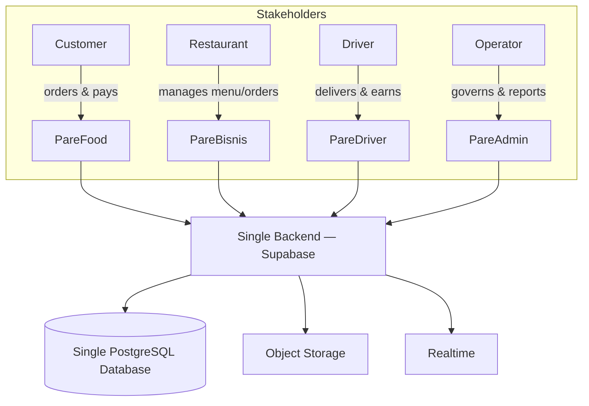

# PF-DOC-01 — Project Vision

| | |
|---|---|
| Document ID | PF-DOC-01 |
| Title | Project Vision |
| Version | 1.0 |
| Status | Approved (review PF-REV-01, 2026-08-06) |
| Date | 2026-08-06 |
| Author | Principal Architect / Product Manager |
| References | None — foundation document. Successors: PF-DOC-02, PF-DOC-03, PF-DOC-05, PF-DOC-29 |

---

## 1. Purpose

This document defines **why the PareFood Platform exists**, what it aspires to become,
and the guiding principles every decision in this documentation suite must honour. It is
the root of the document chain: all 30 documents derive their direction from this vision.
Any later document that conflicts with this vision must be revised.

## 2. Objectives

1. Articulate a clear, lasting mission and vision for the four-product family.
2. Define the problem being solved for each of the four stakeholders (customer,
   restaurant, driver, operator).
3. Establish measurable strategic goals for the first three years.
4. Set non-negotiable product principles that guide design, engineering and business.
5. Provide the "North Star" that later documents (product requirements, roadmap, KPIs)
   trace back to.

## 3. Requirements

### 3.1 Mission Statement

> **PareFood** connects hungry people with great local food — fast, fairly and reliably —
> while giving restaurants a modern sales channel and drivers a dependable source of income.

### 3.2 Vision Statement

> To become the most trusted food ordering and delivery platform in Indonesia — the first
> choice for customers, the most profitable channel for restaurants, and the fairest partner
> for drivers — built on a single, secure, enterprise-grade technology platform.

### 3.3 Product Family

| Product | App code | Audience | Device | One-line purpose |
|---|---|---|---|---|
| PareFood | AP-PF | Consumers | Flutter mobile (Android/iOS) | Browse restaurants, order and pay for food |
| PareBisnis | AP-PB | Restaurant partners | Flutter mobile | Manage menu, orders and restaurant performance |
| PareDriver | AP-PD | Delivery drivers | Flutter mobile | Accept delivery jobs, navigate, get paid |
| PareAdmin | AP-PA | Internal operators | Flutter Web | Operate, moderate and govern the platform |

### 3.4 Problem Statements

| Stakeholder | Problem today | PareFood answer |
|---|---|---|
| Customer | Fragmented ordering, slow delivery, poor trust in quality/timing | One app with live order tracking, reliable ETA and transparent pricing |
| Restaurant | High commissions, poor discovery, hard menu/order management | PareBisnis with fair commissions, analytics and self-service menu tools |
| Driver | Unpredictable income, opaque matching, safety/payment issues | PareDriver with transparent jobs, fair payout and wallet visibility |
| Operator | No unified control plane over four products | PareAdmin giving full governance, moderation and business reporting |

### 3.5 Strategic Goals (0–36 months)

| Horizon | Goal | Target metric |
|---|---|---|
| 0–6 months (MVP) | Launch PareFood + PareBisnis + PareDriver + PareAdmin in one pilot city | 50 partner restaurants; 1,000 weekly active customers |
| 6–12 months | Establish repeat order habit and driver network in the pilot city | 30% monthly repeat order rate; < 35 min median delivery time |
| 12–24 months | Expand to 5 cities; add admin analytics & finance tools | 5 cities; 300+ restaurants; positive gross margin per order |
| 24–36 months | Grow into a full food-commerce platform | 10 cities; adjacent verticals (see PF-DOC-29) |

### 3.6 Guiding Principles

1. **Trust first** — reliability, transparency and food safety beat feature velocity.
2. **One platform, four surfaces** — a single backend and database; all four apps are
   views over the same system of record.
3. **Fair to all sides** — transparent commissions for restaurants, transparent fares and
   payouts for drivers, transparent pricing for customers.
4. **Local first** — built for Indonesian behaviour (cash + e-wallet, motorised delivery,
   local food categories), not copied from Western platforms.
5. **Enterprise grade by default** — security, testing, observability and maintainability
   are baseline requirements, not later add-ons.
6. **Iterate with evidence** — every feature ships behind measurable metrics; data drives
   the roadmap (see PF-DOC-03, PF-DOC-25).

## 4. Diagrams

## 5. Tables

### 5.1 Stakeholder Value Proposition

| Stakeholder | Core value | Emotional value |
|---|---|---|
| Customer | Fast, reliable food delivery at fair price | Convenience, trust, choice |
| Restaurant | New orders without commission exploitation | Business growth, control |
| Driver | Dependable income, fair rules | Stability, dignity, safety |
| Operator | Unified control and insight | Efficiency, confidence |

### 5.2 Non-Negotiables

| # | Commitment | Violation consequence |
|---|---|---|
| 1 | Live order tracking must be accurate within 2 minutes of true state | Revert / incident review |
| 2 | Payouts to drivers and restaurants must never be silently reduced | Financial audit + public apology |
| 3 | Customer data never sold or exposed | Compliance breach, legal exposure |
| 4 | All four apps use the same backend & database | Architecture exception process |

## 6. Rules

- **VR-01** The platform is a monorepo with one backend and one database. Any change
  proposing a second database requires an Architecture Decision Record (ADR).
- **VR-02** Product principles in §3.6 are non-negotiable and referenced by every
  downstream document.
- **VR-03** The four products share the PareFood brand; visual identity is unified
  (see PF-DOC-16).
- **VR-04** Any future product (see PF-DOC-29) must integrate into the same backend
  before being allowed its own.
- **VR-05** Strategic metrics in §3.5 are the only accepted definitions of success for
  roadmap prioritisation (see PF-DOC-25).

## 7. Checklist

- [ ] Mission and vision approved by stakeholders
- [ ] Problem statements validated with at least 3 interviews per stakeholder group
- [ ] Strategic goals agreed with measurable targets
- [ ] Product principles accepted as governing rules
- [ ] This document linked from PF-DOC-02..PF-DOC-30 references

## 8. Risks

| Risk | Likelihood | Impact | Mitigation |
|---|---|---|---|
| Over-scoping the MVP against the vision | High | High | MVP scope fixed in PF-DOC-02/25 |
| Vision drift across four products | Medium | Medium | Principles + governance in PF-DOC-07/18 |
| Local-market assumptions wrong | Medium | High | Validate via research in PF-DOC-04/05 |
| Entering against well-funded competitors | High | High | Differentiation plan in PF-DOC-04 |

## 9. Future Improvements

- Formal brand manifesto and tone-of-voice guide (aligned with PF-DOC-16).
- Public-facing impact report (merchant/driver income transparency) — see PF-DOC-29.
- Vision refresh cadence: re-review annually against PF-DOC-03 KPIs.
