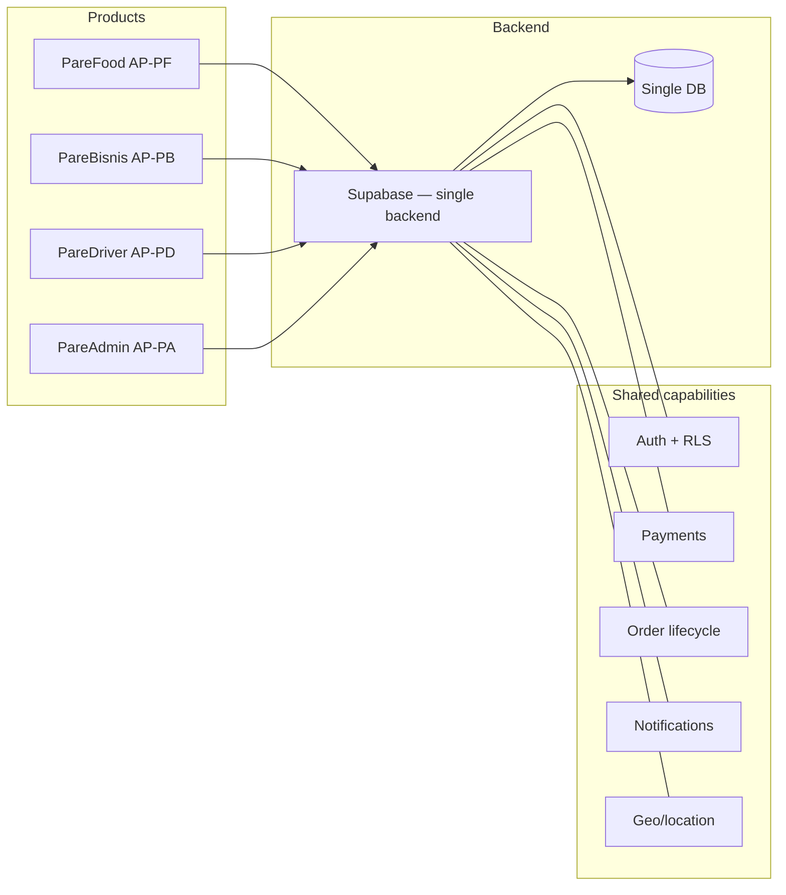

# PF-DOC-02 — Product Requirements

| | |
|---|---|
| Document ID | PF-DOC-02 |
| Title | Product Requirements |
| Version | 1.0 |
| Status | Approved (review PF-REV-01, 2026-08-06) |
| Date | 2026-08-06 |
| Author | Product Manager / Principal Architect |
| References | PF-DOC-01 (vision); successors PF-DOC-07 (FRs), PF-DOC-15 (UX), PF-DOC-25 (roadmap) |

---

## 1. Purpose

This document defines **what each of the four products is**, its core feature set at MVP,
its out-of-scope items, and its success measures. It translates the vision (PF-DOC-01) into
a product definition that PF-DOC-07 turns into precise functional requirements.

## 2. Objectives

1. Define the MVP scope for all four apps, sharply (no scope creep).
2. Define the user journeys that each product must support end-to-end at launch.
3. Define per-product success metrics tied to strategic goals (PF-DOC-01 §3.5).
4. Explicitly list out-of-scope items so the team does not build them.
5. Establish the prioritisation (MoSCoW) contract consumed by PF-DOC-25.

## 3. Requirements

### 3.1 Product Overview

The PareFood Platform is a four-product ecosystem over a single backend (see PF-DOC-12).
Products are delivered as Flutter apps in one monorepo (see PF-DOC-10).

| Product | Role in ecosystem | MVP platforms | Store presence |
|---|---|---|---|
| PareFood (AP-PF) | Customer ordering | Android, iOS | Google Play, App Store |
| PareBisnis (AP-PB) | Restaurant management | Android, iOS | Google Play, App Store |
| PareDriver (AP-PD) | Driver operations | Android, iOS | Google Play, App Store |
| PareAdmin (AP-PA) | Internal operations | Flutter Web | Hosted web app |

### 3.2 PareFood (AP-PF) — MVP Requirements

**Must have**
- Account registration & login (phone OTP + email/password; see PF-DOC-12 Auth).
- Location-based restaurant discovery with search, category filters, sorting.
- Restaurant detail page: menu, prices, images, ratings, estimated delivery time (ETA).
- Cart with quantity edit, promo code entry.
- Checkout: address selection, payment selection (COD, e-wallet, card), fee breakdown.
- Order placement with confirmation; live order status + driver location tracking.
- Order history and order detail with receipts.
- In-app rating & review of restaurant and driver per order.
- Favourites (restaurants) and saved addresses.
- Push notifications for order events.

**Should have**
- Voucher/wallet balance view; payment method management.
- Restaurant reorder (one-tap repeat order).

**Must not (MVP)**
- Pre-ordering/scheduled delivery; group ordering; in-app chat with driver.

### 3.3 PareBisnis (AP-PB) — MVP Requirements

**Must have**
- Registration & onboarding with business documents (KTP, NIB) and verification flow.
- Menu management: categories, items, prices, images, availability toggles.
- Order inbox: incoming orders with accept/decline and prep-time timer.
- Order status updates: accepted, preparing, ready-for-pickup.
- Daily sales summary and simple menu-performance analytics.
- Store profile management: hours, address, delivery radius, cover/logo.
- Settlement report preview (gross, commission, net payout).

**Should have**
- Item-level out-of-stock alerts; bulk menu import via CSV.

**Must not (MVP)**
- Multi-branch management; dynamic pricing; loyalty-program management.

### 3.4 PareDriver (AP-PD) — MVP Requirements

**Must have**
- Onboarding: document upload (SIM, vehicle), approval workflow.
- Go-online/offline toggle with live location reporting.
- Job notifications with restaurant, customer, fare, distance preview.
- Accept/decline jobs; navigation handoff to Google Maps/Waze.
- Job flow: arrive → pickup (verify code) → deliver (photo proof).
- Earnings summary: today/week totals, per-ride breakdown, wallet balance.
- Rating visibility and daily earnings target widgets.

**Should have**
- Shift scheduler; bonus/target banners.

**Must not (MVP)**
- Multi-order batching; parcel (non-food) delivery.

### 3.5 PareAdmin (AP-PA) — MVP Requirements

**Must have**
- Admin login with role-based access (operator, finance, super-admin).
- User management: search, view, suspend merchants/drivers/customers.
- Merchant verification queue (approve/reject onboarding documents).
- Order overview: live board, search by ID, force-cancel with reason.
- Driver management: verify, suspend, payout review.
- Basic analytics dashboard (orders, GMV, cancellations, peak hours).

**Should have**
- Audit log viewer; promo/voucher management.

**Must not (MVP)**
- Customer support ticketing system; automated refunds engine.

### 3.6 Success Metrics (MVP)

| Metric | AP-PF | AP-PB | AP-PD | AP-PA |
|---|---|---|---|---|
| Activation | 1,000 WAU | 50 active restaurants | 40 active drivers | 10 operators |
| Engagement | 30% weekly repeat rate | 90% daily order-inbox response | 70% acceptance rate | Daily sign-in |
| Quality | < 2% order cancellations | < 5% late acceptances | < 40 min median delivery | < 1 h verification turnaround |
| Revenue | Positive contribution margin per order | Positive net commission | Payout accuracy 100% | Reconciliation < 24 h |

## 4. Diagrams

MVP scope: all four products ship together; a hard dependency chain exists because
PareFood orders cannot fulfil without PareBisnis accepting and PareDriver delivering.

## 5. Tables

### 5.1 MVP Feature Backlog by App (count)

| Area | AP-PF | AP-PB | AP-PD | AP-PA |
|---|---|---|---|---|
| Onboarding/auth | 4 | 4 | 4 | 2 |
| Discovery/catalog | 8 | 7 | 0 | 1 |
| Ordering/fulfilment | 9 | 7 | 7 | 5 |
| Payments/finance | 4 | 3 | 3 | 4 |
| Notifications | 3 | 2 | 2 | 1 |
| Analytics/admin | 0 | 3 | 2 | 7 |
| **Total must-have** | **28** | **26** | **18** | **20** |

### 5.2 Priority Legend (MoSCoW)

| Code | Meaning | Gate |
|---|---|---|
| MUST | Blocking for launch | Hard requirement in PF-DOC-07 |
| SHOULD | High value, deferrable | Included if capacity allows (PF-DOC-25) |
| COULD | Nice-to-have | Stretch goals |
| WON'T | Explicitly excluded from MVP | Tracked in PF-DOC-29 backlog |

## 6. Rules

- **PR-01** MVP MUST scope = the tables in §5.1; anything else needs Product Committee sign-off.
- **PR-02** Every product requirement maps to ≥1 FR in PF-DOC-07; orphan features are dropped.
- **PR-03** No product ships a payment flow unless the finance rules (PF-DOC-18) and security
  controls (PF-DOC-19) are satisfied.
- **PR-04** All four apps must launch on the same calendar release (see PF-DOC-26).
- **PR-05** Out-of-scope items are recorded in PF-DOC-29 and must not resurface silently.

## 7. Checklist

- [ ] MVP scope for all four apps approved by product owner
- [ ] Success metrics defined and owners assigned
- [ ] Out-of-scope list recorded and accepted
- [ ] MoSCoW priorities reviewed with engineering (capacity)
- [ ] Links to PF-DOC-01 and PF-DOC-07 verified

## 8. Risks

| Risk | Likelihood | Impact | Mitigation |
|---|---|---|---|
| Four-product MVP too large for team capacity | High | High | Cap MUST scope per PF-DOC-25 capacity model |
| Payment/finance scope creep | Medium | High | Finance rules frozen in PF-DOC-18 first |
| Launching all apps simultaneously slips | Medium | High | Hard milestone in PF-DOC-25/26 |
| Merchant/driver supply insufficient at launch | High | Medium | Supply-side plans in PF-DOC-03 |

## 9. Future Improvements

- Scheduled/pre-orders and group ordering (PF-DOC-29 roadmap candidates).
- Merchant multi-branch management and catalog sync.
- Driver multi-order batching and parcel delivery.
- Admin support ticketing and refunds engine.
