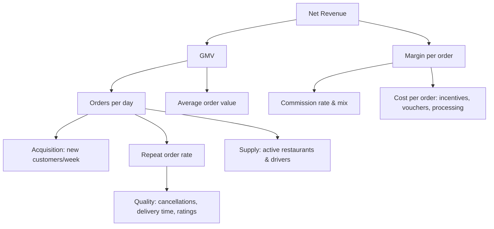
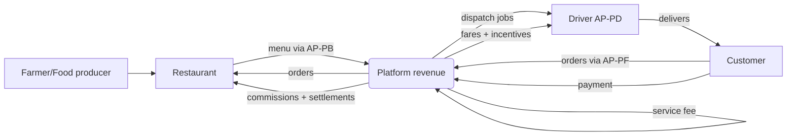
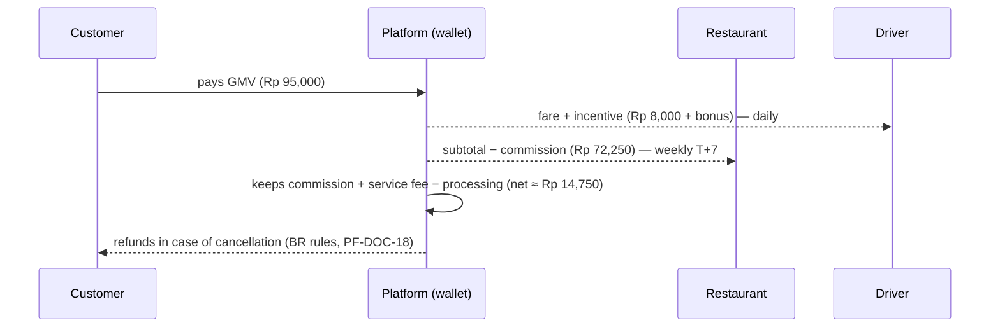

# PF-DOC-03 — Business Analysis

| | |
|---|---|
| Document ID | PF-DOC-03 |
| Title | Business Analysis |
| Version | 1.0 |
| Status | Approved (review PF-REV-01, 2026-08-06) |
| Date | 2026-08-06 |
| Author | Product Manager / Principal Architect |
| References | PF-DOC-01 (vision), PF-DOC-02 (products); successors PF-DOC-04 (competition), PF-DOC-18 (business rules), PF-DOC-26 (release), PF-DOC-27 (monitoring) |

---

## 1. Purpose

This document analyses the **business model, economics, value chain, revenue streams and
KPIs** of the PareFood Platform. It defines the money rules that PF-DOC-18 turns into
enforceable business rules, and the metrics that PF-DOC-27 monitors.

## 2. Objectives

1. Define a viable, fair business model for all four products.
2. Define the value chain and where value is created/captured.
3. Set unit economics with target numbers for MVP.
4. Define revenue streams, cost structure and settlement/payout model.
5. Define the KPI tree consumed by PF-DOC-27 monitoring and PF-DOC-25 roadmap.

## 3. Requirements

### 3.1 Business Model

Marketplace model: PareFood Platform connects demand (customers) with supply (restaurants
and drivers). The platform earns a **commission per delivered order** plus **service fees**,
and charges optional **promotion fees** to merchants. Drivers earn **delivery fares**;
restaurants keep order revenue **minus commission**.

### 3.2 Revenue Streams

| Stream | Payer | Description | Default rate (MVP) |
|---|---|---|---|
| Restaurant commission | Restaurant | % of order subtotal on fulfilled orders | 15% standard, 20% premium tier (config in PF-DOC-18) |
| Delivery fare | Customer | Base + distance fee; paid to driver (platform passes through) | Base Rp 6,000 + Rp 2,000/km (configurable) |
| Service fee | Customer | Fixed fee per order | Rp 2,000 (configurable) |
| Promotion fees | Restaurant | Featured listings, banners | Rate card in PF-DOC-18 |
| Driver subscription/fee | Driver | Optional daily earnings insurance/insurance product (post-MVP) | Future (PF-DOC-29) |

### 3.3 Cost Structure

| Cost item | Nature | MVP target |
|---|---|---|
| Driver incentives | Variable | ≤ 3% of GMV |
| Customer promos/vouchers | Variable | ≤ 5% of GMV |
| Payment processing | Per transaction | 1.5–2.5% of GMV |
| Cloud (Supabase + CDN) | Fixed + scale | Rp 8–15 M/month at pilot scale |
| Support & operations | Fixed | 2 FTE at pilot |
| Insurance & compliance | Fixed | Legal + insurance premium |

### 3.4 Unit Economics (per delivered order, MVP targets)

| Line | Default | Formula/Note |
|---|---|---|
| Order subtotal (AOV) | Rp 85,000 | Avg order value |
| Delivery fee (customer) | +Rp 8,000 | Base + 1 km distance |
| Service fee | +Rp 2,000 | Fixed |
| **Customer pays (GMV)** | **Rp 95,000** | Sum of above |
| Restaurant commission | −Rp 12,750 | 15% × subtotal |
| Driver fare paid | −Rp 8,000 | Full delivery fee passed through |
| Payment processing | −Rp 1,900 | ~2% of GMV |
| Platform net revenue | +Rp 14,750 | Commission + service fee − processing |
| Voucher cost (avg) | −Rp 3,000 | Promo budget per order |
| **Contribution margin** | **≈ +Rp 11,750** | Net revenue − voucher cost (no COGS) |

Target: **positive contribution margin per order from day one**; gross margin (after fixed
ops) turns positive at ≈ 300 orders/day in pilot city.

### 3.5 Settlement & Payout Model

- **Restaurants**: weekly settlement of (order revenue − commission − adjustments), T+7.
- **Drivers**: daily payout of fares + incentives to wallet, with instant top-up to bank/e-wallet.
- **PareAdmin finance**: runs reconciliation; rules and calculations in PF-DOC-18; wallet
  ledger in PF-DOC-13 (`wallets`, `wallet_transactions`).

### 3.6 KPI Tree (cascade)

### 3.7 Target KPIs (MVP pilot, 90-day)

| KPI | Target | Owner | Doc |
|---|---|---|---|
| Weekly active customers | 1,000 | Growth | PF-DOC-02 |
| Orders per day (steady state) | 250 | Ops | PF-DOC-27 |
| Repeat order rate (4-week) | 30% | Product | PF-DOC-02 |
| Median delivery time | < 35 min | Ops | PF-DOC-27 |
| Restaurant acceptance time | < 2 min | Ops | PF-DOC-18 |
| Driver acceptance rate | ≥ 70% | Ops | PF-DOC-02 |
| Commission mix (premium share) | ≥ 25% | Finance | PF-DOC-18 |
| Contribution margin per order | Positive | Finance | §3.4 |
| Cancellation rate | < 2% | Quality | PF-DOC-02 |
| App crash-free rate | ≥ 99.5% | Eng | PF-DOC-08 |

## 4. Diagrams

### 4.1 Value Chain

### 4.2 Money Flow per Order

## 5. Tables

### 5.1 Pricing Inputs (all configurable — see PF-DOC-18)

| Parameter | Default | Scope |
|---|---|---|
| Commission standard | 15% | Per restaurant config |
| Commission premium | 20% | Featured/instant visibility |
| Delivery base fee | Rp 6,000 | Per city |
| Delivery per-km | Rp 2,000 | Per km beyond free distance |
| Free delivery threshold | Rp 150,000 | Optional promo |
| Service fee | Rp 2,000 | Fixed |
| Voucher budget | ≤ 5% GMV | Promo pool |

### 5.2 Revenue Mix Target (Month 12)

| Stream | Share of platform net revenue |
|---|---|
| Restaurant commission | 72% |
| Service fees | 10% |
| Promotion fees | 13% |
| Other (penalty, insurance) | 5% |

## 6. Rules

- **BA-01** Platform must maintain positive contribution margin per order from MVP launch.
- **BA-02** Driver fare is always passed through in full; the platform never profits from
  fare discounts without an explicit, disclosed subsidy.
- **BA-03** Commission rate per restaurant is a contract attribute stored per merchant
  (PF-DOC-13 `restaurants`), never hard-coded.
- **BA-04** Settlement periods are fixed: restaurant T+7, driver daily.
- **BA-05** Every pricing/promo change must update PF-DOC-18 rules and PF-DOC-14 API
  payloads in the same change set.
- **BA-06** Voucher cost and incentives are capped by the finance guardrails in PF-DOC-18.

## 7. Checklist

- [ ] Unit economics model validated with finance stakeholder
- [ ] Pricing parameters agreed and owner assigned for PF-DOC-18
- [ ] Settlement model (T+7 restaurant, daily driver) approved
- [ ] KPI tree and owners defined; monitoring wiring in PF-DOC-27
- [ ] Revenue/cost assumptions added to PF-DOC-26 release gates

## 8. Risks

| Risk | Likelihood | Impact | Mitigation |
|---|---|---|---|
| Commission too high drives merchants to competitors | Medium | High | Transparent rate card; premium tier value first |
| Driver supply shortage at pilot scale | High | High | Incentive budget with hard cap (BA-06) |
| Voucher churn (paying full-price users leave) | Medium | Medium | Voucher targeting + repeat-rate tracking |
| Payment processing costs erode margin | Medium | Medium | Negotiate PSP rates; wallet float (PF-DOC-29) |
| Fraud (fake orders, coupon abuse) | Medium | High | Security + fraud rules in PF-DOC-18/19 |

## 9. Future Improvements

- Own wallet/float to reduce processing costs (PF-DOC-29).
- Subscription tiers (ParePro) for frequent customers.
- Ads/ranked discovery as a merchant revenue stream.
- Driver insurance product sold in-app.
- Loyalty & gamification to lift repeat rate.
