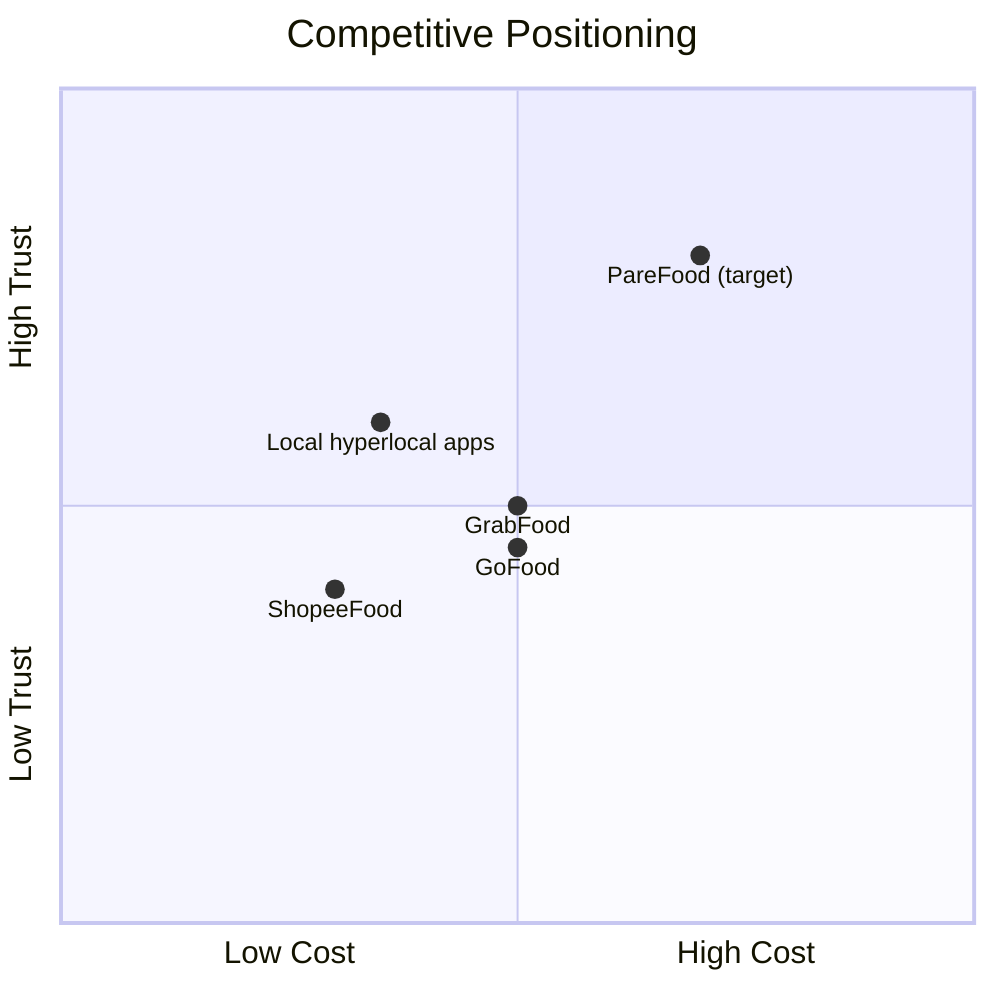

# PF-DOC-04 — Competitor Analysis

| | |
|---|---|
| Document ID | PF-DOC-04 |
| Title | Competitor Analysis |
| Version | 1.0 |
| Status | Approved (review PF-REV-01, 2026-08-06) |
| Date | 2026-08-06 |
| Author | Product Manager |
| References | PF-DOC-01 (vision), PF-DOC-02 (products), PF-DOC-03 (business); successors PF-DOC-05 (target users), PF-DOC-07 (FRs), PF-DOC-29 (expansion) |

---

## 1. Purpose

This document analyses the competitive landscape for food delivery in the target market
(Indonesia) to define the **differentiation strategy** for PareFood. It directly shapes
feature priority (PF-DOC-07), user experience (PF-DOC-15) and roadmap (PF-DOC-25).

## 2. Objectives

1. Map direct and indirect competitors across all four product surfaces.
2. Compare feature sets, pricing, commission models and user experience.
3. Identify PareFood's defensible differentiation.
4. Define competitive response playbooks.
5. Provide input for PF-DOC-05 personas and PF-DOC-07 FR priorities.

## 3. Requirements

### 3.1 Competitive Landscape

| Segment | Direct competitors | Indirect / future threats |
|---|---|---|
| Aggregator food delivery | GrabFood, GoFood, ShopeeFood | TikTok Shop (food), Uber Eats (if re-entry), niche hyperlocal apps |
| Direct restaurant ordering | Restaurant own apps / WhatsApp ordering | Ordering via social channels |
| Dark kitchens / cloud kitchens | Cloud kitchen platforms | Restaurant-owned delivery fleets |
| Driver gig platforms | Grab, Gojek | General courier apps (JNE, SiCepat) |

### 3.2 Competitor Feature Comparison — Customer App

| Capability | PareFood (MVP) | GrabFood | GoFood | ShopeeFood |
|---|---|---|---|---|
| Live order tracking | Yes | Yes | Yes | Yes |
| Live driver map | Yes (MVP) | Yes | Yes | Yes |
| Scheduled ordering | No (future) | Yes | Yes | Yes |
| Group ordering | No (future) | Yes | Yes | Limited |
| E-wallet | Partner PSP | GrabPay | GoPay | ShopeePay |
| Cash on delivery | Yes | Yes | Yes | Yes |
| Reviews of restaurant | Yes | Yes | Yes | Yes |
| Reviews of driver | Yes | Yes | Limited | Limited |
| Premium/loyalty | No (future) | Yes | Yes | Yes |
| Food safety labelling | Plan (PareHygiene, PF-DOC-29) | Partial | Partial | No |

### 3.3 Merchant (Restaurant) Comparison

| Capability | PareFood (PareBisnis) | GrabFood | GoFood | ShopeeFood |
|---|---|---|---|---|
| Self-service menu mgmt | Yes | Yes | Yes | Yes |
| Commission transparency | High (15–20% card) | Opaque, 20–30% typical | Opaque | Opaque |
| Daily sales analytics | Yes | Yes | Yes | Yes |
| Settlement period | T+7 fixed | Variable | Variable | Variable |
| No exclusive lock-in | Yes | No (exclusive in some tiers) | No | No |

### 3.4 Driver Comparison

| Capability | PareFood (PareDriver) | Grab | Gojek |
|---|---|---|---|
| Transparent fare formula | Yes (base + per-km, PF-DOC-18) | Partial | Partial |
| Daily payout to wallet | Yes | Yes | Yes |
| Fare passthrough guarantee | Yes (BA-02) | Partial | Partial |
| Acceptance freedom | Yes (no penalty tier at MVP) | Conditional | Conditional |
| In-app safety features | Plan (SOS, PF-DOC-29) | Yes | Yes |

### 3.5 Differentiation Strategy — "Fair Trade Food Delivery"

PareFood wins not on raw scale but on **fairness and transparency**, the emotional and
economic gap created by the incumbents:

1. **Transparent commissions** — public rate card (15% / 20%) instead of opaque contracts.
2. **Driver fare passthrough** — drivers always receive 100% of the delivery fee.
3. **Fair acceptance** — no punitive acceptance-rate systems at MVP.
4. **Food-quality signalling** — PareHygiene rating (hygiene score) as a trust layer.
5. **Local-first UX** — Indonesian payment habits, motorised delivery, Bahasa Indonesia.
6. **Single-family lock-in value** — one account ecosystem across all four apps.

These map to principles in PF-DOC-01 §3.6 and are validated in PF-DOC-05 research.

### 3.6 Competitive Response Playbook

| Threat | Detect (metric) | Response |
|---|---|---|
| Competitor subsidy war | Customer voucher cost rising above 5% GMV (BA-06) | Pause discounts; defend on quality/ETAs, not price |
| Merchant churn to exclusive deals | Commission mix drop or merchant suspension rate | Re-negotiate; emphasise non-exclusive, transparent terms |
| Driver poaching | Acceptance rate drop, driver churn | Improve earnings transparency & payout speed |
| Copycat "fair trade" positioning | Brand sentiment | Double down on verified, auditable transparency |

## 4. Diagrams

Positioning: PareFood deliberately targets the **high-trust, fair-price** quadrant rather
than the low-cost subsidy war.

## 5. Tables

### 5.1 Competitor Strength/Weakness Matrix

| Competitor | Strengths | Weaknesses PareFood can exploit |
|---|---|---|
| GrabFood | Scale, super-app, logistics | High commissions, opaque driver rules, app bloat |
| GoFood | Strong local brand, merchant tools | Opaque pricing, pressure for exclusivity |
| ShopeeFood | Voucher power, price sensitivity | Weak trust/safety narrative, food quality control |
| WhatsApp ordering | Familiarity, zero commission | No discovery, no tracking, no trust, manual chaos |

### 5.2 Battlecard by Product Surface

| Surface | Our weapon | Parry |
|---|---|---|
| Customer | Live tracking + transparent fees + PareHygiene | "You always know what you pay" |
| Restaurant | 15% card, T+7, no exclusivity | "Own your business, keep your channel" |
| Driver | Fare passthrough, daily payout, no penalty | "Your earnings, your rules" |
| Operator | Full admin control + auditability | "We can show our work" |

## 6. Rules

- **CA-01** PareFood never enters a pure price war; voucher budget is capped (BA-06).
- **CA-02** All commission and fee claims in marketing must match PF-DOC-18 numbers exactly
  (marketing truth rule).
- **CA-03** Competitor features may influence prioritisation only after business case review
  (PF-DOC-03), never by mimicry alone.
- **CA-04** The differentiation statement ("Fair Trade Food Delivery") is reviewed quarterly
  against real sentiment data.

## 7. Checklist

- [ ] Competitor matrix reviewed with market research
- [ ] Differentiation strategy approved by stakeholders
- [ ] Response playbook triggers wired into PF-DOC-27 metrics
- [ ] Marketing truth rule (CA-02) accepted by finance + marketing
- [ ] Personas in PF-DOC-06 aligned with differentiation segments

## 8. Risks

| Risk | Likelihood | Impact | Mitigation |
|---|---|---|---|
| Competitor subsidy war erodes demand | High | High | Defend on trust/quality; cap spend (CA-01) |
| Incumbents copy "fair trade" positioning | Medium | Medium | Make transparency auditable and verifiable (CA-04) |
| Small market share → poor discovery for users | High | Medium | Hyperlocal pilot city focus (PF-DOC-25) |
| Merchant multi-homing favours big platforms | Medium | High | Non-exclusive terms + PareBisnis tool quality |

## 9. Future Improvements

- Quarterly competitor benchmark report (repeat this analysis on a cadence).
- Win/loss analysis for merchant and driver signups.
- Price-sensitivity research per city before expansion (PF-DOC-29).
