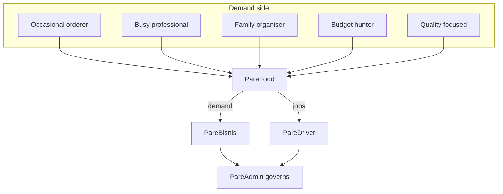

# PF-DOC-05 — Target Users

| | |
|---|---|
| Document ID | PF-DOC-05 |
| Title | Target Users |
| Version | 1.0 |
| Status | Approved (review PF-REV-01, 2026-08-06) |
| Date | 2026-08-06 |
| Author | Product Manager |
| References | PF-DOC-01 (vision), PF-DOC-02 (products), PF-DOC-04 (competition); successor PF-DOC-06 (personas) |

---

## 1. Purpose

This document defines **who the PareFood Platform serves** across its four products. It
segments the market, describes each segment's needs and behaviours, and provides the
evidence basis for personas (PF-DOC-06) and requirement priorities (PF-DOC-07).

## 2. Objectives

1. Define the four user segments (customer, restaurant, driver, operator) precisely.
2. Sub-segment each group with demographics, behaviours and needs.
3. Define channel and device realities for each segment.
4. Prioritise segments for MVP (who we serve first and hardest).
5. Provide recruitment criteria for research and beta testing.

## 3. Requirements

### 3.1 Primary Segments

| Segment | Product | Role in ecosystem |
|---|---|---|
| S1 — Food customer | AP-PF | Demands food; supplies money |
| S2 — Restaurant merchant | AP-PB | Supplies food; captures demand |
| S3 — Delivery driver | AP-PD | Supplies delivery capacity |
| S4 — Platform operator | AP-PA | Governs & operates the platform |

### 3.2 Segment Detail — S1 Food Customer

| Attribute | Description |
|---|---|
| Geography (MVP) | Pilot city (mid-size Indonesian city, e.g. Pare-Pare, Sulawesi), later 5 cities |
| Age | 18–45 |
| Behaviour | Orders 2–4×/month average; heavy users 2–3×/week; peak lunch (11–14) & dinner (17–21) |
| Payment habits | E-wallet ~45%, COD ~35%, card/VA ~20% (national averages; config per city) |
| Key needs | Fast delivery, fair price, food quality confidence, order safety (no wrong order) |
| Pain points | Wrong/missing items, cold food, silent cancellations, opaque fees |
| Device | Android-dominant (~85%), mid-range devices, data-sensitive (offline resilience matters) |
| Channels to reach | Social media, referral, driver/merchant word-of-mouth |

Sub-segments: **Occasional orderer**, **Busy professional**, **Family organiser**,
**Budget-hunter**, **Quality-focused** — profiled fully in PF-DOC-06.

### 3.3 Segment Detail — S2 Restaurant Merchant

| Attribute | Description |
|---|---|
| Business profile | Independent restaurants, food stalls, cloud kitchens; 1 branch (MVP), 5–50 employees |
| Volume | 10–150 orders/day across all channels |
| Goals | More orders without disproportionate commission; easy menu/order management; predictable settlement |
| Pain points | Opaque commissions, locked-in exclusivity, complicated dashboards, slow payouts |
| Digital maturity | Varies: 30% very digital, 50% basic smartphone use, 20% need hand-holding |
| Device | Android smartphone primarily; sometimes tablet for order screen |
| Support need | Onboarding assistance; Bahasa Indonesia support; WhatsApp contact |

### 3.4 Segment Detail — S3 Delivery Driver

| Attribute | Description |
|---|---|
| Profile | 20–45, motorised (motorcycle majority), part-time (45%) and full-time (55%) |
| Work pattern | Peak shifts lunch & dinner; prefers short distance jobs (< 5 km) |
| Goals | Predictable earnings, transparent fares, fast payout, safety, flexible hours |
| Pain points | Opaque fare formulas, punitive acceptance systems, delayed payout, unfair deactivation |
| Device | Android smartphone, single device; power/data constraints |
| Skill | Comfortable with maps apps; needs large-touch, glanceable UI (see PF-DOC-15) |

### 3.5 Segment Detail — S4 Platform Operator

| Attribute | Description |
|---|---|
| Profile | PareFood internal staff: ops, finance, support, super-admin |
| Roles (MVP) | Operator (moderation/verification), Finance (payouts/reconciliation), Super-admin (system) |
| Goals | Efficient verification, fraud/quality control, accurate money handling, clear reporting |
| Pain points | Scattered tools, manual reconciliation, no audit trail, slow lookups |
| Device | Desktop web (Flutter Web, AP-PA); must be fast with large tables |

### 3.6 Segment Prioritisation (MVP)

| Priority | Segment | Rationale |
|---|---|---|
| P0 | S1 Customer | Demand is the flywheel engine |
| P0 | S3 Driver | Delivery supply unlocks order fulfilment |
| P0 | S2 Merchant | Menu supply enables orders |
| P1 | S4 Operator | Enables governance; must exist before scale |

All four are mandatory for MVP (PF-DOC-02 PR-04), but UX depth investment order is
S1 > S3 > S2 > S4.

### 3.7 Design Considerations from Segment Data

| Finding | Consequence (document) |
|---|---|
| Android-dominant, mid-range devices | Performance targets in PF-DOC-08; image sizes in PF-DOC-13 |
| Data-sensitive users | Offline caching strategy in PF-DOC-11 |
| Glanceable driver UI | Driver UX patterns in PF-DOC-15 |
| Bahasa Indonesia primary | i18n strategy in PF-DOC-16, string catalogs |
| COD significant at MVP | Payment flow + COD rules in PF-DOC-18 |

## 4. Diagrams

## 5. Tables

### 5.1 Segment Summary

| Segment | Product | MVP priority | Size (pilot city est.) | Primary need |
|---|---|---|---|---|
| S1 Customer | AP-PF | P0 | 50k addressable HH | Fast, trustworthy delivery |
| S2 Merchant | AP-PB | P0 | 150 food businesses | Orders + fairness |
| S3 Driver | AP-PD | P0 | 200 gig drivers | Predictable income |
| S4 Operator | AP-PA | P1 | 10 staff | Control + audit |

### 5.2 Reach Strategy by Segment

| Segment | Onboarding channel | Retention lever |
|---|---|---|
| S1 | Social, referral, launch promos | Repeat-rate programs, live tracking |
| S2 | Field onboarding team, WhatsApp | Sales analytics, T+7 payout reliability |
| S3 | Driver communities, word-of-mouth | Daily payout, fare transparency |
| S4 | Internal | Admin UX quality, audit tools |

## 6. Rules

- **TU-01** All research and personas must use Bahasa Indonesia interview scripts.
- **TU-02** Segment definitions freeze for the MVP; changes require Product Committee sign-off.
- **TU-03** Any FR (PF-DOC-07) must state which segment it serves; features without a segment
  are deprioritised.
- **TU-04** Accessibility is a design requirement for all segments, notably S3 (glanceable UI).
- **TU-05** New cities (PF-DOC-29) require re-validation of segment assumptions (payment mix,
  vehicle mix, price sensitivity).

## 7. Checklist

- [ ] Segment definitions validated with market research
- [ ] Personas (PF-DOC-06) cover all four segments
- [ ] FRs (PF-DOC-07) traceable to segments
- [ ] Pilot city selection aligns with §5.1 sizing
- [ ] Research evidence logged and stored for audit

## 8. Risks

| Risk | Likelihood | Impact | Mitigation |
|---|---|---|---|
| Segment assumptions wrong for pilot city | Medium | High | Field research + pilot KPIs (PF-DOC-03) |
| Merchant segment too diverse to serve | Medium | Medium | MVP targets independent restaurants only |
| COD abuse (refused/phantom orders) | Medium | Medium | COD limits + fraud rules (PF-DOC-18/19) |
| Driver churn if earnings disappoint | High | High | Fare transparency + daily payout (BA-02/04) |

## 9. Future Improvements

- Segment analytics enrichment (RFM segmentation in data warehouse — PF-DOC-29).
- International market segments (later).
- Additional verticals' segments (grocery, parcel — PF-DOC-29).
