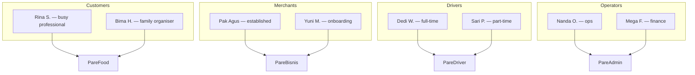

# PF-DOC-06 — User Personas

| | |
|---|---|
| Document ID | PF-DOC-06 |
| Title | User Personas |
| Version | 1.0 |
| Status | Approved (review PF-REV-01, 2026-08-06) |
| Date | 2026-08-06 |
| Author | Product Manager / UX Architect |
| References | PF-DOC-01 (vision), PF-DOC-05 (target users); successors PF-DOC-07 (FRs), PF-DOC-15 (UX), PF-DOC-16 (design) |

---

## 1. Purpose

This document profiles **representative users** for each of the four products, giving the
team concrete, named people to design and build for. Personas are the human interface
between segment data (PF-DOC-05) and requirements (PF-DOC-07).

## 2. Objectives

1. Create one primary persona per product (4) plus supporting personas.
2. Ground each persona in PF-DOC-05 segment data.
3. Define goals, frustrations, key scenarios and feature expectations per persona.
4. Provide acceptance lenses: "would Rina be able to do X in this UI?"
5. Ensure every FR in PF-DOC-07 is traceable to at least one persona.

## 3. Requirements

### 3.1 Persona Index

| # | Name | Segment | Product | Role |
|---|---|---|---|---|
| P1 | Rina S. | S1 busy professional | AP-PF | Primary customer |
| P2 | Bima H. | S1 family organiser | AP-PF | Secondary customer |
| P3 | Pak Agus | S2 merchant | AP-PB | Primary merchant |
| P4 | Yuni M. | S2 merchant (new) | AP-PB | Onboarding merchant |
| P5 | Dedi W. | S3 driver | AP-PD | Primary driver |
| P6 | Sari P. | S3 driver (part-time) | AP-PD | Secondary driver |
| P7 | Nanda O. | S4 operator | AP-PA | Primary operator |
| P8 | Mega F. | S4 finance | AP-PA | Finance operator |

### 3.2 P1 — Rina S. (Primary Customer, AP-PF)

| Attribute | Detail |
|---|---|
| Demographics | 29, project manager at a telco, lives alone in an apartment |
| Device | Android (Samsung A-series), on mobile data mostly |
| Behaviour | Orders 2–3×/week, mostly dinner after office; uses e-wallet (DANA) |
| Goals | Dinner in 35 min; never pay hidden fees; avoid wrong/cold orders |
| Frustrations | Apps that show cheap price then add fees at checkout; cancelled orders; no live driver info |
| Key scenarios | 1) Order dinner from favourite nasi padang. 2) Reorder last week's order. 3) Track driver live. 4) Pay via e-wallet. |
| Feature expectations | Live tracking, transparent fee breakdown (PF-DOC-03), reorder, COD fallback, notifications |
| FR trace | FR-ORDER-*, FR-PAY-*, FR-NOTIF-* |
| Acceptance lens | Rina must reach checkout in ≤ 5 taps from home screen with full fee transparency |

### 3.3 P2 — Bima H. (Secondary Customer, AP-PF)

| Attribute | Detail |
|---|---|
| Demographics | 38, office worker, family of 4 in a suburban house |
| Behaviour | Orders for family 2×/week; price-sensitive; prefers COD |
| Goals | Feed family reliably; keep budget predictable; find family-sized portions |
| Frustrations | High delivery fees on small orders; no family meal combos; fear of wrong items |
| Feature expectations | Search/filter by category, promo codes, delivery-fee-free threshold (PF-DOC-03), order notes |
| FR trace | FR-DISC-*, FR-CART-*, FR-PAY-* |

### 3.4 P3 — Pak Agus (Primary Merchant, AP-PB)

| Attribute | Detail |
|---|---|
| Demographics | 45, owner of "Nasi Campur Agus" (family business, 4 staff), one branch |
| Device | Android smartphone; tablet as order screen during service |
| Behaviour | Runs kitchen himself; needs fast accept/decline; checks sales at night |
| Goals | More orders without 25% commissions; zero confusion in order management; predictable weekly settlement |
| Frustrations | Opaque fees, being pushed into exclusive deals, cluttered dashboards, delayed payouts |
| Key scenarios | 1) Update today's special menu. 2) Accept an order and set prep time. 3) Mark order ready. 4) Read daily sales. |
| Feature expectations | Simple menu editor, order sound + accept timer (PF-DOC-18), daily analytics, T+7 settlement view |
| FR trace | FR-MENU-*, FR-ORD-*, FR-ANA-*, FR-FIN-* |
| Acceptance lens | Pak Agus must accept an order in ≤ 2 taps without leaving the order screen |

### 3.5 P4 — Yuni M. (Onboarding Merchant, AP-PB)

| Attribute | Detail |
|---|---|
| Demographics | 31, opened a cloud kitchen 6 months ago |
| Behaviour | Digitally native, wants to scale to 2 branches later |
| Goals | Fast approval, easy document upload, clear commission agreement |
| Frustrations | Long verification queues, unclear requirements, no status feedback |
| Feature expectations | Document upload with status tracking (PF-DOC-12 Storage), verification checklist, WhatsApp support |
| FR trace | FR-ONB-*, FR-VER-* |

### 3.6 P5 — Dedi W. (Primary Driver, AP-PD)

| Attribute | Detail |
|---|---|
| Demographics | 27, full-time driver, works 9h/day incl. lunch & dinner peaks |
| Device | Android, battery bank always with him; glanceable UI mandatory |
| Behaviour | Stays in one zone; targets 15–20 deliveries/day; checks earnings hourly |
| Goals | Predictable daily income, no surprise deductions, quick payouts, safe jobs |
| Frustrations | Hidden fare math, penalty for declining, long waits at restaurants, no destination preview |
| Key scenarios | 1) Go online. 2) Accept a job; view fare + distance. 3) Navigate to restaurant. 4) Verify pickup code. 5) Deliver with photo. 6) View today's earnings. |
| Feature expectations | Fare formula visible, pickup code verification, photo proof, daily earnings widget, navigation handoff |
| FR trace | FR-DRIV-*, FR-FIN-*, FR-GEO-* |
| Acceptance lens | Dedi must see fare + distance before accepting and start a job in ≤ 3 taps |

### 3.7 P6 — Sari P. (Part-time Driver, AP-PD)

| Attribute | Detail |
|---|---|
| Demographics | 24, student; drives evenings/weekends |
| Behaviour | Chooses short jobs (< 4 km), cares about safety |
| Goals | Top-up pocket money; never forced to accept; feel safe |
| Feature expectations | Distance filter, acceptance freedom (CA-04), SOS (future, PF-DOC-29) |
| FR trace | FR-DRIV-*, FR-NOTIF-* |

### 3.8 P7 — Nanda O. (Primary Operator, AP-PA)

| Attribute | Detail |
|---|---|
| Demographics | 30, ops lead, owns merchant verification & daily operations |
| Device | Desktop web (Flutter Web) |
| Behaviour | Processes 50+ verifications/day; investigates escalations; uses dashboards |
| Goals | Clear queues, fast lookups, full audit trail, force-cancel with reasons |
| Frustrations | Paginated lookups, no audit trail, manual reconciliation |
| Feature expectations | Search by order/user ID, verification queue with doc preview, audit log (PF-DOC-19), live order board |
| FR trace | FR-ADMIN-*, FR-AUD-* |

### 3.9 P8 — Mega F. (Finance Operator, AP-PA)

| Attribute | Detail |
|---|---|
| Demographics | 35, finance analyst |
| Behaviour | Runs weekly settlement & reconciliation against PSP reports |
| Goals | 100% payout accuracy, 24 h reconciliation, error-proof math |
| Feature expectations | Settlement reports (gross/commission/net), payout status, ledger export |
| FR trace | FR-FIN-*, FR-ADMIN-* |

## 4. Diagrams

## 5. Tables

### 5.1 Persona → Requirement Ownership

| Persona | Primary FR areas (PF-DOC-07) | UX lens (PF-DOC-15) |
|---|---|---|
| P1 Rina | ORDER, PAY, NOTIF, GEO | ≤ 5 taps to checkout; fee transparency |
| P2 Bima | DISC, CART, PAY | Family bundles, free-delivery threshold |
| P3 Pak Agus | MENU, ORD, ANA, FIN | ≤ 2 taps accept; glanceable order screen |
| P4 Yuni | ONB, VER | Guided upload + status |
| P5 Dedi | DRIV, FIN, GEO | Fare visible pre-accept; ≤ 3 taps to start |
| P6 Sari | DRIV, NOTIF | Short-job filter, acceptance freedom |
| P7 Nanda | ADMIN, AUD | Search-first, audit trail |
| P8 Mega | FIN, ADMIN | Settlement accuracy, export |

### 5.2 Persona Validation Criteria

| Criterion | Standard |
|---|---|
| Research-backed | Each persona derived from ≥ 3 real interviews (PF-DOC-05 §3.6) |
| Actionable | Each persona influences ≥ 3 FRs in PF-DOC-07 |
| Distinct | No two personas serve identical jobs (checked annually) |
| Current | Refreshed every 12 months or on market shift |

## 6. Rules

- **PS-01** Design and requirement decisions must be validated against personas; "would P1
  do this?" is a required review question.
- **PS-02** Personas are treated as living artefacts; changes require Product Committee
  approval and re-trace of affected FRs.
- **PS-03** No persona may contradict segment data in PF-DOC-05; conflicts are resolved by
  new research.
- **PS-04** Accessibility constraints of P5 (glanceable UI) apply platform-wide.

## 7. Checklist

- [ ] 8 personas documented and approved
- [ ] Each persona linked to ≥ 3 FRs in PF-DOC-07
- [ ] Persona → segment trace verified against PF-DOC-05
- [ ] Acceptance lenses recorded and testable
- [ ] Review date set (12 months)

## 8. Risks

| Risk | Likelihood | Impact | Mitigation |
|---|---|---|---|
| Personas based on assumptions, not data | Medium | High | Interview evidence requirement (PS-01) |
| Persona overload slows decisions | Low | Medium | 8-persona cap; primary personas per product |
| Personas stale after market shifts | Medium | Medium | Annual refresh rule (PS-02) |
| Conflicting persona needs (e.g., COD vs. cashless) | Medium | Low | Trade-off rules in PF-DOC-07 prioritisation |

## 9. Future Improvements

- Persona journey maps (aligned with PF-DOC-15 user flows).
- Service blueprints for onboarding & delivery operations.
- Job-to-be-done interviews feeding PF-DOC-29 roadmap.
