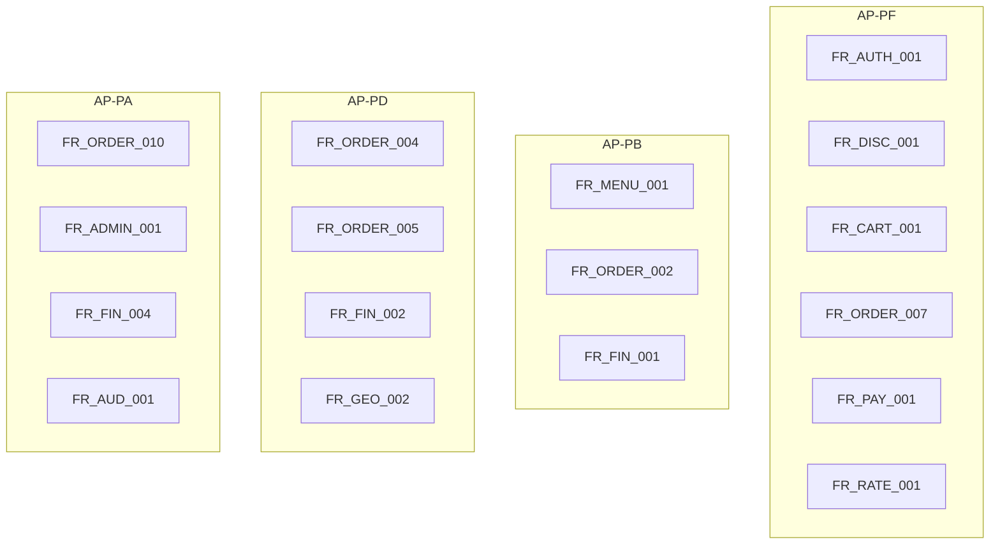
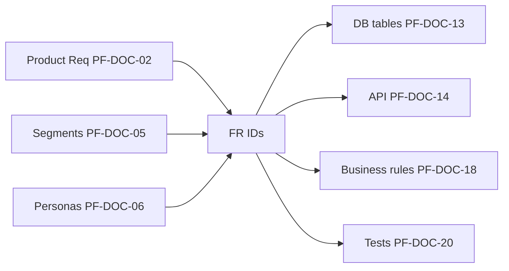

# PF-DOC-07 — Functional Requirements

| | |
|---|---|
| Document ID | PF-DOC-07 |
| Title | Functional Requirements |
| Version | 1.1 |
| Status | Approved (review PF-REV-01, 2026-08-06) |
| Date | 2026-08-06 |
| Author | Product Manager / Principal Architect |
| References | PF-DOC-02 (products), PF-DOC-05 (segments), PF-DOC-06 (personas), PF-DOC-18 (business rules); successors PF-DOC-14 (API), PF-DOC-13 (DB), PF-DOC-20 (tests) |

---

## 1. Purpose

This document is the **authoritative functional requirements catalogue** for the four
products. Every feature in PF-DOC-02 becomes a precise, testable requirement here. Each
FR is traceable to a persona (PF-DOC-06), a segment (PF-DOC-05), a priority (MoSCoW from
PF-DOC-02) and affected apps.

## 2. Objectives

1. Enumerate all MVP functional requirements with stable IDs (`FR-<Area>-<NNN>`).
2. Provide acceptance-ready, testable statements (verify/acceptance criteria).
3. Trace each FR to app(s), persona, priority and business rule where applicable.
4. Form the input set for PF-DOC-20 test cases and PF-DOC-25 sprint planning.
5. Establish a change-control process for requirement changes.

## 3. Requirements

### 3.1 ID & Priority Conventions

- Format: `FR-<Area>-<NNN>` where Area ∈ {AUTH, ONB, DISC, CART, ORDER, PAY, GEO, DRIV,
  MENU, FIN, NOTIF, RATE, ADMIN, ANA, AUD, PROMO}.
- Priority: **M**ust, **S**hould, **C**ould, **W**on't (MoSCoW per PF-DOC-02 §5.2).
- App codes: AP-PF, AP-PB, AP-PD, AP-PA (README global conventions).

### 3.2 Authentication & Onboarding (AUTH / ONB)

| ID | App(s) | Prio | Requirement | Acceptance criteria |
|---|---|---|---|---|
| FR-AUTH-001 | PF, PB, PD | M | Phone OTP + email/password registration & login (Supabase Auth, PF-DOC-12) | User signs up with phone or email; OTP verified; session persists across restart |
| FR-AUTH-002 | PF, PB, PD | M | Profile creation with name, phone, avatar, default role assignment | Role in `profiles` (PF-DOC-13) matches app; role changes only via verified flow |
| FR-AUTH-003 | PA | M | Admin login with role-based access (operator/finance/super-admin) | Only `admin` role signs into AP-PA; role-based menu in PF-DOC-17 |
| FR-AUTH-004 | PF, PB, PD | M | Secure logout & session revocation | Logout invalidates token; protected routes redirect (PF-DOC-17) |
| FR-AUTH-005 | PF, PB, PD | S | Password reset via email; phone change with re-verification | Reset link expires in 24 h (PF-DOC-19) |
| FR-AUTH-006 | PF, PB, PD | S | Multi-role account: one user may hold customer + driver + business roles (e.g., merchant who also orders) | Role selectable at login; roles in `user_roles` (PF-DOC-13); app guard uses effective role |
| FR-ONB-001 | PB | M | Merchant onboarding wizard: business info, address, documents (KTP, NIB) | Wizard completes in ≤ 10 min; uploads stored in Storage bucket `merchant-docs` (PF-DOC-12) |
| FR-ONB-002 | PB | M | Verification status tracking (pending/reviewed/approved/rejected) | Merchant sees status; notifications on change |
| FR-ONB-003 | PD | M | Driver onboarding: SIM, vehicle, bank account details | Documents stored in `driver-docs` bucket; status visible |
| FR-ONB-004 | PD | M | Go online/offline toggle with live location reporting (PF-DOC-12 Realtime) | Toggle updates `driver_locations.online` and streams `location` |
| FR-ONB-005 | PD | M | Driver document verification tracking (SIM, vehicle, bank) with per-document status | Per-document status in `driver_documents` (PF-DOC-13); driver notified on change |

### 3.3 Discovery & Catalog (DISC)

| ID | App(s) | Prio | Requirement | Acceptance criteria |
|---|---|---|---|---|
| FR-DISC-001 | PF | M | Location-based restaurant list (nearest first), lat/lng based | Results ordered by distance within delivery radius |
| FR-DISC-002 | PF | M | Search restaurants & menu items by text | Sub-second response on cached query (PF-DOC-08) |
| FR-DISC-003 | PF | M | Category filters (makanan/minuman etc.) & sorting (rating, ETA, distance) | Filters combine; sort stable |
| FR-DISC-004 | PF | M | Restaurant detail: menu, prices, images, hours, rating, ETA | Data from `restaurants`, `menu_*` tables (PF-DOC-13) |
| FR-DISC-005 | PF | M | Delivery ETA & fee preview before ordering | ETA within 2 min accuracy (PF-DOC-18) |
| FR-DISC-006 | PF | M | Favourites (restaurant bookmark) | Persisted; shown on home |
| FR-DISC-007 | PF | S | Recommended restaurants ("Untuk Kamu") | Ranking uses rating + popularity + distance |
| FR-DISC-008 | PF | S | One-tap reorder of previous order | Rebuilds cart from `orders` + `order_items` |
| FR-MENU-001 | PB | M | Menu CRUD: categories, items, price, image, availability | Changes propagate to customers ≤ 30 s (Realtime) |
| FR-MENU-002 | PB | M | Item out-of-stock toggle | Strikethrough in AP-PF; item cannot be added |
| FR-MENU-003 | PB | S | Bulk menu import (CSV) | Validated; error report returned |

### 3.4 Cart & Checkout (CART)

| ID | App(s) | Prio | Requirement | Acceptance criteria |
|---|---|---|---|---|
| FR-CART-001 | PF | M | Add/update/remove cart items with option groups & quantity | Cart persists across sessions; single-restaurant cart enforced |
| FR-CART-002 | PF | M | Checkout with fee breakdown (subtotal, delivery, service, promo, total) | Total equals PF-DOC-18 formula; breakdown visible pre-payment |
| FR-CART-003 | PF | M | Address selection from saved addresses or new input | Address validated + geocoded (PF-DOC-12 Geo) |
| FR-CART-004 | PF | M | Promo code entry & validation | Valid/invalid state; applies per PROMO rules (PF-DOC-18) |
| FR-CART-005 | PF | M | Delivery time estimate & restaurant closed handling | Order blocked when restaurant closed (PF-DOC-18 hours rules) |
| FR-CART-006 | PF | S | Price-change notice at checkout | If any menu price changed since add-to-cart (BR-REPRICE-001), show diff + require confirm before payment |

### 3.5 Order Lifecycle (ORDER)

| ID | App(s) | Prio | Requirement | Acceptance criteria |
|---|---|---|---|---|
| FR-ORDER-001 | PF, PB, PD, PA | M | Order state machine transitions (placed→accepted→preparing→ready→picked up→delivered; + cancelled) | Transitions only per PF-DOC-18 state machine; history recorded (`order_status_history`) |
| FR-ORDER-002 | PB | M | Incoming order screen with accept/decline and prep timer | Accept ≤ 2 taps; auto-timeout per BR (PF-DOC-18) |
| FR-ORDER-003 | PB | M | Mark order ready for pickup; trigger driver assignment | Ready event fires dispatch (PF-DOC-14 dispatch fn) |
| FR-ORDER-004 | PD | M | Job offer with fare, distance, restaurant, customer area | Accept/decline with confirm; acceptance freedom (CA-04) |
| FR-ORDER-005 | PD | M | Pickup code verification | 4-digit code checked server-side |
| FR-ORDER-006 | PD | M | Delivery proof: photo at drop-off | Photo stored in Storage; attached to `deliveries` |
| FR-ORDER-007 | PF | M | Live order status timeline + driver live location | Realtime subscription (PF-DOC-12) |
| FR-ORDER-008 | PF | M | Order cancellation flows per BR (customer before accept; system after timeouts) | Refund logic per PF-DOC-18 |
| FR-ORDER-009 | PF | M | Order history & detail with digital receipt | Read from `orders`; totals reconciled |
| FR-ORDER-010 | PA | M | Force-cancel order with reason (audit logged) | Requires operator auth + reason; writes audit log |
| FR-ORDER-011 | PA | M | Live order board with filters and ID lookup | Sub-second lookup; realtime updates |

### 3.6 Payments & Finance (PAY / FIN)

| ID | App(s) | Prio | Requirement | Acceptance criteria |
|---|---|---|---|---|
| FR-PAY-001 | PF | M | Payment methods: COD, e-wallet (PSP), card (PSP) | PSP abstraction; card/e-wallet via provider SDK (PF-DOC-14) |
| FR-PAY-002 | PF | M | Payment at order placement (non-COD) with payment intent | Idempotent charge; failure → order not placed |
| FR-PAY-003 | PF, PB, PD, PA | M | Refund/reversal handling per BR-REF rules (PF-DOC-18) | Refund recorded in `wallet_transactions` |
| FR-PAY-004 | PF, PD, PA | M | COD remittance & reconciliation: driver remits collected cash; cash value credited to driver wallet | Remittance recorded per BR-COD-001..004; COD totals reconciled vs remittances in `reconcile` |
| FR-FIN-001 | PB | M | Settlement preview: gross, commission, net (T+7) | Math matches PF-DOC-18 commission rules |
| FR-FIN-002 | PD | M | Earnings summary: today/week totals, per-delivery breakdown | Fare passthrough visible (BA-02) |
| FR-FIN-003 | PD | M | Driver wallet balance & payout request | Ledger-backed (`wallets`, `wallet_transactions`) |
| FR-FIN-004 | PA | M | Finance settlement run with approval workflow | Two-person rule (SEC rule PF-DOC-19) |
| FR-FIN-005 | PA | M | Reconciliation report vs PSP statements | ≤ 24 h reconciliation (PF-DOC-02 §3.6) |

### 3.7 Notifications (NOTIF)

| ID | App(s) | Prio | Requirement | Acceptance criteria |
|---|---|---|---|---|
| FR-NOTIF-001 | PF, PB, PD | M | Push notifications for order events (status change, job offer) | Realtime + APNs/FCM via Supabase Edge Function |
| FR-NOTIF-002 | PF, PB, PD | M | In-app notification centre with read/unread | Stored in `notifications` table |
| FR-NOTIF-003 | PF | M | Driver job offer notification when app in background | Works while driver offline → uses FCM data message |
| FR-NOTIF-004 | PF | S | Promo & reorder reminders (opt-in) | User can disable per category |
| FR-NOTIF-005 | PF, PB, PD | M | Device token registration & push preferences | Token upsert in `device_tokens` (PF-DOC-13) via `register-device-token`; per-user opt-out per type |

### 3.8 Ratings & Reviews (RATE)

| ID | App(s) | Prio | Requirement | Acceptance criteria |
|---|---|---|---|---|
| FR-RATE-001 | PF | M | Customer rates restaurant & driver (1–5 + comment) per delivered order | One review per order per target; editable ≤ 24 h |
| FR-RATE-002 | PB, PD | M | Aggregate rating display (avg + count) | Recomputed per BR (PF-DOC-18) |
| FR-RATE-003 | PA | M | Review moderation queue | Operators can hide abusive reviews (audit logged) |

### 3.9 Location & Geo (GEO)

| ID | App(s) | Prio | Requirement | Acceptance criteria |
|---|---|---|---|---|
| FR-GEO-001 | PF | M | GPS + map picker for delivery address | Coordinates stored with address |
| FR-GEO-002 | PD | M | Background location updates while online/delivering | Batched; RLS-scoped (PF-DOC-12) |
| FR-GEO-003 | PF | M | Distance & delivery-fee calculation per BR (PF-DOC-18) | Haversine/OSRM result matches rule |
| FR-GEO-004 | PA | M | Driver live-position view on map for active order | Realtime subscription |

### 3.10 Admin & Analytics (ADMIN / ANA / AUD / PROMO)

| ID | App(s) | Prio | Requirement | Acceptance criteria |
|---|---|---|---|---|
| FR-ADMIN-001 | PA | M | User search & management (view/suspend/restore) | Role-aware permissions (PF-DOC-19) |
| FR-ADMIN-002 | PA | M | Merchant verification queue (approve/reject with reason) | Decision writes audit log + notifies merchant |
| FR-ADMIN-003 | PA | M | Driver management (verify, suspend, payout review) | Same controls as merchant |
| FR-ANA-001 | PB | M | Daily sales + menu performance dashboard | Numbers match `orders` aggregation |
| FR-ANA-002 | PA | M | Platform analytics: orders, GMV, cancellations, peak hours | Meets KPI tree (PF-DOC-03 §3.6) |
| FR-AUD-001 | PA | M | Audit log viewer for admin actions & financial ops | All privileged actions logged (PF-DOC-19 SEC-AUD) |
| FR-PROMO-001 | PF, PA | M | Promo/voucher creation (admin), redemption (customer) | Rules enforced in PF-DOC-18 PROMO section |

## 4. Diagrams

### 4.1 FR → App Coverage

### 4.2 Traceability Model

## 5. Tables

### 5.1 FR Inventory Count

| Area | Total | MUST | SHOULD | COULD | WON'T (recorded) |
|---|---|---|---|---|---|
| AUTH/ONB | 11 | 9 | 2 | 0 | 0 |
| DISC/MENU | 11 | 8 | 3 | 0 | 1 |
| CART | 6 | 5 | 1 | 0 | 1 |
| ORDER | 11 | 11 | 0 | 0 | 1 |
| PAY/FIN | 9 | 9 | 0 | 0 | 1 |
| NOTIF | 5 | 5 | 0 | 0 | 0 |
| RATE | 3 | 3 | 0 | 0 | 0 |
| GEO | 4 | 4 | 0 | 0 | 1 |
| ADMIN/ANA/AUD/PROMO | 7 | 7 | 0 | 0 | 1 |
| **Total** | **67** | **61** | **6** | **0** | **6** |

### 5.2 FR → Business Rule Coverage (key links)

| FR | Business rule (PF-DOC-18) |
|---|---|
| FR-CART-002 | BR-PRICE fee formula |
| FR-ORDER-001 | BR-ORDER state machine |
| FR-ORDER-008 | BR-CANCEL refund matrix |
| FR-PAY-001 | BR-COD-001..004 (COD); PSP abstraction per PF-DOC-14 |
| FR-FIN-001 | BR-COMM commission |
| FR-FIN-002 | BR-FARE fare passthrough |
| FR-CART-004 | BR-PROMO voucher rules |
| FR-DISC-005 | BR-ETA estimation |

## 6. Rules

- **FR-R01** An FR exists only if it maps to ≥ 1 persona (PF-DOC-06) and a business rule or
  table in PF-DOC-13/18; otherwise it is deleted.
- **FR-R02** FR IDs never change; renames require supersede record (`FR-X-001 superseded by FR-Y-002`).
- **FR-R03** Priority changes (M/S/C/W) require Product Committee sign-off and impact the
  sprint plan (PF-DOC-25).
- **FR-R04** Each FR ships with acceptance criteria that become test cases (PF-DOC-20).
- **FR-R05** "WON'T" items are frozen for MVP; revival only via PF-DOC-29 backlog process.

## 7. Checklist

- [ ] All PF-DOC-02 must-have features have ≥ 1 FR
- [ ] Every FR has acceptance criteria and priority
- [ ] FR→persona→segment trace verified
- [ ] FR→business-rule→DB-table trace verified against PF-DOC-13/18
- [ ] WON'T list recorded; no silent additions

## 8. Risks

| Risk | Likelihood | Impact | Mitigation |
|---|---|---|---|
| FR churn during MVP | High | Medium | Change control (FR-R02/R03) |
| Underspecified acceptance criteria | Medium | High | Criteria reviewed by QA in PF-DOC-20 |
| Traceability breaks in large backlog | Medium | Medium | Central FR registry + automated trace checks (PF-DOC-21) |
| Cross-app FR conflicts (e.g., order state) | Medium | High | Single state machine owned in PF-DOC-18 |

## 9. Future Improvements

- Requirement management tooling (import/export of FR registry into Git).
- Automated traceability verification in CI (PF-DOC-21).
- FR coverage analytics in PF-DOC-27 dashboards.
