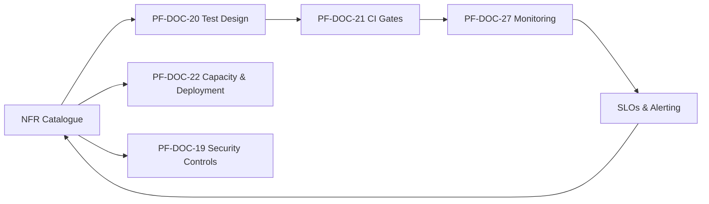
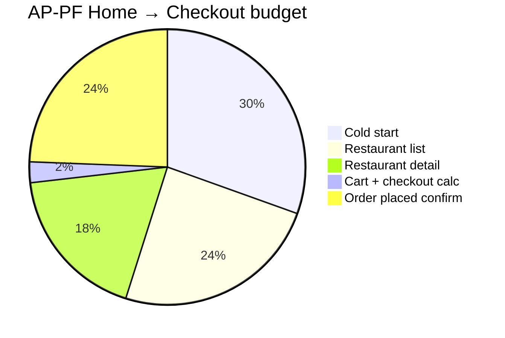

# PF-DOC-08 — Non-Functional Requirements

| | |
|---|---|
| Document ID | PF-DOC-08 |
| Title | Non-Functional Requirements |
| Version | 1.0 |
| Status | Approved (review PF-REV-01, 2026-08-06) |
| Date | 2026-08-06 |
| Author | Principal Architect / QA Lead |
| References | PF-DOC-01 (vision), PF-DOC-07 (FRs); successors PF-DOC-20 (testing), PF-DOC-21 (CI/CD), PF-DOC-22 (deployment), PF-DOC-27 (monitoring) |

---

## 1. Purpose

This document defines the **quality attributes** the PareFood Platform must meet:
performance, scalability, reliability, security, usability, compatibility, accessibility,
maintainability and compliance. NFRs are measurable and enforced by PF-DOC-20 testing,
PF-DOC-27 monitoring and PF-DOC-30 acceptance gates.

## 2. Objectives

1. Define measurable, testable NFRs with stable IDs (`NFR-<NNN>`).
2. Set quantitative targets for performance, reliability and scale.
3. Define device/OS compatibility and accessibility standards.
4. Define compliance requirements (financial, data protection).
5. Establish the NFR contract consumed by engineering and QA.

## 3. Requirements

### 3.1 Performance (NFR-PERF)

| ID | Requirement | Target (MVP) | Verification |
|---|---|---|---|
| NFR-001 | App cold start to interactive | ≤ 2.5 s on mid-range Android | Perf test in CI (PF-DOC-20) |
| NFR-002 | Screen navigation transition | ≤ 16 ms frame; 60 fps sustained | DevTools timeline |
| NFR-003 | Restaurant list load (cold, 50 results) | ≤ 2 s p95 | Load test |
| NFR-004 | Search query response | ≤ 300 ms p95 (cached) | Load test |
| NFR-005 | Checkout total calculation | ≤ 200 ms from cart tap to display | Unit/perf test |
| NFR-006 | Push notification delivery | ≤ 5 s from server emit to device | E2E test |
| NFR-007 | Live order status update visible | ≤ 2 s from DB write to client UI | Realtime test (PF-DOC-12) |
| NFR-008 | App binary size (Android) | ≤ 90 MB AAB upload size | CI check |
| NFR-009 | Network: offline resilience | App usable with cached data on network loss (browse, view cart) | Offline test |
| NFR-010 | Battery: background location | ≤ 2%/h drain during delivery shift | Device test |

### 3.2 Scalability (NFR-SCAL)

| ID | Requirement | Target (MVP→Year 1) | Verification |
|---|---|---|---|
| NFR-011 | Concurrent active users | 5k → 50k | Load test at 2× peak |
| NFR-012 | Peak orders/hour | 250/day → 1,000/day steady | Capacity plan (PF-DOC-27) |
| NFR-013 | DB read throughput | Postgres pools; paginated queries | Load test, query plans |
| NFR-014 | Realtime channel capacity | 10k concurrent sockets | Supabase Realtime limits check |
| NFR-015 | Horizontal scaling path | Supabase scale options documented (PF-DOC-22) | Runbook |

### 3.3 Reliability & Availability (NFR-REL)

| ID | Requirement | Target | Verification |
|---|---|---|---|
| NFR-016 | Service availability (backend) | 99.9% monthly | Uptime monitoring (PF-DOC-27) |
| NFR-017 | Crash-free sessions | ≥ 99.5% | Sentry (PF-DOC-27) |
| NFR-018 | Order data durability | Zero lost orders; ≥ 99.99% | Backups + audit (PF-DOC-28) |
| NFR-019 | Recovery Point Objective (RPO) | ≤ 15 min | Backup policy (PF-DOC-28) |
| NFR-020 | Recovery Time Objective (RTO) | ≤ 4 h | Restore runbook (PF-DOC-28) |
| NFR-021 | Idempotency of payment/order writes | No duplicate charges/orders | E2E tests (PF-DOC-20) |

### 3.4 Security (NFR-SEC)

| ID | Requirement | Target | Verification |
|---|---|---|---|
| NFR-022 | Authentication strength | MFA available for admin; OTP for users | PF-DOC-19 controls |
| NFR-023 | Data encryption in transit & at rest | TLS 1.2+; Supabase at-rest | Config + scan (PF-DOC-21) |
| NFR-024 | Row-level security enforced | All tables RLS-enabled (PF-DOC-12) | Policy review in CI |
| NFR-025 | Secrets management | No secrets in code/repo | Secret scan in CI (PF-DOC-21) |
| NFR-026 | Financial ops integrity | Two-person approval; audit trail | PF-DOC-18/19 |

### 3.5 Usability & Accessibility (NFR-UX)

| ID | Requirement | Target | Verification |
|---|---|---|---|
| NFR-027 | Task completion efficiency | Checkout ≤ 5 taps (persona P1); accept order ≤ 2 taps (P3); start job ≤ 3 taps (P5) | Usability tests (PF-DOC-15) |
| NFR-028 | Touch target size | ≥ 48 dp primary targets | Design review + lint |
| NFR-029 | Accessibility (Android TalkBack / iOS VoiceOver) | WCAG 2.1 AA for AP-PA; sensible labels for mobile apps | Audit in PF-DOC-20 |
| NFR-030 | Contrast ratio | ≥ 4.5:1 text (Material 3, PF-DOC-16) | Design token check |
| NFR-031 | Language | Bahasa Indonesia default; English secondary | i18n (PF-DOC-16) |

### 3.6 Compatibility (NFR-COMP)

| ID | Requirement | Target | Verification |
|---|---|---|---|
| NFR-032 | Android OS | Android 8.0+ (API 26+) | CI matrix |
| NFR-033 | iOS OS | iOS 15+ | CI matrix |
| NFR-034 | Web (AP-PA) | Chrome, Edge, Safari, Firefox latest 2 versions | Playwright tests |
| NFR-035 | Devices | < 2 GB RAM devices must run (lite mode) | Device lab |
| NFR-036 | Network | Works on 3G; degraded gracefully | Network shaping tests |

### 3.7 Maintainability (NFR-MNT)

| ID | Requirement | Target | Verification |
|---|---|---|---|
| NFR-037 | Test coverage (critical paths) | ≥ 80% line coverage on core/data packages | Coverage gate in CI (PF-DOC-21) |
| NFR-038 | Lint/format compliance | 0 analyzer errors; formatted per PF-DOC-23 | CI gate |
| NFR-039 | Dependency hygiene | `dart pub outdated` tracked; monthly review | Dependency bot (PF-DOC-28) |
| NFR-040 | Documentation currency | Docs updated with code; DoD gate (PF-DOC-30) | Review checklist |

### 3.8 Compliance (NFR-COMPL)

| ID | Requirement | Target | Verification |
|---|---|---|---|
| NFR-041 | Personal data protection (Indonesia UU PDP; GDPR-aligned) | Consent, export, deletion flows | Compliance review (PF-DOC-19) |
| NFR-042 | Financial records retention | 7 years (per regulations) | Archival policy (PF-DOC-28) |
| NFR-043 | Payment provider compliance (PCI DSS) | Card data never stored on our systems; PSP tokenisation | Security audit (PF-DOC-19) |
| NFR-044 | Terms & privacy documentation | In-app + web legal pages | Legal review |

## 4. Diagrams

### 4.1 NFR to Engineering Pipeline

### 4.2 Performance Budget (per key journey)

## 5. Tables

### 5.1 NFR Summary by Category

| Category | IDs | Count |
|---|---|---|
| Performance | NFR-001..010 | 10 |
| Scalability | NFR-011..015 | 5 |
| Reliability | NFR-016..021 | 6 |
| Security | NFR-022..026 | 5 |
| Usability/Accessibility | NFR-027..031 | 5 |
| Compatibility | NFR-032..036 | 5 |
| Maintainability | NFR-037..040 | 4 |
| Compliance | NFR-041..044 | 4 |
| **Total** | | **44** |

### 5.2 SLO Mapping (consumed by PF-DOC-27)

| SLO | NFR | Alert trigger |
|---|---|---|
| Backend availability 99.9% | NFR-016 | Uptime < 99.9% over 30 days |
| Crash-free 99.5% | NFR-017 | Crash-free < 99.5% (7-day window) |
| Median delivery < 35 min | NFR-005 (ops) | p75 > 40 min for 2 h |
| Notification latency < 5 s | NFR-006 | p95 > 8 s for 15 min |

## 6. Rules

- **NFR-R01** NFRs are mandatory; a feature that violates an NFR is not releasable.
- **NFR-R02** NFR IDs never change; changes are versioned (e.g., `NFR-011 v2`).
- **NFR-R03** NFR targets are verified in CI or on-call via monitoring; unverified NFRs are
  flagged in PF-DOC-30 gates.
- **NFR-R04** Trade-offs between NFRs (e.g., battery vs. realtime latency) require an ADR.
- **NFR-R05** Every release must demonstrate no NFR regression vs. the previous release.

## 7. Checklist

- [ ] All 44 NFRs have measurable targets
- [ ] Each NFR mapped to test/monitoring verification
- [ ] Performance budgets set for key journeys
- [ ] Compatibility matrix (OS/browser/device) approved
- [ ] SLO mapping completed for PF-DOC-27

## 8. Risks

| Risk | Likelihood | Impact | Mitigation |
|---|---|---|---|
| Perf targets unrealistic on mid-range devices | Medium | High | Device lab + budget reviews (NFR-001..010) |
| Realtime scale limits (Supabase) | Medium | Medium | Capacity planning + fallback (NFR-014) |
| Compliance scope grows (UU PDP/PCI) | Medium | High | Dedicated compliance checklist (NFR-041..044) |
| NFR regressions go unnoticed | Medium | High | CI perf gates + SLO alerting |

## 9. Future Improvements

- Continuous performance budget monitoring in CI.
- Annual accessibility audit against WCAG 2.2.
- Automated compliance evidence collection.
