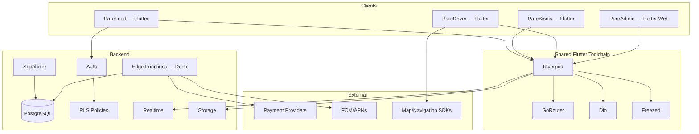
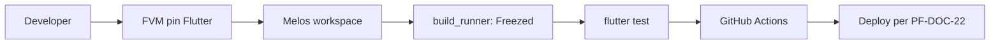

# PF-DOC-09 — Technical Stack

| | |
|---|---|
| Document ID | PF-DOC-09 |
| Title | Technical Stack |
| Version | 1.0 |
| Status | Approved (review PF-REV-01, 2026-08-06) |
| Date | 2026-08-06 |
| Author | Principal Architect |
| References | PF-DOC-01 (vision), PF-DOC-08 (NFRs); successors PF-DOC-10 (monorepo), PF-DOC-11 (Flutter arch), PF-DOC-12 (Supabase arch) |

---

## 1. Purpose

This document defines the **technology stack** for the PareFood Platform, with
justification, version pinning policy, and alternatives considered. It is the contract
between architecture and implementation: teams use exactly these technologies, no
substitutes without an ADR.

## 2. Objectives

1. Define the approved stack across client, backend, database, tooling and operations.
2. Justify every major choice against PF-DOC-01 vision and PF-DOC-08 NFRs.
3. Document rejected alternatives and the reasons.
4. Define version pinning and update policy.
5. Define the ADR process for any future stack change.

## 3. Requirements

### 3.1 Approved Stack Summary

| Layer | Technology | Version/pinning | Purpose |
|---|---|---|---|
| Mobile/web client | Flutter Stable | Pinned via FVM (`fvm flutter`) | All four apps; one codebase |
| Language | Dart | Pinned with Flutter SDK | App logic |
| State management | Riverpod | Pinned via pubspec | Dependency-injected reactive state |
| Routing | GoRouter | Pinned | Declarative navigation (PF-DOC-17) |
| Networking | Dio | Pinned | HTTP/typed requests |
| Code generation | Freezed / build_runner | Pinned | Immutable models & unions |
| Backend platform | Supabase (managed) | Supabase region + version policy | Auth, DB, Storage, Realtime, Edge Functions |
| Database | PostgreSQL | Supabase-managed (PG 16) | System of record |
| Edge Functions | Supabase Edge (Deno) | Versioned in monorepo `backend/` | Business-critical logic, webhooks, payments |
| Payments | PSP abstraction | Config per env (Xendit/Midtrans/Stripe refs) | Charging, refunds, payout API |
| Push | FCM + APNs | Via Supabase Edge function | Mobile notifications |
| CI/CD | GitHub Actions | Workflows in `infra/ci/` | Build, test, deploy |
| Monitoring | Sentry + Supabase logs + custom metrics | Pinned SDK | Errors, perf, ops (PF-DOC-27) |
| Secrets | GitHub Actions secrets + Vault/env files | Never in repo | Security (PF-DOC-19) |

### 3.2 Justification Matrix

| Choice | Why (tied to vision/NFRs) | Alternatives rejected |
|---|---|---|
| Flutter (single codebase, 4 apps) | Vision PR-01 (one platform, four surfaces); NFR-032..035 compatibility; web for AP-PA | React Native (split web/mobile), native Kotlin/Swift (2× cost) |
| Riverpod | Compile-safe DI + reactive state; testability (PF-DOC-20); scales with features | Bloc (verbose), Provider (less safe), GetX (unstructured) |
| GoRouter | Declarative, deep-linkable, guard support → auth flows (PF-DOC-17) | auto_route (codegen weight), Navigator 1.0 (imperative) |
| Dio | Interceptors (auth/retry/logging), typed requests, cancelling, uploads | http (thin), Retrofit-style wrappers on Dio |
| Freezed | Immutable, sealed model classes → predictable domain (PF-DOC-11) | json_serializable alone (no union types), hand-written models |
| Supabase (managed) | Fastest path to enterprise-grade Postgres + Auth + RLS + Realtime + Storage; single backend (vision) | Self-hosted Postgres (ops burden, NFR-016), Firebase (non-Postgres, RLS weaker) |
| PostgreSQL | RLS (NFR-024), JSONB, geospatial (PostGIS), transactional integrity for money (NFR-021) | MySQL (weaker RLS), Mongo (no transactions) |
| GitHub Actions | Hosts CI for monorepo; matrix support; no extra infra | GitLab CI (extra account), Jenkins (ops burden) |
| Sentry | Crash/perf monitoring across 4 apps + web (NFR-017) | Firebase Crashlytics (Flutter web weak) |

### 3.3 Version Pinning Policy

- **Flutter/Dart**: pinned to an exact stable version in `fvm_config.json` and `.fvmrc` at
  repo root. All CI and developers use FVM so builds are reproducible.
- **Pub dependencies**: exact versions committed via `pubspec.lock`. Security/dep updates
  follow PF-DOC-28 policy.
- **Supabase**: pin Edge Function runtimes and CLI version; DB migrations versioned in repo
  (PF-DOC-13).
- **Language of the day**: English in code; Bahasa Indonesia in UI strings (PF-DOC-16 i18n).

### 3.4 Minimum SDK / Deployment Targets

| Platform | Target |
|---|---|
| Android | minSdk 26, target latest stable |
| iOS | iOS 15+ |
| Web (AP-PA) | latest 2 major versions of Chrome/Edge/Safari/Firefox |

### 3.5 Architecture Patterns (approved)

| Pattern | Where |
|---|---|
| Clean/feature-first layered architecture | PF-DOC-11 |
| Repository pattern over Supabase SDK + Dio | PF-DOC-11 |
| RLS-first data access | PF-DOC-12 |
| Edge Function business logic for money flows | PF-DOC-12/14 |
| Event-sourced-ish order state history | PF-DOC-13 `order_status_history` |

## 4. Diagrams

### 4.1 Stack Layers

### 4.2 Toolchain Flow

## 5. Tables

### 5.1 Stack Decision Record

| Decision | Approved | Status |
|---|---|---|
| Flutter Stable + FVM | Yes | Fixed |
| Riverpod + Freezed | Yes | Fixed |
| GoRouter + Dio | Yes | Fixed |
| Supabase managed (single project) | Yes | Fixed |
| PostgreSQL 16 (Supabase) | Yes | Fixed |
| Edge Functions (Deno) for money logic | Yes | Fixed |
| GitHub Actions | Yes | Fixed |
| Sentry | Yes | Fixed |
| Payment gateway (specific vendor) | Deferred | Choose at implementation, abstraction fixed |

### 5.2 Repository Toolchain Inventory

| Tool | Purpose | Config location (PF-DOC-10) |
|---|---|---|
| Melos | Monorepo workspace/publish | `melos.yaml` |
| FVM | Flutter version pinning | `.fvmrc`, `fvm_config.json` |
| Very Good CLI / custom templates | Scaffolding | `tool/` |
| dart_code_metrics / lint | Code quality | `analysis_options.yaml` (PF-DOC-23) |
| build_runner | Freezed generation | per package `build.yaml` |

## 6. Rules

- **TS-R01** New technologies require an ADR signed by the Principal Architect; unpinned
  versions are not allowed in CI.
- **TS-R02** The stack table (§3.1) is the single source of truth; tooling proposals that
  duplicate an existing layer are rejected.
- **TS-R03** Payment gateway is behind a PSP abstraction; no app code may call a gateway SDK
  directly (enforced by package boundaries in PF-DOC-10).
- **TS-R04** All apps must use the shared toolchain packages (Riverpod/GoRouter/Dio/Freezed);
  per-app framework exceptions are forbidden.
- **TS-R05** Version pin updates follow the dependency policy in PF-DOC-28 and are released
  via the normal pipeline (PF-DOC-21).

## 7. Checklist

- [ ] Stack table approved by architecture review
- [ ] ADR log created (records any changes since)
- [ ] FVM + Melos bootstrap verified in a sandbox
- [ ] PSP abstraction interface drafted for PF-DOC-14
- [ ] Update policy (TS-R05) linked to PF-DOC-28

## 8. Risks

| Risk | Likelihood | Impact | Mitigation |
|---|---|---|---|
| Flutter web (AP-PA) perf/limits | Medium | Medium | Use web-appropriate widgets; SPA deploy (PF-DOC-22) |
| Supabase lock-in | Low→Medium | Medium | Postgres portability; SDK abstraction in data layer (PF-DOC-11) |
| Deno Edge runtime learning curve | Medium | Low | Small surface; tests in CI |
| Dependency version drift | Medium | Medium | Lockfiles + CI checks (PF-DOC-28) |

## 9. Future Improvements

- Evaluate Supabase self-host option for multi-region (PF-DOC-29).
- Add data warehouse/analytics stack post-MVP (PF-DOC-29).
- Evaluate A/B testing and feature-flag tooling.
