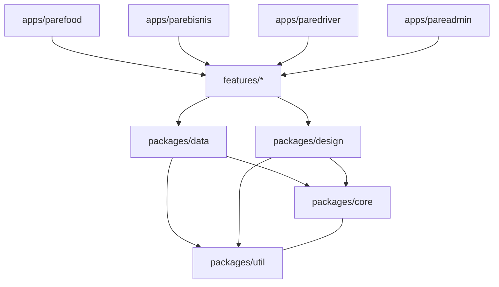
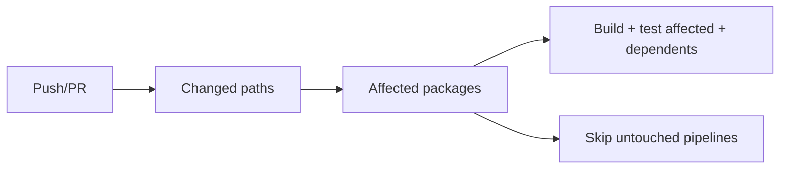

# PF-DOC-10 — Monorepo Blueprint

| | |
|---|---|
| Document ID | PF-DOC-10 |
| Title | Monorepo Blueprint |
| Version | 1.0 |
| Status | Approved (review PF-REV-01, 2026-08-06) |
| Date | 2026-08-06 |
| Author | Principal Architect |
| References | PF-DOC-09 (stack), PF-DOC-11 (Flutter arch), PF-DOC-12 (Supabase arch); successors PF-DOC-21 (CI/CD), PF-DOC-23 (coding standards), PF-DOC-24 (git) |

---

## 1. Purpose

This document defines the **monorepo layout** for the PareFood Platform: repository
structure, package boundaries, dependency rules, tooling (Melos/FVM), and code ownership.
It is the physical map that PF-DOC-11 (app architecture), PF-DOC-21 (CI) and PF-DOC-24
(git) operate on.

## 2. Objectives

1. Define the repository directory structure for apps, packages, backend and tooling.
2. Define package boundaries and the dependency direction (enforceable rules).
3. Define Melos workspace configuration and commands.
4. Define code ownership (CODEOWNERS) and change impact rules.
5. Enable CI to detect affected packages efficiently (PF-DOC-21).

## 3. Requirements

### 3.1 Repository Root Layout

```
parefood-platform/
├── .fvmrc                    # Flutter version pin (PF-DOC-09 TS-R01)
├── melos.yaml                # Melos workspace definition
├── pubspec.yaml              # Root workspace pubspec (private)
├── analysis_options.yaml     # Shared lint base (PF-DOC-23)
├── README.md                 # Onboarding + links to docs/
├── docs/                     # This documentation suite (30 documents)
├── apps/
│   ├── parefood/             # AP-PF — customer app
│   ├── parebisnis/           # AP-PB — merchant app
│   ├── paredriver/           # AP-PD — driver app
│   └── pareadmin/            # AP-PA — admin web app
├── packages/
│   ├── core/                 # Domain models, enums, errors (Freezed)
│   ├── data/                 # Repositories, data sources (Supabase/Dio)
│   ├── design/               # Design system, tokens, widgets (PF-DOC-16)
│   ├── util/                 # Pure helpers, extensions
│   └── features/             # Feature modules (cross-app reuse)
│       ├── auth_feature/
│       ├── cart_feature/
│       ├── orders_feature/
│       ├── payments_feature/
│       ├── notifications_feature/
│       └── profile_feature/
├── backend/
│   ├── supabase/
│   │   ├── migrations/       # SQL migrations (PF-DOC-13)
│   │   ├── functions/        # Edge Functions (PF-DOC-14)
│   │   └── config.toml       # Supabase project config
│   └── seeds/                # Dev seed data
├── infra/
│   ├── ci/                   # GitHub Actions workflows (PF-DOC-21)
│   ├── deploy/               # Deployment scripts (PF-DOC-22)
│   └── monitor/              # Monitoring config (PF-DOC-27)
├── tool/                     # Custom dev scripts (codegen, env, checks)
├── .github/
│   ├── workflows/
│   └── CODEOWNERS
└── .gitignore
```

### 3.2 Package Responsibilities & Boundaries

| Package | Owns | Must NOT do | Depends on |
|---|---|---|---|
| `core` | Pure domain models, enums, value objects (Freezed), domain exceptions | No Flutter widgets, no network, no Supabase SDK | — |
| `data` | Repositories, remote/local data sources, mappers | No widgets; no business decisions | `core`, `util` |
| `design` | Design tokens, theme, reusable widgets, i18n | No business logic; no networking | `core`, `util` |
| `util` | Pure helpers (formatters, validators, extensions) | No domain knowledge | — |
| `features/*` | Feature UI + state (Riverpod providers, controllers) | No direct DB/network; talks to `data` only | `core`, `data`, `design`, `util` |
| `apps/*` | Composition root: wires features, routing, theming, env config | No business logic | all packages |

**Dependency rule (enforced):** `apps → features → design/data → core/util`. No upward or
sideways imports. Violations fail CI (`melos exec` + `depend_on` analysis).

### 3.3 Melos Workspace Configuration

`melos.yaml` must define:
- `name: parefood_platform`
- `packages: ["apps/*", "packages/*", "packages/features/*"]`
- Scripts: `bootstrap`, `codegen`, `analyze`, `test`, `format`, `publish` (locked — no
  public publish; packages are private).
- `command.bootstrap.usePubspecOverrides: true` for path deps.

Core commands (documented in README):

| Command | Purpose |
|---|---|
| `fvm flutter pub global activate melos` | Install tooling once |
| `melos bootstrap` | Wire path dependencies, install all |
| `melos run codegen` | Run build_runner across packages (Freezed) |
| `melos run analyze` | `flutter analyze` all packages |
| `melos run test` | `flutter test` all packages |
| `melos run format` | `dart format` all packages |

### 3.4 Apps → Packages Consumption Map

| App | Uses features | Owns routing | Owns theme override |
|---|---|---|---|
| parefood | auth, profile, cart, orders, payments, notifications | GoRouter shell (PF-DOC-17) | Brand theme (PF-DOC-16) |
| parebisnis | auth, profile, orders, notifications | Own shell | Brand theme |
| paredriver | auth, profile, orders, notifications | Own shell | Brand theme |
| pareadmin | auth, profile, orders, notifications | Own shell (web routes) | Brand theme |

### 3.5 Code Ownership (CODEOWNERS)

| Path | Owner (team/role) |
|---|---|
| `docs/` | All (architect maintains index) |
| `apps/parefood/`, `apps/parebisnis/` | App team customers |
| `apps/paredriver/` | App team drivers |
| `apps/pareadmin/` | Web team |
| `packages/core/`, `packages/data/` | Platform team (architect) |
| `packages/design/` | Design engineering |
| `backend/supabase/` | Backend team (architect) |
| `infra/`, `tool/` | DevOps team |
| `melos.yaml`, `.fvmrc`, root `analysis_options.yaml` | Architect |

## 4. Diagrams

### 4.1 Dependency Graph



### 4.2 Monorepo Build/Test Impact Model (for PF-DOC-21)



## 5. Tables

### 5.1 Package Inventory

| Package | Type | Expected size (LOC) | Reused by |
|---|---|---|---|
| core | Dart (no Flutter import for domain) | 3–5k | all |
| data | Flutter + Supabase SDK + Dio | 4–6k | all features |
| design | Flutter | 6–8k | all apps |
| util | Dart | 1–2k | all |
| features/auth_feature | Flutter | 2–3k | all apps |
| features/cart_feature | Flutter | 2–3k | parefood |
| features/orders_feature | Flutter | 4–5k | all apps |
| features/payments_feature | Flutter | 3–4k | parefood |
| features/notifications_feature | Flutter | 1–2k | all apps |
| features/profile_feature | Flutter | 1–2k | all apps |

### 5.2 Enforcement Rules

| Rule | Check | Failure |
|---|---|---|
| Dependency direction | `melos run dependency-check` (custom tool) | CI red |
| No Flutter in `core` | `melos run dependency-check` (import scan) | CI red |
| No direct Supabase SDK in features/apps | import scan for `supabase_flutter` | CI red |
| Locked versions | `pubspec.lock` committed; `melos bootstrap` with lock | Review rejection |

## 6. Rules

- **MO-R01** No new top-level directory outside the §3.1 layout without architect approval.
- **MO-R02** Features never import `supabase_flutter` or `dio` directly; they use `data`.
- **MO-R03** New shared code goes to the lowest package that respects boundaries; duplicate
  code across apps is a CI-flagged smell.
- **MO-R04** Packages are private (never published to pub.dev); versioned in-repo.
- **MO-R05** Every package has `README.md` explaining its responsibility and boundary.
- **MO-R06** Apps are thin composition roots; thick apps are a design defect (PF-DOC-11).

## 7. Checklist

- [ ] Layout matches §3.1 exactly
- [ ] Melos bootstrap + codegen + analyze + test pass in sandbox
- [ ] Dependency-direction checker implemented and wired into CI
- [ ] CODEOWNERS defined and reviewed
- [ ] README onboarding instructions written

## 8. Risks

| Risk | Likelihood | Impact | Mitigation |
|---|---|---|---|
| Package boundary violations creep in | Medium | Medium | Enforced via CI scans (MO-R02) |
| Monorepo build time grows | Medium | Medium | Affected-package detection (PF-DOC-21) |
| Feature packages over-generalised | Medium | Low | Features stay app-agnostic, config via providers |
| Tooling drift (FVM/Melos versions) | Low | Medium | Pin tooling versions in CI and docs |

## 9. Future Improvements

- Bazel/Rules or melos remote caching for faster CI (PF-DOC-21/29).
- Module federation for web (PF-DOC-29).
- Codegen for feature scaffolding via `tool/` templates.
