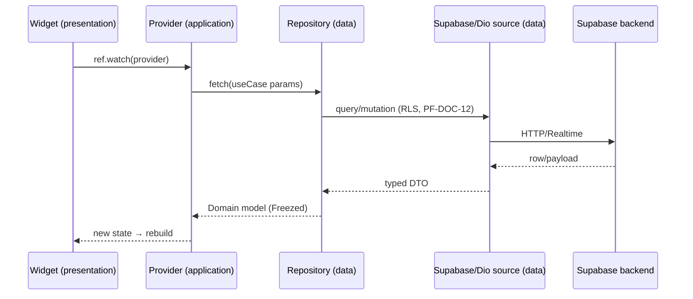
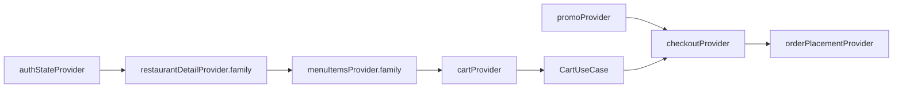

# PF-DOC-11 — Flutter Architecture

| | |
|---|---|
| Document ID | PF-DOC-11 |
| Title | Flutter Architecture |
| Version | 1.0 |
| Status | Approved (review PF-REV-01, 2026-08-06) |
| Date | 2026-08-06 |
| Author | Principal Architect |
| References | PF-DOC-09 (stack), PF-DOC-10 (monorepo); successors PF-DOC-15 (UX), PF-DOC-16 (design), PF-DOC-17 (navigation), PF-DOC-20 (testing), PF-DOC-23 (coding standards) |

---

## 1. Purpose

This document defines the **internal architecture of every Flutter app** in the monorepo:
layering, state management with Riverpod, data flow, offline strategy, and codegen
practices. It ensures all four apps share one consistent, testable architecture.

## 2. Objectives

1. Define the layered architecture inside each app/feature.
2. Define Riverpod usage patterns (providers, notifiers, family, modifiers).
3. Define the data flow from UI to backend (Supabase SDK + Dio) and back.
4. Define offline-first caching strategy.
5. Define error handling and loading-state conventions.
6. Define codegen (Freezed) rules for models.

## 3. Requirements

### 3.1 Layering Inside a Feature

Each feature in `packages/features/*` follows a feature-first, clean-ish layering:

```
lib/
├── data/            # Feature-specific data mappers/sources (thin; delegates to packages/data)
│   └── feature_repository.dart
├── domain/          # Feature-specific use cases / selectors (pure Dart)
│   └── feature_use_case.dart
├── application/     # Riverpod providers, notifiers, state (StateNotifier/AsyncNotifier)
│   └── feature_providers.dart
├── presentation/
│   ├── widgets/     # Feature widgets
│   ├── pages/       # Feature pages (routes registered in app shell)
│   └── controllers/ # Widget-local state controllers
└── feature.dart     # Public barrel (only what apps may import)
```

**Rule:** presentation never imports `data`; it consumes `application` providers only.

### 3.2 Riverpod Patterns

| Concern | Pattern | Example |
|---|---|---|
| Remote async data | `FutureProvider.family` or `AsyncNotifierProvider` | `restaurantDetailProvider(id)` |
| Mutable UI state | `NotifierProvider` (immutable state) | `cartProvider` |
| Auth/session | `StreamProvider<AuthState>` over Supabase auth stream | `authStateProvider` |
| Configuration | `Provider` for env/flags | `apiBaseUrlProvider` |
| Cross-feature coordination | Provider composition; never global singletons | `ordersFeatureDepsProvider` |

Rules:
- State classes are immutable; use Freezed for state models where state has many fields.
- All providers are created in `application/` files with explicit `ref`.
- Providers are never instantiated inside widgets; widgets read via `ref.watch/read`.
- `ProviderScope` is created once at app root (composition root, PF-DOC-10).
- Overrides (`provider.overrideWith`) are the only test seam (PF-DOC-20).

### 3.3 Data Flow



Key points:
- `data` repositories return domain models (Freezed) — no raw JSON escapes `data`.
- Mappers live in `data` (`fromJson`/`toJson` on models generated by Freezed).
- Supabase responses are decoded to DTOs then mapped to domain models.

### 3.4 Offline Strategy

| Layer | Strategy | NFR |
|---|---|---|
| Catalog (restaurants/menu) | Cache last-known-good JSON locally (drift/SQLite); serve while offline; refresh in background | NFR-009 |
| Cart | Persist cart locally (drift/SQLite); sync on reconnection | NFR-009 |
| Auth session | Supabase session persistence (built-in) | NFR-009 |
| Orders (view) | Cache recent orders list locally | NFR-009 |
| Order placement / payments | Never offline; block with explicit error + retry | NFR-021 idempotency |

Storage decision (review fix AR-26): structured caches (catalog, cart, orders history)
use **drift (SQLite)** — `shared_preferences` is used only for small settings (theme,
locale, notification prefs). Cache size budget: catalog ≤ 20 MB, orders history ≤ 5 MB;
LRU eviction. This replaces the ambiguous `shared_preferences/drift` wording.

Rules:
- Offline caches expire in ≤ 24 h for catalog, ≤ 7 days for orders history.
- All writes to backend are idempotent (client-generated `idempotency_key`, PF-DOC-18).
- Realtime is the freshness layer when online; cache is the fallback when offline.

### 3.5 Error Handling & Loading States

| State | Widget convention | Detail |
|---|---|---|
| Loading | `AsyncValue` `isLoading` → skeleton/shimmer | Material 3 skeletons (PF-DOC-16) |
| Error | ErrorView with retry | Human message (Bahasa), optional retry; logs to Sentry |
| Empty | EmptyState | Icon + message + CTA |
| Data | Content | Normal view |
| Refresh | `RefreshIndicator` / pull-to-refresh | Manual refresh always available |

Error mapping: domain exceptions in `core` (`PareException` subtypes: network, auth,
not-found, forbidden, business-rule, server). UI maps exception → message + action.

### 3.6 Code Generation (Freezed)

- All domain models and state models use Freezed (classes + unions).
- `part` files generated by `build_runner`; never hand-edited.
- JSON serialisation: `freezed` + `json_serializable`; DTOs in `data`.
- Codegen runs via `melos run codegen`; generated files committed (deterministic) OR
  regenerated in CI and diff-checked — decision: **generated files committed and
  diff-checked in CI** (PF-DOC-21).

### 3.7 Dependency Injection Rules

- DI is provider-based (Riverpod), not `get_it`/manual singletons.
- App root provides env config (`AppConfig`): supabase URL/anon key, API base URL, flags.
- Feature packages receive dependencies via provider composition — no global locators.

## 4. Diagrams

### 4.1 Feature Internal Layers

```mermaid
graph TD
    subgraph presentation
        PAGES[pages]
        WIDGETS[widgets]
        CTRL[controllers]
    end
    subgraph application
        PROV[providers & notifiers]
        STATE[immutable state (Freezed)]
    end
    subgraph domain
        UC[use cases / selectors]
    end
    subgraph data
        REPO[repositories]
        SRCS[data sources]
        MAPPERS[mappers/DTOs]
    end
    PAGES --> PROV
    WIDGETS --> PROV
    PROV --> UC
    PROV --> REPO
    UC --> REPO
    REPO --> SRCS
    SRCS --> MAPPERS
    PROV --> STATE
```

### 4.2 Riverpod Provider Graph (PareFood cart example)



## 5. Tables

### 5.1 Riverpod Type Mapping

| Type | Use for | Alternative |
|---|---|---|
| `Provider` | Constants, config, singletons | — |
| `FutureProvider` | One-shot async reads | `AsyncNotifier` if refreshable stateful |
| `StreamProvider` | Realtime/subscriptions, auth | — |
| `NotifierProvider` | Mutable synchronous state | `StateNotifier` (legacy) |
| `AsyncNotifierProvider` | Async state with actions | `FutureProvider` + events |

### 5.2 Package → Architecture Responsibility (from PF-DOC-10)

| Package | Responsibility in this architecture |
|---|---|
| `core` | Domain models, exceptions, enums |
| `data` | Repositories + sources + mappers |
| `design` | Widgets/tokens consumed by presentation |
| `features/*` | feature layers above |
| `apps/*` | Composition root, routing, theming |

## 6. Rules

- **FL-R01** Widgets are rebuild-synchronous; all async work goes through providers.
- **FL-R02** No `BuildContext` usage across async gaps without `mounted` checks (lints enforce).
- **FL-R03** Business decisions (fees, state transitions) never live in the UI; they live in
  backend business rules (PF-DOC-18) and mirrored use-case tests.
- **FL-R04** Riverpod providers must be testable via `overrideWith`; no private-network
  singleton tests.
- **FL-R05** Offline writes are only allowed with idempotency keys (NFR-021).
- **FL-R06** Generated code (Freezed) is committed and diff-checked in CI.
- **FL-R07** Every screen handles all four states (loading/error/empty/data) per §3.5.

## 7. Checklist

- [ ] Feature template matches §3.1 layering
- [ ] Provider pattern table followed in code review
- [ ] Offline strategy implemented per §3.4
- [ ] Error handling covers all domain exception types
- [ ] Codegen committed; CI diff-check active

## 8. Risks

| Risk | Likelihood | Impact | Mitigation |
|---|---|---|---|
| Providers become a tangled graph | Medium | Medium | Provider composition via deps providers; review |
| Riverpod v2→v3 migration churn | Medium | Medium | Keep abstraction thin; pin version (PF-DOC-09) |
| Offline/cache sync bugs (stale menus) | Medium | High | Cache TTL + version headers; tests |
| Business logic leaks into widgets | Medium | High | FL-R03 + review checklist |
| Codegen conflicts in monorepo | Low | Medium | `melos run codegen` ordering; CI diff-check |

## 9. Future Improvements

- Adopt Riverpod v3 patterns when stable (pin policy PF-DOC-09).
- Add drift (SQLite) for richer local persistence (PF-DOC-29).
- Feature-flag-driven feature modules (PF-DOC-29).
