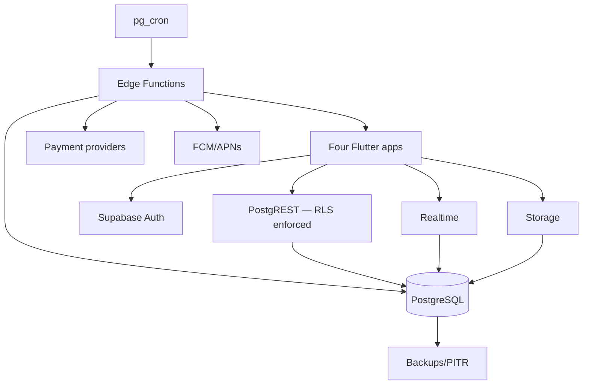
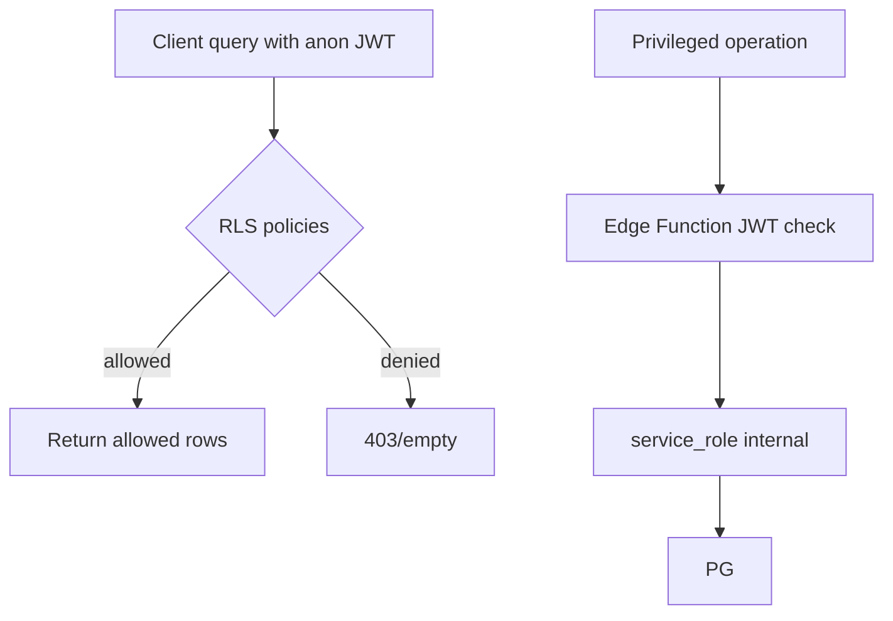

# PF-DOC-12 — Supabase Architecture

| | |
|---|---|
| Document ID | PF-DOC-12 |
| Title | Supabase Architecture |
| Version | 1.1 |
| Status | Approved (review PF-REV-01, 2026-08-06) |
| Date | 2026-08-06 |
| Author | Principal Architect |
| References | PF-DOC-09 (stack), PF-DOC-13 (database), PF-DOC-14 (API); successors PF-DOC-19 (security), PF-DOC-22 (deployment) |

---

## 1. Purpose

This document defines how **Supabase** hosts the single backend: projects and
environments, authentication, database access (RLS-first), Storage, Realtime, Edge
Functions, and operational settings. It is the backend complement to PF-DOC-11
(Flutter) and consumes the schema from PF-DOC-13.

## 2. Objectives

1. Define Supabase project topology and environments.
2. Define authentication strategy (providers, roles, session).
3. Define the RLS-first data access model.
4. Define Storage buckets and access policies.
5. Define Realtime usage and channel security.
6. Define Edge Functions catalogue and deployment model.
7. Define secrets, backups and operational settings consumed by PF-DOC-22/28.

## 3. Requirements

### 3.1 Project Topology & Environments

| Environment | Supabase project | Purpose | Created by |
|---|---|---|---|
| Development | `parefood-dev` | Daily engineering (shared or per-dev via local CLI) | Supabase CLI `supabase start` for local; linked cloud project for shared |
| Staging | `parefood-staging` | Integration/e2e, release verification | CI (PF-DOC-21) |
| Production | `parefood-prod` | Live platform | CI with approval gate (PF-DOC-22) |

- **One database per environment; one backend** (vision PR-01). No multi-project split by
  product.
- Schema is managed by migrations in `backend/supabase/migrations/` (PF-DOC-13), applied via
  Supabase CLI with zero-downtime review in PF-DOC-21/22.
- `config.toml` at `backend/supabase/` defines project settings per environment.

### 3.2 Authentication

| Aspect | Design |
|---|---|
| Providers | Email/password; phone OTP (SMS via provider); passwordless magic link (optional) |
| Session | JWT (Supabase Auth) with refresh; expiry 1 h access / 30 d refresh |
| Roles | `customer`, `business`, `driver`, `admin` stored in `profiles.role`; enforced via RLS + Edge Function checks |
| Custom claims | Role mirrored into JWT `app_metadata` claims at signup/update (helper function) for lightweight client checks |
| Admin login | `admin` role only; MFA enforced for AP-PA (PF-DOC-19) |
| Sign-up flow | Server-side trigger creates `profiles` row + role; role fixed per app entry point |
| Account deletion | Legal requirement flow (PF-DOC-19 SEC-DEL): cascade cleanup + retention |

### 3.3 Database Access — RLS First

- **Every table has Row Level Security enabled** (NFR-024). Tables without RLS fail CI review.
- Policies expressed as SQL in migrations; reviewed in PF-DOC-19.
- Client (Supabase anon key) queries are allowed ONLY through RLS-permitted paths.
- Privileged operations (payments, settlements, force-cancel) go through Edge Functions with
  `service_role` in a protected Deno runtime — never exposed to clients.

Policy patterns:

| Table group | Typical policy |
|---|---|
| `profiles` | user can read own; `admin` can read all; update own non-role fields |
| `restaurants` | public read (approved only); owner (business role + owner_id) writes |
| `orders` | customer reads own; restaurant reads own; driver reads assigned; admin reads all |
| `wallets` | owner reads; writes only via Edge Function (service role) |
| `menu_items` | public read (available); owner writes |

### 3.4 Storage

| Bucket | Read | Write | Use |
|---|---|---|---|
| `product-images` | public (CDN) | restaurant owner (business), admin | Menu item images, restaurant logo/cover |
| `merchant-docs` | owner + admin | merchant (onboarding, PF-DOC-07 FR-ONB-001) | KTP, NIB documents |
| `driver-docs` | owner + admin | driver | SIM, vehicle photos |
| `delivery-proof` | order participants + admin | driver | Drop-off photo (FR-ORDER-006) |
| `avatars` | public | owner | Profile pictures |

Policy: file paths include `user_id`/`order_id`; bucket policies enforce ownership
(RLS on Storage via `storage.objects` policies).

### 3.5 Realtime

| Use case | Channel/Postgres changes | Scope | FR |
|---|---|---|---|
| Order status updates | `orders`, `order_status_history` | order participants | FR-ORDER-007 |
| Driver live location | Realtime (broadcast) or Postgres changes on `driver_locations` | order participants | FR-GEO-004 |
| Menu updates | `menu_*` tables | public restaurant page | FR-MENU-001 |
| Job offers to drivers | Edge Function → Realtime/FCM | driver | FR-NOTIF-003 |
| Admin live board | `orders` filtered | admins | FR-ORDER-011 |

Rules:
- Realtime is enabled per-table, per-row filters; never subscribe to whole tables.
- Authorization for Realtime channels uses RLS on the underlying table.
- Broadcast channels require auth token; driver location uses ephemeral signed channels.
- Driver location updates are throttled to ≥ 5 s per driver and batched; writes and
  broadcasts never fire per-GPS-event (review fix AR-23).
- Fallback: if Realtime unavailable, clients poll at 30 s interval (degraded mode, NFR-014).

### 3.6 Edge Functions

Deployed in `backend/supabase/functions/`, written in Deno, invoked via HTTP
(`/functions/v1/<name>`) with JWT verification; use `service_role` only internally.

Catalogue (details in PF-DOC-14):

| Function | Purpose | Trigger |
|---|---|---|
| `place-order` | Validates cart+pricing, creates order, payment intent, idempotent | App (customer) |
| `accept-order` | Restaurant accept/decline with timer enforcement | App (merchant) |
| `ready-order` | Merchant marks order ready; fires dispatch trigger | App (merchant) |
| `dispatch` | Driver matching & assignment (offers via Realtime/FCM) | DB trigger on `orders.status='ready'` via `pg_net` |
| `accept-job` / `decline-job` | Driver accepts/declines an offer (atomic first-accept-wins) | App (driver) |
| `driver-arrived` / `driver-delivered` | Update deliveries, verify pickup code, capture proof | App (driver) |
| `complete-order` | Finalise totals, apply commission/fares, notify | Internal |
| `cancel-order` | Cancel + refund matrix (PF-DOC-18 BR-CANCEL) | App/Admin |
| `process-payment` | PSP charge/refund abstraction | `place-order`, `cancel-order` |
| `settle-restaurants` | Weekly T+7 settlement (scheduled) | Cron (pg_cron) |
| `payout-drivers` | Daily driver payout to wallet | Cron (pg_cron) |
| `send-notification` | FCM/APNs fan-out | Various |
| `register-device-token` | Upsert device tokens + push preferences (FR-NOTIF-005) | App |
| `webhook-psp` | Payment provider callbacks (idempotent) | PSP |
| `reconcile` | Reconciliation vs PSP statements + COD ledger (PF-DOC-18 BR-COD) | Cron |
| `user-admin` | Admin privileged actions (force-cancel, suspend) | AP-PA |
| `gen-hygiene-score` | PareHygiene aggregation (post-MVP) | Cron (PF-DOC-29) |

**Dispatch trigger:** a DB trigger on `orders.status='ready'` (set by `ready-order`) posts
to `/functions/v1/dispatch` through `pg_net`; the call is idempotent and retried by cron on
failure. This closes the gap where dispatch was specified but never invoked (review fix
AR-01).

### 3.7 Secrets & Config

- Project secrets (`service_role`, PSP keys) stored in Supabase project secrets; referenced
  by Edge Functions via `Deno.env`.
- CI secrets in GitHub Actions (PF-DOC-21); no secrets in migrations or config committed.
- `config.toml` commits only non-secret settings.

### 3.8 Operational Settings (consumed by PF-DOC-22/27/28)

| Item | Setting |
|---|---|
| Backups | Supabase automatic PITR + nightly dumps; RPO ≤ 15 min (NFR-019) |
| Rate limiting | Supabase Auth + API; per-IP/per-user guardrails (PF-DOC-19) |
| Observability | Supabase logs shipped to monitoring (PF-DOC-27) |
| Extensions | `pg_cron`, `postgis` (geo queries), `pgcrypto`, `pg_trgm` (search), `pg_net` (dispatch trigger) |
| Connection pooling | Supabase pooler for Postgres; long-lived client settings |

## 4. Diagrams

### 4.1 Supabase Component Map

### 4.2 RLS Decision Flow

## 5. Tables

### 5.1 Auth → Role Matrix

| Role | Sign-in apps | MFA | Can use service role? |
|---|---|---|---|
| customer | AP-PF | No | No |
| business | AP-PB | No | No |
| driver | AP-PD | No | No |
| admin | AP-PA | Yes | Via Edge Functions only |

### 5.2 Storage Access Summary

| Bucket | Public read | Authenticated write | Admin |
|---|---|---|---|
| product-images | Yes | owner/business | Yes |
| merchant-docs | No | owner | Yes |
| driver-docs | No | owner | Yes |
| delivery-proof | order participants | driver | Yes |
| avatars | Yes | owner | Yes |

### 5.3 Function Security Profile

| Function | Callers | Auth method | Uses service_role |
|---|---|---|---|
| place-order | customer | user JWT | Yes (internal only) |
| process-payment | server (place-order) | internal | Yes |
| settle-restaurants | cron | internal secret | Yes |
| webhook-psp | PSP | signature verification (SEC, PF-DOC-19) | Yes |
| user-admin | admin | admin JWT + MFA | Yes |

## 6. Rules

- **SUP-R01** All tables RLS-enabled; new migrations must prove RLS in CI (policy test).
- **SUP-R02** No `service_role` key ever shipped to clients or embedded in apps.
- **SUP-R03** Money-moving logic lives only in Edge Functions; RLS cannot authorise a charge.
- **SUP-R04** Realtime subscriptions must have row-level filters; full-table subscriptions
  are forbidden.
- **SUP-R05** Storage paths are structured (`<tenant>/<entity>/<id>.<ext>`) for policy scoping.
- **SUP-R06** Migrations are the only way schema changes reach environments (PF-DOC-21/22).
- **SUP-R07** Every Edge Function has tests and secrets declared in its doc header.

## 7. Checklist

- [ ] Project topology (dev/staging/prod) created
- [ ] RLS policy set covers every table in PF-DOC-13
- [ ] Storage buckets + policies created per §3.4
- [ ] Realtime channels scoped; fallback polling implemented
- [ ] Edge Function catalogue aligned with PF-DOC-14
- [ ] Secrets rotation and CI wiring complete (PF-DOC-21)

## 8. Risks

| Risk | Likelihood | Impact | Mitigation |
|---|---|---|---|
| RLS policy mistakes expose data | Medium | High | Policy tests in CI + review (PF-DOC-19) |
| Realtime scale/cost at launch | Medium | Medium | Scoped channels + degraded polling |
| Edge Function cold starts on mobile | Medium | Low | Warmers + keep-alive; acceptable for money ops |
| service_role leak via logs | Low | High | Secret scanning + log redaction (PF-DOC-19) |
| Migration drift across envs | Medium | High | Supabase CLI diff check in CI |

## 9. Future Improvements

- Multi-region replication for disaster recovery (PF-DOC-29).
- Local Emulator-based contract tests for Edge Functions (PF-DOC-20).
- Postgres extension adoption: `pg_stat_statements` tuning, partitioning hot tables.
