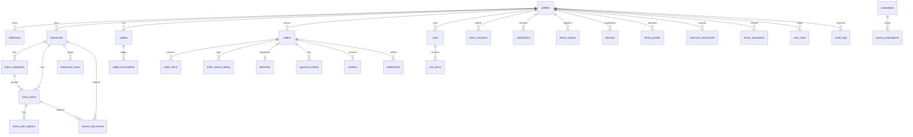
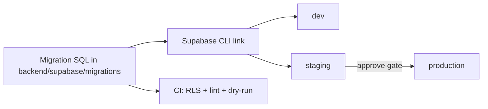

# PF-DOC-13 — Database Blueprint

| | |
|---|---|
| Document ID | PF-DOC-13 |
| Title | Database Blueprint |
| Version | 1.1 |
| Status | Approved (review PF-REV-01, 2026-08-06) |
| Date | 2026-08-06 |
| Author | Database Architect |
| References | PF-DOC-07 (FRs), PF-DOC-12 (Supabase), PF-DOC-18 (business rules); successor PF-DOC-14 (API) |

---

## 1. Purpose

This document is the **authoritative schema blueprint** for the single PostgreSQL
database: every table, column, type, constraint, index and RLS posture. It implements the
data needs of the functional requirements (PF-DOC-07) and business rules (PF-DOC-18), and
is consumed by the API (PF-DOC-14) and migrations pipeline (PF-DOC-21).

## 2. Objectives

1. Define the complete table catalogue with columns, types and constraints.
2. Define relationships and the entity-relationship diagram.
3. Define indexing strategy for hot queries (PF-DOC-08 performance).
4. Define money-handling conventions (integer minor units, audit).
5. Define the migration strategy (versioned SQL in `backend/supabase/migrations/`).
6. Define the RLS posture per table (detailed policies in PF-DOC-19).

## 3. Requirements

### 3.1 Conventions

| Convention | Rule |
|---|---|
| Naming | `snake_case` tables/columns; plural table names; singular FK columns with `_id` suffix |
| Primary keys | `uuid` PK by default (generated via `gen_random_uuid()`) |
| Money | `bigint` minor units (1 unit = Rp 1; IDR has no sen in circulation); never `float`; display conversion at edge |
| Timestamps | `timestamptz`; `created_at`/`updated_at` with DB defaults + triggers |
| Soft delete | `deleted_at timestamptz null` where audit matters; physical delete only in legal purge |
| Status | `text` with `CHECK` constraints (enum strings) for stability of RLS & rules |
| Search | `pg_trgm` GIN indexes for text search |
| Geo | `postgis` `geography(Point, 4326)` for lat/lng + distance queries |
| RLS | **Every table RLS-enabled**; policy per role (PF-DOC-12 §3.3) |

### 3.2 Table Catalogue

#### Auth / Identity

**profiles** — user profile; one row per Supabase auth user.

| Column | Type | Constraints / notes |
|---|---|---|
| id | uuid | PK; FK → `auth.users.id` |
| role | text | CHECK in (customer, business, driver, admin); immutable except admin |
| full_name | text | not null |
| phone | text | unique, not null |
| avatar_url | text | null |
| status | text | CHECK in (active, suspended, deleted); default active |
| created_at / updated_at | timestamptz | defaults |

**addresses** — saved delivery addresses.

| Column | Type | Notes |
|---|---|---|
| id | uuid | PK |
| user_id | uuid | FK profiles; owner |
| label | text | e.g. "Rumah" |
| address_line | text | not null |
| geo | geography(Point,4326) | not null |
| is_default | boolean | default false |

#### Catalog

**restaurants** — merchant storefront.

| Column | Type | Notes |
|---|---|---|
| id | uuid | PK |
| owner_id | uuid | FK profiles (business) |
| name | text | not null |
| slug | text | unique, not null |
| description | text | null |
| logo_url / cover_url | text | null |
| status | text | CHECK in (pending, active, suspended, closed) |
| commission_rate_pct | numeric(5,2) | not null default 15 (PF-DOC-03) |
| delivery_radius_km | numeric(4,1) | default 5 |
| rating_avg | numeric(3,2) | default 0; computed |
| review_count | integer | default 0; computed |
| geo | geography(Point,4326) | not null |
| is_featured | boolean | default false |
| created_at / updated_at | timestamptz | |

**restaurant_hours** — weekly open hours.

| Column | Type | Notes |
|---|---|---|
| id | uuid | PK |
| restaurant_id | uuid | FK restaurants |
| day_of_week | smallint | CHECK 0..6 |
| open_time / close_time | time | not null |
| is_closed | boolean | default false |

**menu_categories** — menu grouping.

| Column | Type | Notes |
|---|---|---|
| id | uuid | PK |
| restaurant_id | uuid | FK restaurants |
| name | text | not null |
| sort_order | integer | default 0 |

**menu_items** — menu products.

| Column | Type | Notes |
|---|---|---|
| id | uuid | PK |
| restaurant_id | uuid | FK |
| category_id | uuid | FK menu_categories |
| name | text | not null |
| description | text | null |
| price | bigint | minor units; not null; ≥ 0 |
| image_url | text | null |
| is_available | boolean | default true |
| is_featured | boolean | default false |
| sort_order | integer | default 0 |
| created_at / updated_at | timestamptz | |

**menu_item_options** — option groups & choices (e.g., level pedas).

| Column | Type | Notes |
|---|---|---|
| id | uuid | PK |
| menu_item_id | uuid | FK |
| group_name | text | not null |
| is_required | boolean | default false |
| choices | jsonb | array of {label, price_adjust, max_select} |

#### Cart

**carts** — one active cart per customer (per restaurant).

| Column | Type | Notes |
|---|---|---|
| id | uuid | PK |
| customer_id | uuid | FK profiles |
| restaurant_id | uuid | FK restaurants |
| status | text | CHECK in (open, checked_out, abandoned) |
| updated_at | timestamptz | |

**cart_items** — lines in cart.

| Column | Type | Notes |
|---|---|---|
| id | uuid | PK |
| cart_id | uuid | FK carts |
| menu_item_id | uuid | FK |
| quantity | integer | CHECK > 0 |
| selected_options | jsonb | null |
| unit_price | bigint | snapshot at add |
| line_total | bigint | quantity × (unit_price + Σ selected option `price_adjust`) |

#### Orders

**orders** — the core order entity.

| Column | Type | Notes |
|---|---|---|
| id | uuid | PK |
| order_no | text | unique human-readable (e.g., `PF-20260806-000123`) |
| customer_id | uuid | FK profiles |
| restaurant_id | uuid | FK restaurants |
| driver_id | uuid | null FK profiles (driver) |
| status | text | CHECK: placed, accepted, preparing, ready, picked_up, delivered, cancelled, refunded. Driver assignment is tracked in `deliveries.status` (sub-state machine, PF-DOC-18); an order remains `ready` while dispatch is in progress |
| subtotal | bigint | minor units |
| delivery_fee | bigint | |
| service_fee | bigint | |
| discount | bigint | promo applied |
| total | bigint | subtotal + fees − discount |
| commission_amount | bigint | restaurant commission (locked at completion) |
| driver_fare | bigint | locked at completion |
| payment_method | text | CHECK: cod, ewallet, card |
| payment_status | text | CHECK: pending, paid, refunded, failed |
| payment_intent_id | text | null (PSP reference) |
| idempotency_key | uuid | unique; prevents duplicate placement |
| delivery_address | text | snapshot |
| delivery_geo | geography(Point,4326) | snapshot |
| estimated_minutes | integer | locked ETA at placement |
| placed_at | timestamptz | |
| completed_at | timestamptz | null |
| cancelled_at | timestamptz | null |
| cancel_reason | text | null |
| created_at / updated_at | timestamptz | |

**order_items** — order line items snapshot.

| Column | Type | Notes |
|---|---|---|
| id | uuid | PK |
| order_id | uuid | FK orders |
| menu_item_id | uuid | null FK (kept as snapshot) |
| item_name | text | snapshot |
| quantity | integer | |
| unit_price | bigint | snapshot |
| selected_options | jsonb | null |
| line_total | bigint | |

**order_status_history** — append-only state machine log.

| Column | Type | Notes |
|---|---|---|
| id | uuid | PK |
| order_id | uuid | FK orders |
| from_status | text | null |
| to_status | text | not null |
| changed_by | uuid | FK profiles (user/system) |
| reason | text | null |
| created_at | timestamptz | default |

#### Delivery

**driver_locations** — live driver position.

| Column | Type | Notes |
|---|---|---|
| id | uuid | PK |
| driver_id | uuid | FK profiles |
| geo | geography(Point,4326) | |
| heading / speed | numeric | null |
| online | boolean | |
| updated_at | timestamptz | index |

**deliveries** — delivery job record per order.

| Column | Type | Notes |
|---|---|---|
| id | uuid | PK |
| order_id | uuid | FK unique |
| driver_id | uuid | FK |
| status | text | CHECK: assigned, arrived_pickup, picked_up, delivered, failed |
| pickup_code | text | 4-digit |
| accepted_at / arrived_at / picked_up_at / delivered_at | timestamptz | null |
| proof_photo_url | text | null |

#### Finance

**wallets** — user balances (driver, restaurant, customer refunds).

| Column | Type | Notes |
|---|---|---|
| id | uuid | PK |
| user_id | uuid | FK profiles unique |
| balance | bigint | minor units; ≥ 0 enforced |
| currency | text | default IDR |
| updated_at | timestamptz | |

**wallet_transactions** — append-only ledger.

| Column | Type | Notes |
|---|---|---|
| id | uuid | PK |
| wallet_id | uuid | FK wallets |
| tx_type | text | CHECK: credit, debit |
| reason | text | CHECK: fare, incentive, settlement, refund, adjustment, payout |
| amount | bigint | positive |
| reference_id | uuid | order/settlement reference |
| status | text | CHECK: pending, completed, failed, reversed |
| external_tx_id | text | null (PSP ref) |
| created_at | timestamptz | |

**settlements** — restaurant payout runs.

| Column | Type | Notes |
|---|---|---|
| id | uuid | PK |
| restaurant_id | uuid | FK |
| period_start / period_end | date | |
| gross_amount / commission_amount / net_amount | bigint | |
| status | text | CHECK: calculated, approved, paid, failed |
| approved_by / approved_at | uuid / timestamptz | two-person rule |

#### Payments

**payment_intents** — PSP charge/refund tracking.

| Column | Type | Notes |
|---|---|---|
| id | uuid | PK |
| order_id | uuid | FK |
| intent_type | text | CHECK: charge, refund, payout |
| amount | bigint | |
| psp | text | provider code |
| psp_status | text | raw provider status |
| status | text | CHECK: created, processing, succeeded, failed, refunded |
| webhook_received_at | timestamptz | null |
| created_at / updated_at | timestamptz | |

#### Engagement

**reviews** — ratings.

| Column | Type | Notes |
|---|---|---|
| id | uuid | PK |
| order_id | uuid | FK; unique(order_id, target_type) — one review per target per order |
| target_type | text | CHECK: restaurant, driver |
| target_id | uuid | restaurant/driver id |
| author_id | uuid | FK profiles |
| rating | smallint | CHECK 1..5 |
| comment | text | null |
| moderated | boolean | default false; admin hide |
| created_at | timestamptz | |

**favorites** — restaurant bookmarks.

| Column | Type | Notes |
|---|---|---|
| id | uuid | PK |
| user_id | uuid | FK |
| restaurant_id | uuid | FK |
| created_at | timestamptz | unique(user_id, restaurant_id) |

**notifications** — in-app notification centre.

| Column | Type | Notes |
|---|---|---|
| id | uuid | PK |
| user_id | uuid | FK |
| type | text | CHECK: order, job, payment, promo, system |
| title / body | text | |
| data | jsonb | null |
| read_at | timestamptz | null |
| created_at | timestamptz | |

**device_tokens** — push notification registrations (FR-NOTIF-005).

| Column | Type | Notes |
|---|---|---|
| id | uuid | PK |
| user_id | uuid | FK profiles |
| platform | text | CHECK: android, ios, web |
| token | text | unique; FCM/APNs token (encrypted at rest) |
| active | boolean | default true; set false on push error |
| created_at / updated_at | timestamptz | |

Upserted via `register-device-token` Edge Function; writes never exposed via PostgREST.

**promotions** — promo/voucher definitions.

| Column | Type | Notes |
|---|---|---|
| id | uuid | PK |
| code | text | unique |
| type | text | CHECK: fixed, percent, free_delivery |
| value | bigint | amount or basis points |
| min_subtotal | bigint | null |
| max_discount | bigint | null |
| usage_limit / used_count | integer | |
| starts_at / ends_at | timestamptz | |
| status | text | CHECK: active, disabled, expired |

**promo_redemptions** — per-user redemption ledger (BR-PROMO-006).

| Column | Type | Notes |
|---|---|---|
| id | uuid | PK |
| promo_id | uuid | FK promotions |
| user_id | uuid | FK profiles |
| order_id | uuid | FK orders null |
| created_at | timestamptz | |

unique(promo_id, user_id, order_id); per-user count enforced by Edge Function.

#### Admin / Ops

**audit_logs** — privileged action trail.

| Column | Type | Notes |
|---|---|---|
| id | uuid | PK |
| actor_id | uuid | FK profiles |
| action | text | e.g. force_cancel, suspend_user, approve_merchant, settle_payout |
| entity_type / entity_id | text / uuid | target |
| payload | jsonb | before/after |
| ip | inet | |
| created_at | timestamptz | |

**driver_profiles** — driver operational data.

| Column | Type | Notes |
|---|---|---|
| id | uuid | PK |
| user_id | uuid | FK profiles unique |
| vehicle_type | text | CHECK: motorcycle, car, other |
| license_no | text | encrypted at rest |
| bank_account_ref | text | tokenised (never raw IBAN) |
| status | text | CHECK: pending, approved, suspended |
| rating_avg / review_count | numeric / int | computed |
| accepted_jobs / total_jobs | int | for acceptance stats |

**merchant_documents** — onboarding docs metadata.

| Column | Type | Notes |
|---|---|---|
| id | uuid | PK |
| user_id | uuid | FK |
| doc_type | text | CHECK: ktp, nib, sim |
| storage_path | text | |
| status | text | CHECK: submitted, reviewed, approved, rejected |
| reviewed_by / reviewed_at | uuid / timestamptz | null |

**driver_documents** — driver onboarding document tracking (FR-ONB-005).

| Column | Type | Notes |
|---|---|---|
| id | uuid | PK |
| user_id | uuid | FK profiles (driver) |
| doc_type | text | CHECK: sim, vehicle, bank_account |
| storage_path | text | |
| status | text | CHECK: submitted, reviewed, approved, rejected |
| reviewed_by / reviewed_at | uuid / timestamptz | null |

#### Search

**search_documents** — denormalised restaurant + menu search index (NFR-004).

| Column | Type | Notes |
|---|---|---|
| id | uuid | PK |
| entity_type | text | CHECK: restaurant, menu_item |
| entity_id | uuid | FK restaurants / menu_items |
| restaurant_id | uuid | FK restaurants |
| name | text | |
| tags | text | category, cuisine keywords |
| is_available | boolean | |
| geo | geography(Point,4326) | null |
| updated_at | timestamptz | |

GIN (pg_trgm) on name + tags; maintained by triggers on `restaurants`/`menu_items`;
reconciled by cron.

#### Auth / Roles (design-locked, activation post-MVP per FR-AUTH-006)

**user_roles** — multi-role assignment (one user, several roles).

| Column | Type | Notes |
|---|---|---|
| user_id | uuid | FK profiles |
| role | text | CHECK in (customer, business, driver) |
| granted_at | timestamptz | |

PK (user_id, role). Not used by MVP RLS (single `profiles.role` remains authoritative)
but schema exists so later multi-role support does not conflict.

## 4. Diagrams

### 4.1 Entity-Relationship Diagram

### 4.2 Migration Pipeline

## 5. Tables

### 5.1 Table Inventory

| Table | Purpose | Row estimate (pilot) | Key index |
|---|---|---|---|
| profiles | identity/roles | 5k | role, status |
| addresses | saved addresses | 10k | user_id |
| restaurants | storefronts | 300 | geo (GiST), status |
| restaurant_hours | hours | 2k | restaurant_id |
| menu_categories | categories | 2k | restaurant_id |
| menu_items | products | 20k | restaurant_id, is_available, name GIN |
| menu_item_options | options | 25k | menu_item_id |
| carts / cart_items | cart | 5k / 20k | customer_id, cart_id |
| orders | orders | 100k | order_no, customer_id, restaurant_id, status, placed_at |
| order_items | line items | 400k | order_id |
| order_status_history | state log | 600k | order_id, created_at |
| deliveries | jobs | 100k | order_id, driver_id, status |
| driver_locations | live pos | high-write | driver_id, updated_at |
| wallets / wallet_transactions | money | 5k / 1M | user_id / wallet_id, created_at |
| settlements | payouts | 10k | restaurant_id, period_start |
| payment_intents | PSP | 200k | order_id, psp_status |
| reviews | ratings | 60k | target_type+target_id, order_id |
| favorites | bookmarks | 15k | user_id |
| notifications | in-app | 500k | user_id, read_at |
| device_tokens | push registration | 10k | user_id, token |
| promotions | vouchers | 100 | code, status |
| promo_redemptions | promo ledger | 200k | promo_id, user_id |
| audit_logs | trail | 50k | actor_id, created_at |
| driver_profiles | driver ops | 500 | user_id |
| merchant_documents | onboarding | 1k | user_id, status |
| driver_documents | driver docs | 2k | user_id, status |
| search_documents | search index | 60k | name GIN, restaurant_id, entity_type |
| user_roles | multi-role (post-MVP) | 100 | user_id, role |

### 5.2 Critical Indexes

| Index | Table | Type | Supports |
|---|---|---|---|
| `idx_orders_status_placed` | orders | B-tree (status, placed_at) | live board, ops |
| `idx_orders_customer_placed` | orders | B-tree (customer_id, placed_at DESC) | history |
| `idx_restaurants_geo` | restaurants | GiST (geo) | nearest search (NFR-003) |
| `idx_menu_search` | menu_items | GIN (name trgm) | search (NFR-004) |
| `idx_driver_loc_active` | driver_locations | B-tree (driver_id, updated_at DESC) | tracking |
| `idx_wallet_tx_created` | wallet_transactions | B-tree (wallet_id, created_at DESC) | ledger pagination |
| `idx_orders_idempotency` | orders | unique (idempotency_key) | idempotency (NFR-021) |
| `idx_search_name` | search_documents | GIN (name trgm, tags trgm) | search (NFR-004) |

## 6. Rules

- **DB-R01** All schema changes ship as migrations; never ad-hoc SQL on production.
- **DB-R02** Money columns are `bigint` minor units; casting rules in PF-DOC-23.
- **DB-R03** Status transitions are validated in Edge Functions and DB CHECKs; direct UPDATE
  of `orders.status` via client RLS is impossible (policy denies).
- **DB-R04** Computed columns (rating_avg, review_count) update via triggers/Edge Function,
  never in app code.
- **DB-R05** Full-table scans on hot tables are forbidden in app queries (index plan review).
- **DB-R06** Every table has RLS; a migration adding a table without RLS fails CI (PF-DOC-21).
- **DB-R07** Time columns always `timestamptz`; comparisons in UTC.
- **DB-R08** `deleted_at` soft delete where noted; legal purge uses a dedicated function.

## 7. Checklist

- [ ] All 31 tables defined per §3.2
- [ ] ERD matches the table catalogue
- [ ] Indexes cover the hot queries in PF-DOC-08
- [ ] Money conventions (bigint, snapshots) reviewed by finance
- [ ] RLS posture per table matches PF-DOC-12 §3.3
- [ ] Migration strategy wired into CI (PF-DOC-21)

## 8. Risks

| Risk | Likelihood | Impact | Mitigation |
|---|---|---|---|
| Schema churn post-launch | High | Medium | Migration discipline (DB-R01) + backward-compat rule |
| Financial integrity bugs (double settle) | Medium | High | Ledger append-only + idempotency (NFR-021) |
| Realtime write load on driver_locations | High | Medium | 5 s min throttle + batching + TTL; fallback polling |
| Index bloat with large tables | Medium | Medium | Quarterly index review (PF-DOC-28) |
| Geo data quality (bad coordinates) | Medium | Medium | Validation at write (bounds check) |

## 9. Future Improvements

- Partitioning for `orders`, `wallet_transactions` at scale (PF-DOC-29).
- Materialised analytics views / data warehouse (PF-DOC-29).
- PostGIS spatial index tuning for multi-city expansion.
- Read replica for analytics traffic (PF-DOC-29).
