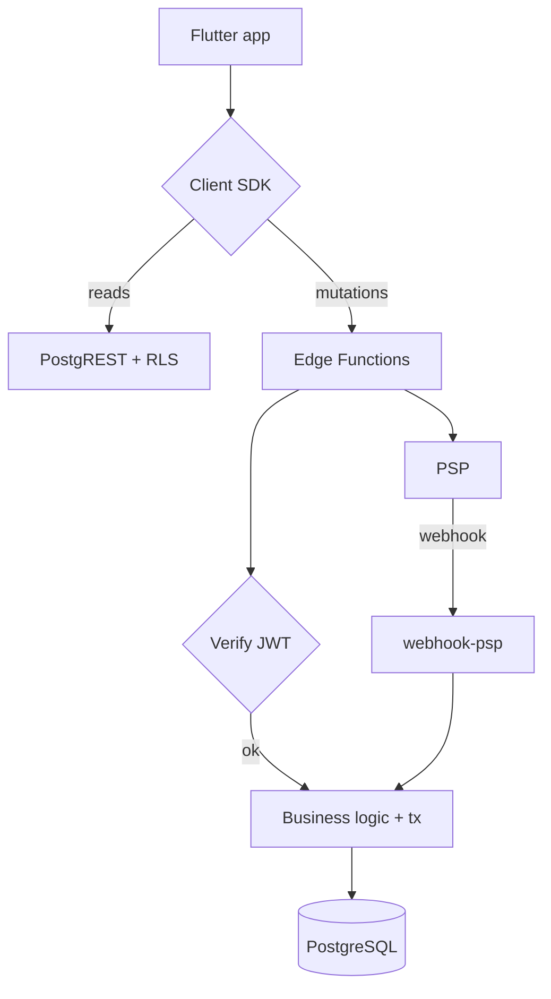

# PF-DOC-14 — API Blueprint

| | |
|---|---|
| Document ID | PF-DOC-14 |
| Title | API Blueprint |
| Version | 1.1 |
| Status | Approved (review PF-REV-01, 2026-08-06) |
| Date | 2026-08-06 |
| Author | Principal Architect |
| References | PF-DOC-07 (FRs), PF-DOC-12 (Supabase), PF-DOC-13 (DB), PF-DOC-18 (business rules), PF-DOC-19 (security); successors PF-DOC-20 (tests), PF-DOC-22 (deployment) |

---

## 1. Purpose

This document defines the **application programming surface** of the PareFood backend:
which tables are exposed through PostgREST (RLS-scoped), which operations are Edge
Functions, request/response contracts, error model, versioning and rate limits. It is the
contract the Flutter data layer (PF-DOC-11) implements.

## 2. Objectives

1. Define the read/query surface via PostgREST (table, filters, allowed).
2. Define the write/mutation surface via Edge Functions (money + privileged ops).
3. Define request/response envelopes and error model.
4. Define idempotency and concurrency semantics.
5. Define versioning, pagination and rate limits.
6. Map every endpoint to FRs (PF-DOC-07) and tables (PF-DOC-13).

## 3. Requirements

### 3.1 API Surface Model

Two complementary channels (per PF-DOC-12):

| Channel | Base path | Auth | Use |
|---|---|---|---|
| PostgREST (read/model access) | `https://<ref>.supabase.co/rest/v1/<table>` | user JWT (anon) + RLS | Reads + simple row writes permitted by RLS |
| Edge Functions | `https://<ref>.supabase.co/functions/v1/<fn>` | user JWT or internal | Money moves, state transitions, admin, webhooks |

Rule: **anything that changes money or order state is an Edge Function.** PostgREST is
read-heavy; app writes through RLS are limited to benign rows (profile, addresses,
favorites, cart, reviews, notifications read-state).

### 3.2 PostgREST Read Surface (allowed reads)

| Table | Allowed filters | Notes |
|---|---|---|
| restaurants | status=active | public read of approved merchants |
| restaurant_hours | by restaurant_id | public |
| menu_categories / menu_items | by restaurant_id; menu_items.is_available=true | public |
| menu_item_options | by menu_item_id | public |
| profiles | self or admin | own row only |
| addresses | user_id = self | own |
| orders | customer sees own; restaurant sees own; driver sees assigned | RLS |
| order_status_history | with own order | RLS |
| driver_locations | on assigned active order | RLS, scoped |
| reviews | target_type+target_id | public aggregates |
| favorites | self | own |
| promotions | status=active, within window | public-safe fields only (code, type, value) |
| notifications | user_id = self | own |
| device_tokens | user_id = self | read own; writes via `register-device-token` |
| search_documents | public, is_available=true | restaurant + menu item search (NFR-004) |
| wallets | self balance (read-only) | writes via functions |
| wallet_transactions | self | read-only |

### 3.3 Edge Function Contract (functions catalogue)

Common envelope:

```
POST /functions/v1/<name>
Headers: { Authorization: "Bearer <JWT>", "Content-Type": "application/json",
           "X-Idempotency-Key": "<uuid>" (when mutating) }
Body:    <typed JSON params>

200 OK    → { "data": {...} }
400       → { "error": { "code": "BUSINESS_RULE_VIOLATION", "message": "...", "rule": "BR-..." } }
401       → { "error": { "code": "UNAUTHENTICATED", "message": "..." } }
403       → { "error": { "code": "FORBIDDEN", "message": "..." } }
404       → { "error": { "code": "NOT_FOUND", "message": "..." } }
409       → { "error": { "code": "CONFLICT", "message": "state conflict", "state": "..." } }
500       → { "error": { "code": "INTERNAL", "message": "server_error" } }   // no internals leaked
```

| Function | Method | Auth | Key params | Returns | FR | Notes |
|---|---|---|---|---|---|---|
| `place-order` | POST | customer | cart snapshot, address id, payment method, idempotency_key | order + payment_intent | FR-ORDER-001, FR-PAY-002 | Validates price (BR-PRICE), stock (BR-STOCK), hours (BR-HOURS) |
| `accept-order` | POST | business | order_id, decision (accept/decline) | order status | FR-ORDER-002 | Enforces 120 s timer (BR-ACCEPT) |
| `ready-order` | POST | business | order_id | order status | FR-ORDER-003 | Sets `ready`; fires dispatch trigger (pg_net) |
| `accept-job` | POST | driver | delivery_id | assignment result | FR-ORDER-004 | Atomic first-accept-wins (BR-DISPATCH-003, BR-JOB) |
| `decline-job` | POST | driver | delivery_id | assignment result | FR-ORDER-004 | Offer window per BR-JOB |
| `dispatch` | POST | internal (trigger) | order_id | assignment result | FR-ORDER-003 | Matching rules BR-DISPATCH |
| `driver-arrived` | POST | driver | delivery_id | status | FR-ORDER-005 | |
| `driver-pickup` | POST | driver | delivery_id, pickup_code | status | FR-ORDER-005 | Verifies code |
| `driver-delivered` | POST | driver | delivery_id, proof_photo | status | FR-ORDER-006 | Uploads proof |
| `complete-order` | POST | internal | order_id | finalised order | — | Locks commission/fare (BR-COMM, BR-FARE) |
| `cancel-order` | POST | customer/driver/admin | order_id, reason | refund status | FR-ORDER-008 | Refund matrix BR-CANCEL |
| `process-payment` | POST | internal | payment_intent_id | charge/refund result | FR-PAY-002 | PSP abstraction |
| `webhook-psp` | POST | PSP | signed payload | 200 ack | FR-PAY-003 | Signature verify (PF-DOC-19) |
| `settle-restaurants` | POST | cron | period | settlements | FR-FIN-001 | BR-SETTLE |
| `payout-drivers` | POST | cron | — | payouts | FR-FIN-003 | BR-PAYOUT |
| `reconcile` | POST | cron/finance | period | report | FR-FIN-005 | BR-RECON |
| `user-admin` | POST | admin | action + target | result | FR-ORDER-010, FR-ADMIN-001..003 | audit logged |
| `send-notification` | POST | internal | user_id, type, payload | delivery receipt | FR-NOTIF-001 | FCM/APNs |
| `request-refund` | POST | customer/admin | order_id | refund intent | FR-PAY-003 | BR-REFUND |
| `register-device-token` | POST | user | platform, token | receipt | FR-NOTIF-005 | Upserts `device_tokens`; never via PostgREST |

**Dispatch trigger:** when `ready-order` sets `orders.status='ready'`, a DB trigger POSTs to
`/functions/v1/dispatch` via `pg_net` (idempotent; retried by cron on failure). Drivers are
notified through `send-notification` + Realtime. Driver accept/decline is allowed ONLY
through `accept-job`/`decline-job` — there is no direct `deliveries` insert policy
(RLS denies), preventing self-assignment.

### 3.4 Error Model

| Code | HTTP | Meaning | Client handling |
|---|---|---|---|
| BUSINESS_RULE_VIOLATION | 400 | Rule blocked (e.g., restaurant closed) | Show rule message + CTA |
| VALIDATION_ERROR | 400 | Param invalid | Show field errors |
| UNAUTHENTICATED | 401 | Missing/expired token | Refresh → re-login |
| FORBIDDEN | 403 | RLS/role denied | Hide feature |
| NOT_FOUND | 404 | Entity missing | Show empty state |
| CONFLICT | 409 | State transition invalid | Refresh state, re-attempt |
| RATE_LIMITED | 429 | Too many requests | Backoff + retry |
| INTERNAL | 500 | Server fault | Retry; report to Sentry |

### 3.5 Idempotency & Concurrency

- Mutations carry `X-Idempotency-Key` (client uuid). Server: if a completed result exists
  for the key, return it (no side effects). Stored in `orders.idempotency_key` and
  `payment_intents` lookup.
- Order state transitions use optimistic concurrency: request carries `expected_status`;
  mismatch → `409 CONFLICT`.
- Money writes run inside DB transactions in Edge Functions; partial failures roll back.

### 3.6 Pagination & Filtering

- PostgREST: `limit`/`offset`, `order`, `select`; capped `limit` ≤ 100 (config).
- Edge list endpoints: cursor-style `page_token` for stable pagination of large sets
  (settlements, audit logs).
- Search: use `ilike`/pg_trgm on allowed columns; never unbounded `select *`.

### 3.7 Versioning

- PostgREST schema versioned implicitly by migrations; client must tolerate additive
  columns (backward-compatible rule in PF-DOC-23).
- Edge Functions versioned by deployment; breaking changes add a suffix
  (`place-order/v2`), keep v1 alive for one release cycle (PF-DOC-26).

### 3.8 Rate Limits (PF-DOC-08/19)

| Scope | Limit (MVP) | Enforced at |
|---|---|---|
| Per-user Edge mutations | 60/min | Edge Function gate |
| Anonymous PostgREST reads | 300/min/IP | API gateway |
| Auth attempts | Supabase Auth defaults | Supabase |
| Job offer accepts | 10/min per driver | Edge gate |

## 4. Diagrams

### 4.1 Request Routing



### 4.2 Place-Order Sequence

```mermaid
sequenceDiagram
    participant A as AP-PF
    participant E as place-order (Edge)
    participant D as DB
    participant P as PSP
    A->>E: POST place-order {cartId, addressId, payMethod, key}
    E->>D: validate cart, price (BR-PRICE), stock, hours (tx)
    E->>D: insert orders + order_items + history (tx)
    E->>P: create charge (process-payment)
    P-->>E: intent created
    E-->>A: {order, payment_intent}
    P-->>E: webhook success
    E->>D: mark paid; notify (send-notification)
```

## 5. Tables

### 5.1 Endpoint → FR → Table Trace (sample)

| Endpoint | FR | Table(s) | Method |
|---|---|---|---|
| place-order | FR-ORDER-001/PAY-002 | carts, orders, order_items, payment_intents | POST |
| accept-order | FR-ORDER-002 | orders, order_status_history | POST |
| ready-order | FR-ORDER-003 | orders, order_status_history | POST |
| accept-job / decline-job | FR-ORDER-004 | deliveries, orders | POST |
| driver-pickup | FR-ORDER-005 | deliveries, orders | POST |
| register-device-token | FR-NOTIF-005 | device_tokens | POST |
| complete-order | FR-ORDER-001 | orders, wallets, wallet_transactions | POST (internal) |
| cancel-order | FR-ORDER-008/PAY-003 | orders, payment_intents, wallets | POST |
| REST restaurants | FR-DISC-001..004 | restaurants, menu_* | GET |

### 5.2 HTTP Status Use by Operation

| Operation | Success | Failure codes |
|---|---|---|
| Reads | 200 | 400, 401, 403, 404, 429 |
| Place/accept/cancel | 200 (with data) | 400, 401, 403, 404, 409, 429 |
| PSP webhook | 200 ack | 500 (retry by PSP) |
| Admin ops | 200 | 400, 401, 403, 409, 429 |

## 6. Rules

- **API-R01** Money/state mutations exist only as Edge Functions; PostgREST never mutates
  order status, wallets or settlements.
- **API-R02** Every mutation is idempotent (X-Idempotency-Key) — required by NFR-021.
- **API-R03** Responses never expose internal identifiers beyond required `id`s, never
  include PSP tokens or service secrets (PF-DOC-19).
- **API-R04** Error payloads include machine codes (for tests) + user messages (Bahasa).
- **API-R05** Breaking API changes require a version suffix and one-cycle overlap (PF-DOC-26).
- **API-R06** Edge Functions must validate all inputs (never trust RLS-only for money).
- **API-R07** Rate limits are config and monitored (PF-DOC-27).

## 7. Checklist

- [ ] Read surface (§3.2) matches RLS posture (PF-DOC-12)
- [ ] Function catalogue implemented with tests (PF-DOC-20)
- [ ] Error model + envelopes implemented uniformly
- [ ] Idempotency verified for all mutations
- [ ] Pagination and rate limits enforced
- [ ] Endpoint↔FR↔table trace verified

## 8. Risks

| Risk | Likelihood | Impact | Mitigation |
|---|---|---|---|
| Business logic duplicated between functions and apps | Medium | Medium | Apps render rule results; rules live server-side (PF-DOC-18) |
| Webhook retries cause double-processing | Medium | High | Idempotent webhook handler (PF-DOC-19) |
| PostgREST over-exposure via crafted queries | Medium | High | RLS + allowed-column review in CI |
| Breaking change rollout issues | Medium | Medium | Version suffix + overlap (API-R05) |
| Rate-limit tuning too tight for merchant | Medium | Low | Config + monitoring |

## 9. Future Improvements

- OpenAPI/Supabase generated SDK for typed clients.
- GraphQL layer (Hasura/PostGraphile) for admin analytics (PF-DOC-29).
- Public partner API (restaurants integrate own POS) (PF-DOC-29).
- Webhook signature versioning and key rotation automation.
