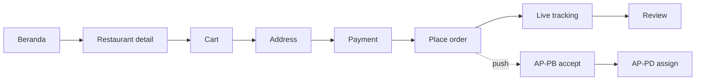
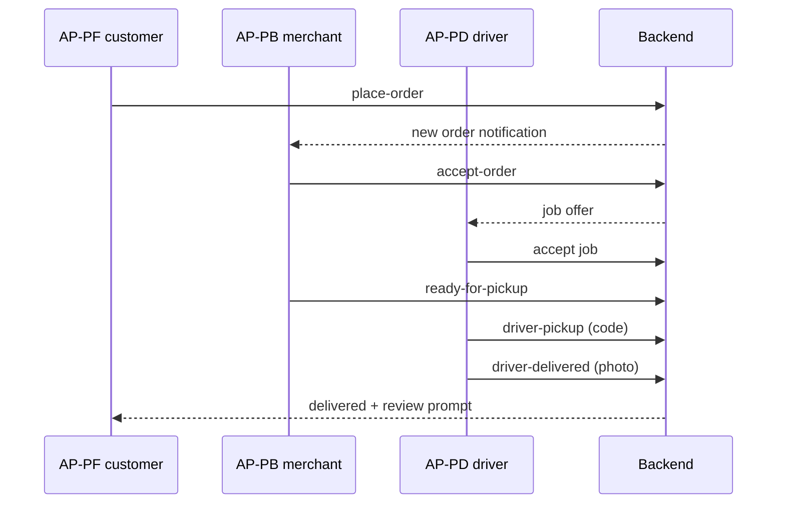

# PF-DOC-15 — UI/UX Blueprint

| | |
|---|---|
| Document ID | PF-DOC-15 |
| Title | UI/UX Blueprint |
| Version | 1.0 |
| Status | Approved (review PF-REV-01, 2026-08-06) |
| Date | 2026-08-06 |
| Author | UI/UX Architect |
| References | PF-DOC-02 (products), PF-DOC-06 (personas), PF-DOC-07 (FRs), PF-DOC-08 (NFRs); successors PF-DOC-16 (design), PF-DOC-17 (navigation) |

---

## 1. Purpose

This document defines the **user experience strategy** across the four apps: experience
principles, information architecture (IA), key user flows, interaction patterns and
accessibility. It shapes PF-DOC-16 (visual design) and PF-DOC-17 (navigation) and is
validated against personas (PF-DOC-06) and NFRs (PF-DOC-08).

## 2. Objectives

1. Define experience principles for the whole family.
2. Define IA (tab structures, primary/secondary navigation) per app.
3. Define the critical user flows (ordered, accepted, tracked, delivered).
4. Define interaction patterns (states, feedback, error recovery, offline).
5. Define accessibility requirements beyond visual style (NFR-027..030).
6. Define usability test protocol feeding PF-DOC-20.

## 3. Requirements

### 3.1 Experience Principles

1. **Clarity over density** — one job per screen; the order state is always visible.
2. **Transparency** — fees, fares and ETA are shown before commitment (PF-DOC-03).
3. **Speed of trust** — critical actions (accept, pay) are ≤ 2–5 taps per persona.
4. **Recovery first** — every error state offers a path forward (retry, contact, alternative).
5. **Glanceable when moving** — driver app usable at a glance while riding (P5, PF-DOC-06).
6. **Consistent family** — same patterns across AP-PF/AP-PB/AP-PD/AP-PA via design system.

### 3.2 Information Architecture — PareFood (AP-PF)

Bottom navigation (4 tabs): **Beranda** (home) | **Pesanan** (orders) | **Favorit**
(favorites) | **Akun** (profile).

```
Beranda
 ├─ Search bar (restaurant/item)
 ├─ Promo carousel
 ├─ Categories chips
 ├─ "Untuk Kamu" recommendations
 └─ Restaurant list (distance, ETA, rating)
Restaurant detail (push)
 ├─ Cover + rating + ETA
 ├─ Menu by category
 └─ Sticky bottom bar: "Lihat Keranjang (n)"
Checkout flow
 Cart → Address → Payment → Confirm
Pesanan
 └─ Active order card (status timeline, driver map) / history list
Akun
 └─ Profile, addresses, payment methods, vouchers, settings
```

### 3.3 Information Architecture — PareBisnis (AP-PB)

Bottom navigation (3 tabs): **Pesanan** (orders) | **Menu** | **Laporan** (reports) +
Account.

```
Pesanan
 └─ Incoming queue (accept/decline, 120 s timer)
 └─ Active orders (prep timer → ready)
Menu
 └─ Categories → items (price, image, availability toggle)
Laporan
 └─ Today sales, top items, settlement preview
Akun
 └─ Store profile, hours, radius, commission rate view
```

### 3.4 Information Architecture — PareDriver (AP-PD)

Bottom navigation (3 tabs): **Pekerjaan** (jobs) | **Penghasilan** (earnings) | **Akun**.

```
Pekerjaan
 ├─ Online toggle (large) + status
 ├─ Job offer bottom sheet (fare, distance, restaurant, accept/decline)
 └─ Active job screen (large buttons: Arrived → Pickup code → Deliver photo)
Penghasilan
 ├─ Today total, weekly total, per-delivery breakdown
 └─ Wallet balance + payout
Akun
 └─ Profile, vehicle, documents, settings
```

### 3.5 Information Architecture — PareAdmin (AP-PA) (Flutter Web)

Left sidebar: **Dashboard** | **Orders** | **Users** | **Merchants** | **Drivers** |
**Finance** | **Promo** | **Audit**.

```
Dashboard → KPIs (orders, GMV, cancellations, peak hours)
Orders → live board, search by order_no, order detail, force-cancel
Users/Merchants/Drivers → list with filters, detail, verification queue, suspend/restore
Finance → settlements, payouts, reconciliation reports
Promo → voucher CRUD
Audit → audit log viewer
```

### 3.6 Critical User Flows

Flow 1 — **Customer order-to-door** (PF persona P1):
Home → search/select restaurant → add items → cart → address → payment → place order →
live status → delivered → review. Budget ≤ 5 taps to checkout; ≤ 8 taps total.

Flow 2 — **Merchant accept-to-ready** (persona P3):
Incoming order (sound + banner) → accept (≤ 2 taps) → prep timer → ready-for-pickup.
Auto-decline at 120 s (BR-ACCEPT, PF-DOC-18).

Flow 3 — **Driver accept-to-delivered** (persona P5):
Job offer sheet → accept (≤ 3 taps) → navigate → arrive → pickup code → photo proof →
delivered → earnings update. Glanceable big-touch UI.

Flow 4 — **Admin verify-and-govern** (persona P7):
Merchant verification queue → review documents (inline preview) → approve/reject with reason
→ audit logged → notify merchant.

### 3.7 Interaction Patterns

| Pattern | Standard |
|---|---|
| Loading | Skeleton/shimmer for content; circular spinner ≤ 1 s actions |
| Empty state | Illustration + message + primary CTA |
| Error | Message (Bahasa) + Retry; never raw stack traces |
| Pull-to-refresh | On all lists |
| Bottom sheet | For job offers (driver), payment confirmation, address picker |
| Sticky bar | Cart bar while browsing menu |
| Undo | For soft actions (remove favorite, decline job is confirm-gated) |
| Offline | Banner "Mode offline — data tersimpan" + cached content (NFR-009) |
| Big touch | Driver app: primary buttons ≥ 56 dp (NFR-028) |
| Feedback | Haptic on accept/deliver; sound on incoming order (merchant, configurable) |

### 3.8 Accessibility (NFR-027..030)

| Requirement | Standard |
|---|---|
| Screen reader | Semantic labels on all interactive elements; TalkBack/VoiceOver tested |
| Touch targets | ≥ 48 dp standard; ≥ 56 dp driver primary actions |
| Contrast | ≥ 4.5:1 normal text, ≥ 3:1 large (token-driven, PF-DOC-16) |
| Font scaling | UI supports system font scale up to 200% without breakage |
| Colour independence | Status never communicated by colour alone (icon + text + colour) |
| Focus order (web) | Logical tab order for AP-PA; visible focus rings |
| Reduced motion | Respect OS reduce-motion for animations |

### 3.9 Usability Test Protocol

| Item | Spec |
|---|---|
| Cadence | One round per sprint for changed flows (PF-DOC-25) |
| Participants | ≥ 5 per persona; recruited per PF-DOC-05 criteria |
| Tasks | Flow 1–4 above + error/offline scenarios |
| Metrics | Task success, time, taps, system usability score (SUS) ≥ 70 |
| Output | Findings logged to `docs/ux-findings/` and wired to FR changes (PF-DOC-07) |

## 4. Diagrams

### 4.1 Customer Order Flow



### 4.2 Multi-App Coordination Flow



## 5. Tables

### 5.1 App IA Summary

| App | Bottom/side nav | Primary CTA | Secondary actions |
|---|---|---|---|
| AP-PF | Beranda/Pesanan/Favorit/Akun | "Pesan Sekarang" | Search, filter, reorder |
| AP-PB | Pesanan/Menu/Laporan + Akun | "Terima" (accept) | Decline, ready, toggle stock |
| AP-PD | Pekerjaan/Penghasilan/Akun | "Terima Pekerjaan" | Navigate, pickup, deliver |
| AP-PA | Sidebar (8 items) | Primary page CTA per module | Filters, export, approve |

### 5.2 Key Flow Budgets (per NFR-027)

| Flow | Max taps | Target time | Owner |
|---|---|---|---|
| Customer checkout | 5 | ≤ 60 s | PF team |
| Merchant accept | 2 | ≤ 3 s | PF team |
| Driver job start | 3 | ≤ 15 s | PF team |
| Admin approve merchant | 4 | ≤ 90 s | Web team |

## 6. Rules

- **UX-R01** Experience principles (§3.1) are binding on all design work.
- **UX-R02** No screen ships without all four states (loading/error/empty/data) handled
  (FL-R07).
- **UX-R03** Money/fee information is always shown before any commitment (transparency).
- **UX-R04** Driver-facing controls must meet the big-touch standard (§3.7).
- **UX-R05** Usability findings are tracked to FR changes; UX debt is logged like tech debt.
- **UX-R06** All UI copy in Bahasa Indonesia; English is a secondary locale (PF-DOC-16 i18n).

## 7. Checklist

- [ ] IA for all four apps approved
- [ ] Four critical flows designed and usability-tested
- [ ] Interaction patterns documented and implemented in design system
- [ ] Accessibility standard met (audit in PF-DOC-20)
- [ ] Usability protocol active with metrics captured

## 8. Risks

| Risk | Likelihood | Impact | Mitigation |
|---|---|---|---|
| Driver UI unsafe while riding | Medium | High | Big-touch, minimal text; hands-free nav; SOS (PF-DOC-29) |
| Information density vs. transparency tension | Medium | Low | Progressive disclosure (details expandable) |
| Cross-app inconsistency | Medium | Medium | Single design system (PF-DOC-16) |
| Web admin complexity | Medium | Medium | Reuse design system web-first components |

## 9. Future Improvements

- Journey maps per persona (P1–P8) for deeper empathy (PF-DOC-29).
- Voice control / hands-free driver mode.
- Dark mode and dynamic theming (PF-DOC-16).
