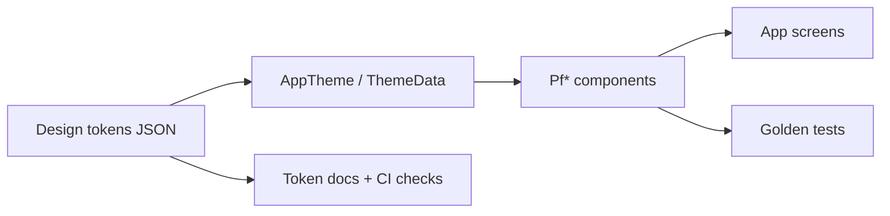
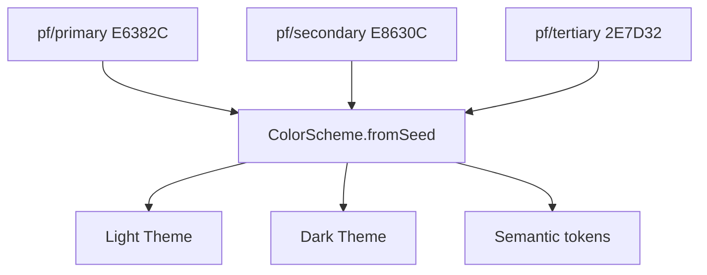

# PF-DOC-16 — Design System

| | |
|---|---|
| Document ID | PF-DOC-16 |
| Title | Design System |
| Version | 1.0 |
| Status | Approved (review PF-REV-01, 2026-08-06) |
| Date | 2026-08-06 |
| Author | UI/UX Architect |
| References | PF-DOC-08 (NFRs), PF-DOC-15 (UX), PF-DOC-10 (monorepo, `packages/design`); successor PF-DOC-17 (navigation) |

---

## 1. Purpose

This document defines the **PareFood design system**: Material 3-based visual language,
design tokens, components, typography, colour, spacing, iconography and theming across all
four apps. It is implemented in `packages/design` (PF-DOC-10) and consumed by every app to
guarantee a consistent family experience (UX-R01).

## 2. Objectives

1. Define Material 3 token model (colour, type, space, shape, motion).
2. Define the PareFood brand colour and typography system.
3. Define the shared component library and usage rules.
4. Define light/dark theming and contrast compliance (NFR-030).
5. Define iconography, imagery and illustration standards.
6. Define i18n and text standards (Bahasa Indonesia).
7. Define governance: how tokens/components evolve.

## 3. Requirements

### 3.1 Material 3 Foundations

- The platform uses **Material 3** with dynamic colour off (brand identity fixed) and a
  custom `ColorScheme.fromSeed` seeded from the brand primary (PF-DOC-09 TS-R04).
- All components derive from Material 3 tokens; custom components extend the token set.

### 3.2 Colour System (Brand Tokens)

| Token | Light value | Dark value | Usage |
|---|---|---|---|
| `pf/primary` | #E6382C (PareRed) | #FFB4AB | Brand actions, CTA |
| `pf/onPrimary` | #FFFFFF | #690005 | Text on primary |
| `pf/secondary` | #E8630C (saffron) | #FFB77B | Highlights, promos |
| `pf/tertiary` | #2E7D32 (leaf green) | #81C784 | Success, hygiene badge |
| `pf/surface` | #FFF8F6 | #201A19 | App background |
| `pf/surfaceContainer` | #F5EDEA | #2B2321 | Cards, sheets |
| `pf/error` | #BA1A1A | #FFB4AB | Errors, destructive |
| `pf/onSurface` | #221A19 | #F0DFDC | Primary text |
| `pf/onSurfaceVariant` | #857370 | #D5C2BF | Secondary text |
| `pf/outline` | #9A8682 | #9A8682 | Borders, dividers |

Status semantics (colour + icon + text — NFR-030):

| Status | Colour token | Companion icon |
|---|---|---|
| Active/online | pf/tertiary | ● |
| Pending | pf/secondary | ⏱ |
| Error/declined | pf/error | ✕ |
| Cancelled | pf/onSurfaceVariant | — |

### 3.3 Typography

Based on Material 3 type scale with the **Plus Jakarta Sans** family (variable weights;
supports Bahasa Indonesia and Latin).

| Style | Size/weight/line-height | Use |
|---|---|---|
| display | 36–45 / Bold / 1.2 | Marketing, empty states |
| headline | 24–32 / Bold / 1.3 | Screen titles |
| title | 16–22 / SemiBold / 1.35 | Cards, sheet headers |
| body | 14–16 / Regular / 1.5 | Content |
| label | 12–14 / Medium / 1.45 | Buttons, chips, captions |
| number | tabular figures (feature `tnum`) | Prices, ETAs, earnings |

Rules:
- Prices always use `tnum` and the IDR format `Rp 85.000` (thousands separator, no decimals).
- ETAs shown as "±25 mnt".
- Body minimum 14 px; contrast per NFR-030.

### 3.4 Spacing & Layout Grid

| Token | Value |
|---|---|
| `pf/space-1` | 4 |
| `pf/space-2` | 8 |
| `pf/space-3` | 12 |
| `pf/space-4` | 16 |
| `pf/space-5` | 24 |
| `pf/space-6` | 32 |
| `pf/space-7` | 48 |
| Content max width | 480 px (mobile); 1200 px (web admin) |
| Screen padding | 16 px (mobile); 24 px (web) |

### 3.5 Shape & Elevation

| Token | Value | Use |
|---|---|---|
| `pf/shape-sm` | 8 | chips, small cards |
| `pf/shape-md` | 12 | cards, inputs |
| `pf/shape-lg` | 16 | sheets, dialogs |
| `pf/shape-xl` | 28 | images, hero cards |
| Elevation | M3 tonal overlays; avoid hard shadows | cards, FAB, sheets |

### 3.6 Motion

| Pattern | Spec |
|---|---|
| Duration | 150 ms micro, 250 ms standard, 350 ms complex |
| Curves | `easeInOutCubic` for in/out; `emphasized` for shared transitions |
| Navigation transitions | M3 page transition; respect reduce-motion (NFR-030) |
| Loading | shimmer/skeleton, no spinner on full-page loads > 1 s |

### 3.7 Component Library (in `packages/design`)

| Component | Notes |
|---|---|
| `PfButton` | primary/secondary/tertiary/outline/text; sizes; loading state |
| `PfChip` | filter chips, category chips |
| `PfCard` | restaurant card, order card, earnings card |
| `PfBottomSheet` | job offer, payment, address picker |
| `PfAppBar` | with search, back, actions |
| `PfBottomNav` | app shell tabs (PF-DOC-17) |
| `PfListItem` | menu item row with qty stepper |
| `PfStatusBadge` | status pill with icon+colour (§3.2) |
| `PfStepper` | cart quantity, options |
| `PfTimeline` | order status timeline |
| `PfMapView` | driver tracking wrapper (Google Maps) |
| `PfSkeleton` / `PfEmptyState` / `PfErrorState` | the four states (FL-R07) |
| `PfFormField` | validated input with error text |
| `PfDialog` | confirmations (decline, cancel, approve) |
| `PfDataTable` | web admin tables (AP-PA) |
| `PfSideNav` | web admin sidebar |
| `PfTag` | hygiene score, promo labels |

Component rules:
- All components accept design tokens, never hard-coded colours.
- All components are keyboard/reader accessible (NFR-029).
- Components are golden-testable (PF-DOC-20).

### 3.8 Iconography & Imagery

| Item | Standard |
|---|---|
| Icons | Material Symbols (outlined default; filled for active nav) |
| Food imagery | Real photography; 4:3 restaurant cards; 16:9 covers; served on brand-tinted background |
| Illustrations | Flat, warm palette anchored to pf/primary; used in empty states |
| Driver avatar | Initial-based avatars with deterministic colour hash |

### 3.9 Theming (Light/Dark)

- Light theme = default; dark theme = automatic follow-system, overridable in settings.
- Tokens are defined once; `ThemeData` built from `ColorScheme` + `TextTheme` in
  `packages/design` `AppTheme`.
- Contrast validated at token level (NFR-030); CI token check (PF-DOC-21).

### 3.10 i18n & Text (Bahasa Indonesia)

- Default locale `id-ID`; fallback `en`. Strings live in ARB files per app and in
  `packages/design` for shared components.
- Currency `Rp`; date `dd MMM yyyy`; time 24 h; relative time "5 mnt lalu".
- All user-facing strings localised; developer-facing strings English (PF-DOC-23).
- TBD/placeholder text is forbidden before release (checked in review).

### 3.11 Governance

| Item | Process |
|---|---|
| Token change | Design-eng PR; update `docs/design-tokens.json`; token tests updated |
| New component | Propose to design system owner; add to library + golden tests |
| Deprecation | Mark deprecated; remove after 2 releases (PF-DOC-26) |
| Versioning | `packages/design` follows semver internally; consumed by all apps |

## 4. Diagrams

### 4.1 Token → Component → Screen Flow

### 4.2 Brand Colour Family

## 5. Tables

### 5.1 Design Token Categories

| Category | Count (target) | Examples |
|---|---|---|
| Colour | 16 | §3.2 |
| Typography | 6 | §3.3 |
| Spacing | 7 | §3.4 |
| Shape | 4 | §3.5 |
| Motion | 3 | §3.6 |
| Elevation | 4 | §3.5 |
| **Total** | **40** | — |

### 5.2 Component Maturity

| Component | Status (MVP) | Apps |
|---|---|---|
| PfButton..PfTimeline | Must have | all |
| PfMapView | Must have | AP-PF, AP-PD |
| PfDataTable / PfSideNav | Must have | AP-PA |
| PfTag (hygiene) | Should have | AP-PF (future) |

## 6. Rules

- **DS-R01** Apps must use `packages/design`; hard-coded colours/type are forbidden (lint
  guard in CI).
- **DS-R02** Tokens are the single source of truth; no component-specific colour overrides.
- **DS-R03** Status colours always paired with icon/text (accessibility, NFR-030).
- **DS-R04** New components require design-system review before merge.
- **DS-R05** ARB files are the only source of user-facing strings.
- **DS-R06** Dark mode must be parity-tested for contrast and readability.

## 7. Checklist

- [ ] Token set (40) defined and versioned
- [ ] Component library implemented in packages/design
- [ ] Light/dark themes built from tokens
- [ ] Contrast audit passed (NFR-030)
- [ ] i18n (id-ID) strings complete for all screens
- [ ] Golden tests + token checks wired to CI (PF-DOC-21)

## 8. Risks

| Risk | Likelihood | Impact | Mitigation |
|---|---|---|---|
| Design drift between apps | Medium | Medium | Shared package + token lint |
| Contrast failures in dark mode | Medium | Medium | Token-level contrast tests |
| Component API churn | Medium | Medium | Deprecation policy (governance) |
| Icon/license issues | Low | Low | Material Symbols licensed use |

## 9. Future Improvements

- Component stories/playground page for rapid preview.
- Dynamic colour opt-in for premium theme.
- Brand illustration library expansion.
- Web-only density mode for AP-PA.
