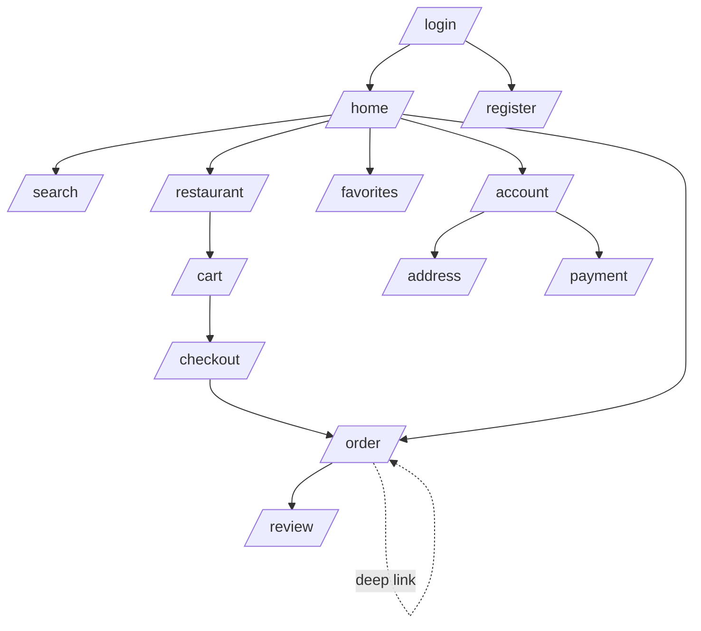
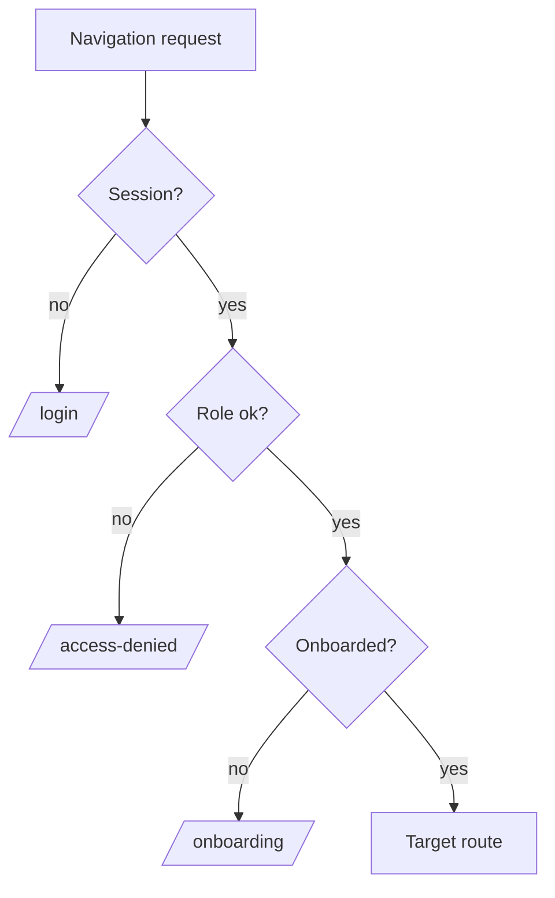

# PF-DOC-17 — Navigation Flow

| | |
|---|---|
| Document ID | PF-DOC-17 |
| Title | Navigation Flow |
| Version | 1.0 |
| Status | Approved (review PF-REV-01, 2026-08-06) |
| Date | 2026-08-06 |
| Author | Principal Architect / UX Architect |
| References | PF-DOC-07 (FRs), PF-DOC-11 (Flutter arch), PF-DOC-15 (UX IA), PF-DOC-16 (design); successors PF-DOC-23 (coding), PF-DOC-20 (testing) |

---

## 1. Purpose

This document defines **navigation across the four apps** using GoRouter (PF-DOC-09):
route tables, navigation guards (auth/role), deep links, and shell layouts. It turns the
IA in PF-DOC-15 into concrete routing rules.

## 2. Objectives

1. Define the GoRouter setup and route tables per app.
2. Define authentication/authorisation guards (redirects) per role.
3. Define deep-link strategy (order tracking, promo, restaurant share).
4. Define shell/nested navigation (bottom nav, side nav, tabs).
5. Define error and fallback routing (404, access denied).
6. Define navigation state restoration and web URL semantics (AP-PA).

## 3. Requirements

### 3.1 GoRouter Foundation

- One `GoRouter` instance per app, built in the composition root (PF-DOC-10/11).
- `routerConfig` uses `StatefulShellRoute.indexedStack` for bottom nav (keeps tab state).
- Route paths are declared in one table per app (below); names stable (`routeNames`).
- Guards implemented via `GoRouterRedirect` using `authStateProvider` and role claims
  (PF-DOC-12 §3.2).
- Transition animations per PF-DOC-16 §3.6; web (AP-PA) uses URL path mapping.

### 3.2 PareFood (AP-PF) Route Table

| Route path | Name | Guard | Notes |
|---|---|---|---|
| `/` | home | auth | Beranda tab |
| `/orders` | orders | auth | Pesanan tab |
| `/favorites` | favorites | auth | Favorit tab |
| `/account` | account | auth | Akun tab |
| `/restaurant/:id` | restaurant | auth | detail |
| `/cart` | cart | auth | cart view |
| `/checkout` | checkout | auth | address+payment |
| `/order/:id` | orderDetail | auth + owner | live tracking + receipt |
| `/search` | search | auth | |
| `/address/new` | addressNew | auth | |
| `/payment/methods` | paymentMethods | auth | |
| `/onboarding` | onboarding | auth + no-profile | first-run profile |
| `/login` | login | unauthenticated | redirects to `/` if authed |
| `/register` | register | unauthenticated | |
| `/restaurant/:id/review/:orderId` | review | auth | post-delivery review |

### 3.3 PareBisnis (AP-PB) Route Table

| Route path | Name | Guard | Notes |
|---|---|---|---|
| `/` | orders | business | order inbox tab |
| `/orders/:id` | orderDetail | business | order ops |
| `/menu` | menu | business | menu editor tab |
| `/menu/category/:id` | categoryEdit | business | |
| `/menu/item/:id` | itemEdit | business | |
| `/reports` | reports | business | Laporan tab |
| `/account` | account | business | |
| `/onboarding` | onboarding | business + no-restaurant | merchant setup |
| `/login` | login | unauthenticated | |

### 3.4 PareDriver (AP-PD) Route Table

| Route path | Name | Guard | Notes |
|---|---|---|---|
| `/` | jobs | driver | Pekerjaan tab |
| `/job/:id` | jobActive | driver | active job screen |
| `/earnings` | earnings | driver | Penghasilan tab |
| `/wallet` | wallet | driver | |
| `/account` | account | driver | |
| `/onboarding` | onboarding | driver + no-driver-profile | documents |
| `/login` | login | unauthenticated | |

### 3.5 PareAdmin (AP-PA) Route Table (Flutter Web)

| Route path | Name | Guard | Notes |
|---|---|---|---|
| `/` | dashboard | admin | redirects by role |
| `/orders` | ordersBoard | admin | live board |
| `/orders/:id` | orderDetail | admin | |
| `/users` | users | admin | |
| `/users/:id` | userDetail | admin | |
| `/merchants` | merchants | admin | verification queue |
| `/merchants/:id` | merchantDetail | admin | |
| `/drivers` | drivers | admin | |
| `/drivers/:id` | driverDetail | admin | |
| `/finance/settlements` | settlements | admin+finance | |
| `/finance/reconciliation` | reconciliation | admin+finance | |
| `/promo` | promo | admin | vouchers |
| `/audit` | audit | admin+super | |
| `/login` | login | unauthenticated | |

### 3.6 Guards & Redirect Rules

| Guard | Rule | Redirect target |
|---|---|---|
| `requireAuth` | No valid session | `/login` (with `redirect` back param) |
| `requireRole(role)` | Session but role mismatch | Access denied page (`/access-denied`) |
| `requireOnboarded(app)` | Session but profile/restaurant/driver missing | `/onboarding` |
| `unauthenticatedOnly` | Session exists | `/` |
| `requireOrderOwner` | User not participant of order | `/access-denied` |

Guard implementation order: auth → role → onboarding → ownership.

### 3.7 Deep Links

| Link | Target app/route | Use |
|---|---|---|
| `parefood://order/<id>` | AP-PF `/order/:id` | Order tracking from notification |
| `parefood://restaurant/<id>` | AP-PF `/restaurant/:id` | Share merchant |
| `parefood://promo/<code>` | AP-PF checkout promo | Campaign links |
| `parebisnis://order/<id>` | AP-PB `/orders/:id` | New order notification |
| `paredriver://job/<id>` | AP-PD `/job/:id` | Job offer notification |
| Web (AP-PA) | URL paths = routes | Browser refresh keeps state |

Rules:
- Deep links open only for authorised users; unauthorised → login then continue.
- Android App Links verified; iOS universal links (deploy config PF-DOC-22).
- Notification taps use deep links (FR-NOTIF-001..003).

### 3.8 Shell Layouts

| App | Shell |
|---|---|
| AP-PF | `StatefulShellRoute.indexedStack` with 4 bottom tabs |
| AP-PB | 3 bottom tabs |
| AP-PD | 3 bottom tabs (+ always-visible online toggle in jobs tab) |
| AP-PA | Side nav `PfSideNav` (PF-DOC-16); content area nested routes |

Tab state preserved across navigation; deep links can navigate into a tab's nested stack.

### 3.9 Error & Fallback Routing

| Case | Behaviour |
|---|---|
| Unknown path | `errorBuilder` → NotFound page with link home |
| Access denied | `/access-denied` page (role mismatch) |
| App update required | Route `/update-required` with store links |
| Maintenance | Remote flag → maintenance screen (no navigation) |

### 3.10 State Restoration

- `GoRouter` state restored on app restart using `restorationScopeId`; tab selection restored.
- Web (AP-PA): browser back/forward drives route history; URLs shareable.

## 4. Diagrams

### 4.1 AP-PF Navigation Graph

### 4.2 Guard Pipeline

## 5. Tables

### 5.1 Route Inventory per App

| App | Routes (MVP) | Guards | Deep links |
|---|---|---|---|
| AP-PF | 14 | auth, owner | 3 |
| AP-PB | 9 | business, onboarded | 1 |
| AP-PD | 7 | driver, onboarded | 1 |
| AP-PA | 14 | admin (+role) | web paths |

### 5.2 Route Naming Convention

| Convention | Example |
|---|---|
| `snake_case` path segments | `/restaurant/:id` |
| `camelCase` route names | `restaurantDetail` |
| Param format | `:id`, `:code`, `:orderId` |
| Query params | `?redirect=`, `?promo=` |

## 6. Rules

- **NV-R01** All navigation is GoRouter-declared; no imperative `Navigator.push` outside
  controlled cases (dialogs, sheets).
- **NV-R02** Guards are declarative; auth state changes redirect automatically.
- **NV-R03** Route names are constants shared by deep links and notification payloads.
- **NV-R04** Tab shells preserve state; navigation must not rebuild tabs (indexedStack).
- **NV-R05** Every route implements error/empty handling per FL-R07.
- **NV-R06** Web routes must be directly loadable (deep-link parity) — AP-PA.
- **NV-R07** New routes require guard review in PR (PF-DOC-19 security checklist).

## 7. Checklist

- [ ] Route tables implemented per app
- [ ] Guard pipeline tested (auth/role/onboarding/ownership)
- [ ] Deep links verified on Android/iOS/web
- [ ] Tab state preservation verified
- [ ] 404/access-denied/maintenance routes present
- [ ] Route inventory synced with PF-DOC-07 FRs

## 8. Risks

| Risk | Likelihood | Impact | Mitigation |
|---|---|---|---|
| Guard bypass (deep link into guarded page) | Medium | High | Guards enforced on every route + tests |
| Web refresh loses state | Medium | Medium | URL-path routing + state restoration |
| Deep link config drift (App Links/Universal) | Medium | Medium | CI link verification (PF-DOC-21) |
| Tab rebuild flicker | Low | Medium | indexedStack + state restoration |

## 9. Future Improvements

- Bottom-sheet routes for lightweight flows.
- Multi-window / responsive web layouts for AP-PA.
- Route-based permission audit tooling.
