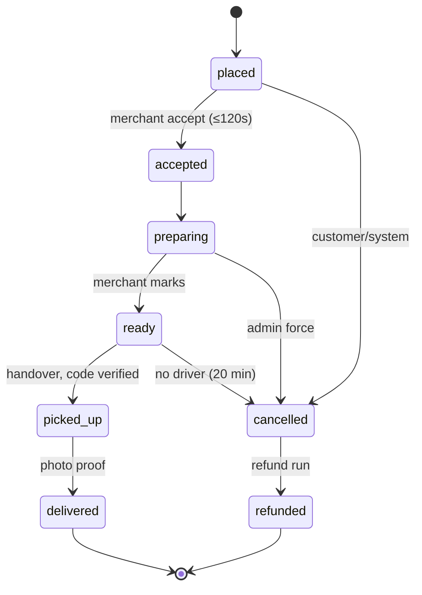
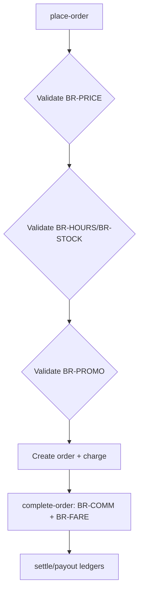

# PF-DOC-18 — Business Rules

| | |
|---|---|
| Document ID | PF-DOC-18 |
| Title | Business Rules |
| Version | 1.1 |
| Status | Approved (review PF-REV-01, 2026-08-06) |
| Date | 2026-08-06 |
| Author | Product Manager / Principal Architect / Finance |
| References | PF-DOC-03 (business analysis), PF-DOC-07 (FRs), PF-DOC-13 (DB), PF-DOC-14 (API); successors PF-DOC-19 (security), PF-DOC-27 (monitoring) |

---

## 1. Purpose

This document is the **single source of truth for business rules**: pricing, commissions,
fares, order state machine, cancellation/refund matrix, dispatch, settlement, promotions
and fraud guardrails. Rules are implemented server-side (PF-DOC-12/14) and mirrored in
tests (PF-DOC-20). No rule lives only in app code.

## 2. Objectives

1. Define all business rules with stable IDs (`BR-<NNN>`) and defaults.
2. Define the order state machine and every allowed transition.
3. Define pricing, commission, fare and settlement formulas.
4. Define the cancellation/refund matrix and timeouts.
5. Define dispatch/matching rules and ratings calculation.
6. Define promo rules and fraud guardrails.
7. Establish rule-change governance (marketing truth rule CA-02).

## 3. Requirements

### 3.1 Pricing (BR-PRICE)

Formula: `total = subtotal + delivery_fee + service_fee − discount` (money in bigint IDR).
Line item: `line_total = quantity × (unit_price + Σ selected option price_adjust)`.

| Rule | Default | Notes |
|---|---|---|
| BR-PRICE-001 | Delivery fee = base + max(0, km − free_km) × per_km | base Rp 6,000; per_km Rp 2,000; free_km 0 |
| BR-PRICE-002 | Service fee fixed Rp 2,000 | Config per city |
| BR-PRICE-003 | Discount never exceeds subtotal + fees; total ≥ 0 | Guard in function |
| BR-PRICE-004 | Price snapshot at add-to-cart (unit price + option adjustments); revalidated before place | Revalidate at placement |
| BR-PRICE-005 | Minimum order value Rp 15,000 | Config per restaurant |
| BR-REPRICE-001 | Menu price changed since add-to-cart | Cart shows new price + total; customer must confirm before payment (FR-CART-006) |
| BR-REPRICE-002 | Item out-of-stock / option removed at placement | Blocked with message; customer adjusts cart (BR-STOCK-001) |

### 3.2 Commission & Fares (BR-COMM, BR-FARE)

| Rule | Default | Notes |
|---|---|---|
| BR-COMM-001 | Commission = order subtotal × rate | rate per restaurant (15% standard / 20% premium) |
| BR-COMM-002 | Commission computed on delivered orders only | Completed state |
| BR-COMM-003 | Fare passthrough: driver receives 100% of delivery fee + incentives | Never reduced (BA-02) |
| BR-FARE-001 | Incentive rules per campaign; capped by finance guardrail | ≤ 3% GMV (PF-DOC-03) |
| BR-SETTLE-001 | Restaurant settlement T+7 of completed orders | Period cron |
| BR-PAYOUT-001 | Driver payout daily to wallet; instant top-up optional | Ledger-backed |
| BR-COD-001 | COD remittance: driver remits collected cash ≤ 24 h (via payment point/agent) | FR-PAY-004 |
| BR-COD-002 | COD credited to driver wallet after remittance verified | Wallet credit `reason=settlement` |
| BR-COD-003 | Order total for COD never becomes driver wallet debit until remittance confirmed | Prevent double-charge |
| BR-COD-004 | `reconcile` covers COD totals vs remittances; mismatch flags for finance review | BR-COD-001..003 + FR-PAY-004 |

### 3.3 Order State Machine (BR-ORDER)

States: `placed → accepted → preparing → ready → picked_up → delivered`
plus `cancelled` (from placed/accepted/preparing/ready) and terminal `refunded`.

Driver assignment is a **delivery sub-state machine**, not an `orders` status:
`deliveries.status ∈ {assigned, arrived_pickup, picked_up, delivered, failed}`. An order
stays `ready` while dispatch runs and moves to `picked_up` only at handover. This keeps
`orders.status` CHECK consistent with the transition table below (review fix AR-06).

Allowed transitions:

| From | To | Actor | Rule |
|---|---|---|---|
| placed | accepted | business | BR-ACCEPT-001 (≤ 120 s) |
| placed | cancelled | customer/system | BR-CANCEL-001/005 |
| accepted | preparing | business | auto on accept |
| preparing | ready | business | BR-TIMER (prep limit) |
| ready | picked_up | driver | handover with code verify (BR-PICKUP); dispatch/`assigned` is a `deliveries` sub-state |
| picked_up | delivered | driver | BR-DELIVERY (photo proof) |
| placed/accepted/preparing | cancelled | admin | BR-CANCEL-003 (force) |
| cancelled | refunded | system | BR-REFUND-001 |

### 3.4 Timeouts (BR-ACCEPT, BR-TIMER)

| Rule | Default | Effect |
|---|---|---|
| BR-ACCEPT-001 | Restaurant accept window 120 s | Auto-decline → customer notified, full refund |
| BR-TIMER-001 | Prep time set by merchant at accept (min 5, max 45 min) | ETA = prep + dispatch buffer |
| BR-CANCEL-005 | Customer auto-cancel if no accept in 120 s | Refund auto |
| BR-DISPATCH-003 | Dispatch target: notify ≥ 3 eligible drivers; first accept wins | Fair matching |

### 3.5 Cancellation & Refund Matrix (BR-CANCEL, BR-REFUND)

| Scenario | Who | Payment status | Customer money | Notes |
|---|---|---|---|---|
| Customer cancels before accept | Customer | pre-charge or COD | Full refund (if charged) | BR-CANCEL-001 |
| Auto-cancel (no accept) | System | — | Full refund | BR-CANCEL-005 |
| Merchant declines | Merchant | — | Full refund | BR-CANCEL-006 |
| Customer cancels after accept but before ready | Customer | charged | Refund − cancellation fee Rp 5,000 | Fee ≤ service+delivery; BR-CANCEL-002 |
| Admin force-cancel (restaurant/driver fault) | Admin | charged | Full refund | BR-CANCEL-003 |
| Delivery failed (no driver) | System | charged | Full refund | BR-CANCEL-004 |
| Food safety issue post-delivery | Customer/Admin | charged | Refund per case (BR-REFUND-002) | Max Rp 150,000/item |

Refund routing: original payment method; fallback wallet credit (BR-REFUND-001).

### 3.6 Dispatch & Matching (BR-DISPATCH)

| Rule | Default |
|---|---|
| BR-DISPATCH-001 | Triggered at `ready` (or early if merchant short staffed) |
| BR-DISPATCH-002 | Eligible: online, within radius (default 4 km), not on active job |
| BR-DISPATCH-003 | Notify up to 3 drivers; first accept wins; others dismissed |
| BR-DISPATCH-004 | If no driver in 10 min → retry with wider radius (+1 km, max 6) |
| BR-DISPATCH-005 | If no driver in 20 min → cancel order (BR-CANCEL-004) |
| BR-DISPATCH-006 | Acceptance freedom: declining never lowers ranking at MVP (CA-04) |
| BR-JOB-001 | Job offer window 90 s; expiry → next eligible driver | Driver notified (Realtime + FCM) |
| BR-JOB-002 | Accept is atomic: first accepted offer wins; others dismissed with no state change | `accept-job` in a DB transaction |
| BR-JOB-003 | Declining/ignoring never penalises at MVP | BR-DISPATCH-006 |

### 3.7 ETA (BR-ETA)

| Rule | Formula/Default |
|---|---|
| BR-ETA-001 | ETA = merchant prep (BR-TIMER) + pickup buffer (5 min) + route time (distance / avg speed 20 km/h) |
| BR-ETA-002 | ETA locked at placement; recomputed on dispatch; client shows ±2 min band |

### 3.8 Ratings (BR-RATE)

| Rule | Default |
|---|---|
| BR-RATE-001 | Rating scale 1–5; one review per order per target |
| BR-RATE-002 | Aggregate = mean of last 200 reviews (recency-weighted optional) |
| BR-RATE-003 | Restaurant rating excludes driver; driver rating excludes restaurant |
| BR-RATE-004 | Unrated orders do not affect aggregates |
| BR-RATE-005 | Reviews with flagged content hidden by moderation (FR-RATE-003) |

### 3.9 Promotions (BR-PROMO)

| Rule | Default |
|---|---|
| BR-PROMO-001 | Voucher types: fixed, percent, free_delivery |
| BR-PROMO-002 | Min subtotal enforced; max discount enforced |
| BR-PROMO-003 | One voucher per order; stack with delivery-free threshold only if configured |
| BR-PROMO-004 | Voucher valid window + usage limit; server-side validation |
| BR-PROMO-005 | Budget cap: promo cost ≤ 5% GMV monthly (BA-06); stops new redemptions if exceeded |
| BR-PROMO-006 | Per-user cap (max N redemptions per voucher per user) enforced via `promo_redemptions` | Default 1 |

### 3.10 Fraud Guardrails (BR-FRAUD)

| Rule | Default |
|---|---|
| BR-FRAUD-001 | COD order cap Rp 500,000 per order; 3 COD max per week per account |
| BR-FRAUD-002 | Suspicious pattern flags (same device/address/IP) reviewed by admin |
| BR-FRAUD-003 | Refund velocity: max 5 refunds/30 days per account before review |
| BR-FRAUD-004 | Duplicate account detection on signup (phone uniqueness, device fingerprint) |
| BR-FRAUD-005 | Force-cancel requires admin reason + audit (FR-ORDER-010) |

### 3.11 Hours & Availability (BR-HOURS, BR-STOCK)

| Rule | Default |
|---|---|
| BR-HOURS-001 | Orders only while restaurant open (restaurant_hours) + 0 buffer |
| BR-HOURS-002 | Closed restaurants not shown in list (FR-DISC-001) |
| BR-STOCK-001 | Out-of-stock items cannot be added; cart items revalidated at place |
| BR-STOCK-002 | Quantity cap 99 per item; 50 line items per order |

## 4. Diagrams

### 4.1 Order State Machine

Note: `ready → picked_up` embeds the delivery sub-state machine
(`deliveries.status`: assigned → arrived_pickup → picked_up), per review fix AR-06.

### 4.2 Money Flow Validation

## 5. Tables

### 5.1 Rule Inventory

| Group | Rule IDs | Count |
|---|---|---|
| Pricing | BR-PRICE-001..005 | 5 |
| Reprice (cart) | BR-REPRICE-001..002 | 2 |
| Commission/Fare/Settlement | BR-COMM-001..002, BR-FARE-001, BR-SETTLE-001, BR-PAYOUT-001 | 5 |
| COD | BR-COD-001..004 | 4 |
| State machine | BR-ORDER (transitions) | 1 (covers 9 rows / 11 edge cases) |
| Timeouts | BR-ACCEPT-001, BR-TIMER-001, BR-CANCEL-005 | 3 |
| Cancellation/Refund | BR-CANCEL-001..006, BR-REFUND-001..002 | 8 |
| Dispatch | BR-DISPATCH-001..006 | 6 |
| Job offers | BR-JOB-001..003 | 3 |
| ETA | BR-ETA-001..002 | 2 |
| Ratings | BR-RATE-001..005 | 5 |
| Promotions | BR-PROMO-001..006 | 6 |
| Fraud | BR-FRAUD-001..005 | 5 |
| Hours/Stock | BR-HOURS-001..002, BR-STOCK-001..002 | 4 |
| **Total** | | **59** |

### 5.2 Config Owner & Refresh

| Setting group | Owner | Change process |
|---|---|---|
| Pricing/fees | Finance | Config table + release note |
| Commission rates | Finance + merchant contract | Per-merchant field (PF-DOC-13) |
| Timeouts/ETA | Ops | Config change + test |
| Promo budget | Finance | Monthly review (PF-DOC-03) |
| Fraud thresholds | Security | Threat review (PF-DOC-19) |

## 6. Rules

- **BR-R01** Rules are implemented in Edge Functions (PF-DOC-14) and verified by tests;
  client code only displays rule outcomes.
- **BR-R02** Changing a rule requires updating this document, the config, the tests and the
  release note in one change set (CA-02).
- **BR-R03** Every rule default is config; no hard-coded business constants in app code.
- **BR-R04** Money rules are audited quarterly by finance (PF-DOC-28).
- **BR-R05** Rule conflicts are resolved by document precedence: this doc > PF-DOC-03 >
  PF-DOC-07.

## 7. Checklist

- [ ] All 59 rules defined with defaults and owners
- [ ] State machine transitions match PF-DOC-07 FR-ORDER-001
- [ ] Refund matrix covers all cancellation scenarios
- [ ] Rule tests exist per rule group (PF-DOC-20)
- [ ] Marketing claims match rule numbers (CA-02)

## 8. Risks

| Risk | Likelihood | Impact | Mitigation |
|---|---|---|---|
| Rule mismatch between systems | Medium | High | Single implementation + contract tests |
| Fraud exploits (COD abuse) | High | High | BR-FRAUD + security review (PF-DOC-19) |
| Refund matrix edge cases | Medium | High | Matrix tests + admin overrides audited |
| Fee surprises damage trust | Medium | Medium | Transparency rule (UX-R03) |

## 9. Future Improvements

- Rules-as-config with versioned deployment (PF-DOC-29).
- Automated rule impact simulation (change fee → margin model).
- Dynamic surge pricing (reviewed later, PF-DOC-29).
