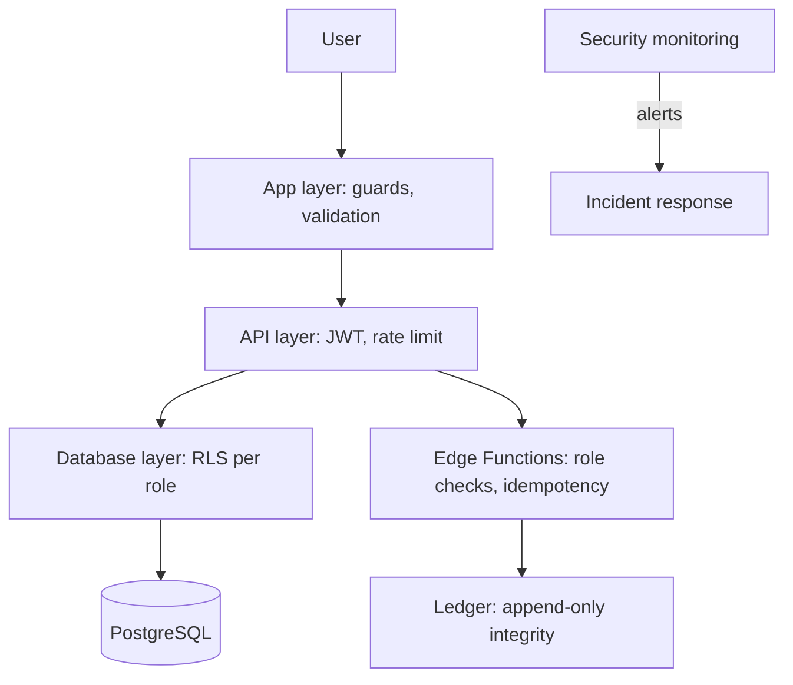
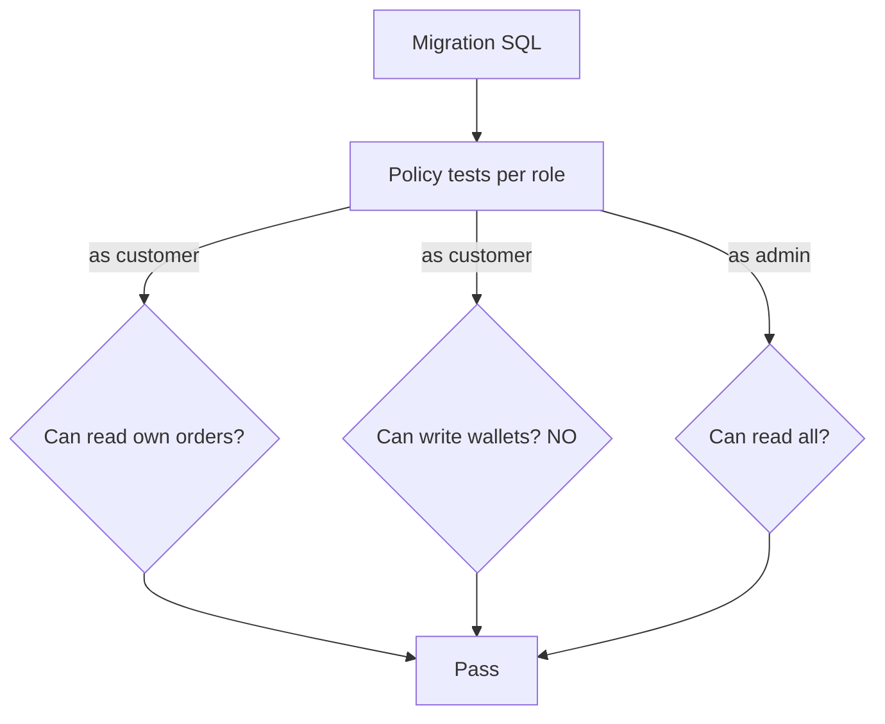

# PF-DOC-19 — Security Strategy

| | |
|---|---|
| Document ID | PF-DOC-19 |
| Title | Security Strategy |
| Version | 1.1 |
| Status | Approved (review PF-REV-01, 2026-08-06) |
| Date | 2026-08-06 |
| Author | Security Architect |
| References | PF-DOC-08 (NFRs), PF-DOC-12 (Supabase), PF-DOC-13 (DB), PF-DOC-14 (API), PF-DOC-18 (business rules); successors PF-DOC-21 (CI/CD), PF-DOC-27 (monitoring), PF-DOC-28 (maintenance) |

---

## 1. Purpose

This document defines the **security strategy** for the PareFood Platform: threat model,
authentication/authorisation, data protection, RLS posture, secret management, financial
integrity, compliance and incident handling. It operationalises security requirements
NFR-022..026 and NFR-041..044.

## 2. Objectives

1. Define the threat model and risk register.
2. Define identity & access management (IAM) rules.
3. Define the RLS policy catalogue (implementation of PF-DOC-12 §3.3).
4. Define data protection, retention and legal-deletion flows.
5. Define secrets management and CI security.
6. Define financial security (PCI, settlement integrity).
7. Define monitoring/alerting for security events (feeds PF-DOC-27).
8. Define incident response process (feeds PF-DOC-28).

## 3. Requirements

### 3.1 Threat Model (STRIDE summary)

| Threat class | Example | Countermeasure |
|---|---|---|
| Spoofing | Fake account / stolen OTP | OTP rate limits, device fingerprint (BR-FRAUD-004) |
| Tampering | Change order totals client-side | Server-side pricing (BR-PRICE), signed webhooks |
| Repudiation | Fraudulent refund claim | Audit logs (PF-DOC-13 `audit_logs`) |
| Information disclosure | RLS misconfig exposes data | RLS-first (SUP-R01) + policy tests |
| Denial of service | Rate-limit abuse | API rate limits (PF-DOC-14 §3.8) |
| Elevation of privilege | Customer calls admin function | Role checks in every Edge Function |

### 3.2 Identity & Access Management

| Area | Rule |
|---|---|
| Authentication | Supabase Auth; email/password + phone OTP (PF-DOC-12 §3.2) |
| Session | JWT; access 1 h, refresh 30 d; refresh token rotation; revocation on logout |
| MFA | Required for all admin accounts (AP-PA) |
| Roles | `customer`, `business`, `driver`, `admin` in `profiles.role`; claim mirrored to JWT |
| Role change | Only via verified flow or admin action; audit logged |
| Password policy | ≥ 10 chars; no re-use of last 5 (Supabase settings) |
| Account suspension | `profiles.status`; suspended users blocked at guard + RLS |
| Onboarding security | Documents stored privately; reviewed before activation |

### 3.3 RLS Policy Catalogue (per PF-DOC-13 tables)

| Table | Customer | Business | Driver | Admin (service) |
|---|---|---|---|---|
| profiles | read/update self | read/update self | read/update self | all |
| addresses | own CRUD | own CRUD | own CRUD | read |
| restaurants | read active | read own + write own | read | all |
| menu_categories/menu_items/options | read available | read/write own | read | all |
| restaurant_hours | read | read/write own | read | all |
| carts/cart_items | own | none | none | read |
| orders | own | own restaurant | assigned | all |
| order_items | with own order | own restaurant | assigned | all |
| order_status_history | with own order | own | assigned | all |
| deliveries | with own order | with own order | assigned | all |
| driver_locations | on active assigned | none | write own, read own | all |
| device_tokens | own | own | own | all (service) |
| driver_documents | none | none | own | all |
| promo_redemptions | read own | none | none | all |
| search_documents | read | read | read | all |
| user_roles | read own | read own | read own | read (post-MVP) |
| wallets | read own | read own | read own | read |
| wallet_transactions | read own | read own | read own | read |
| settlements | none | read own | none | all |
| payment_intents | none | none | none | all (service) |
| reviews | create on own order; read public aggregates | read | read | moderate |
| favorites | own CRUD | none | none | read |
| notifications | own | own | own | none |
| promotions | read active | read | read | all |
| audit_logs | none | none | none | admin+ |
| driver_profiles | none | none | own | all |
| merchant_documents | none | own | own | all |

Enforcement: RLS policies in migrations; **policy tests** assert each role's access in CI
(PF-DOC-21). No `security definer` unless audited.

Note: `deliveries` and `orders.status` have **no direct write policy for any client role**.
Driver assignment happens only through `accept-job`/`decline-job` (Edge Functions that
verify the offer token + JWT), and `ready-order`/`dispatch` through the pg_net trigger —
preventing self-assignment and state tampering (review fix AR-02/AR-22).

### 3.4 Data Protection

| Area | Rule |
|---|---|
| Encryption in transit | TLS 1.2+ enforced on all channels |
| Encryption at rest | Supabase-managed at-rest encryption (disk + storage) |
| PII minimisation | Store only required PII (name, phone, address, documents) |
| Sensitive fields | `license_no`/bank refs tokenised/encrypted at column level (PG `pgcrypto` or vault) |
| Payment data | Card data NEVER stored; PSP tokenisation only (PCI, NFR-043) |
| Log hygiene | No PII/payment data in logs; redaction pipeline |
| Data export | User data export (JSON) within 7 days of request (NFR-041) |
| Data deletion | Account deletion cascade + retention per legal schedule |
| Retention | Financial records 7 years; operational data ≤ 24 months unless legal |

### 3.5 Secrets Management

| Item | Rule |
|---|---|
| Locations | GitHub Actions secrets (CI), Supabase project secrets (runtime) |
| Prohibited | Secrets in code, config, migrations, docs, logs, app bundles |
| Anon key | Public client key allowed by design; service_role NEVER client-side |
| Rotation | service_role & PSP keys rotate ≥ every 90 days; on personnel change |
| CI checks | Secret scanning on every push (gitleaks); repo is pre-commit scanned |

### 3.6 Financial Security

| Rule | Detail |
|---|---|
| Two-person rule | Settlements & payouts require two admins (creator + approver) |
| Ledger integrity | `wallet_transactions` append-only; no UPDATE/DELETE policy |
| PSP webhook security | Verify signature + idempotency (BR + PF-DOC-14) |
| Reconciliation | Daily auto + finance sign-off (BR-RECON) |
| Payment amounts | Server-computed; client display only |

### 3.7 Secure Development (SDLC)

| Activity | When | Owner |
|---|---|---|
| Threat modelling | New money/privileged features | Security architect |
| Dependency scanning | CI (npm/pub + SBOM) | DevOps |
| SAST (static analysis) | CI per package | DevOps |
| Secret scanning | CI + pre-commit | DevOps |
| RLS policy tests | CI on migrations | Backend |
| Dependency updates | Monthly (PF-DOC-28) | DevOps |
| Penetration test | Pre-launch + annual | External vendor |
| Code review security checklist | Every PR | Reviewer |

### 3.8 Security Monitoring & Alerting (feeds PF-DOC-27)

| Event | Signal | Response |
|---|---|---|
| Brute-force sign-in | Auth failures > threshold | Block + alert on-call |
| Unusual payout volume | Finance metric anomaly | Freeze + review (BR-FRAUD) |
| RLS policy change | Migration CI diff | Mandatory security review |
| Elevated error rate 4xx/5xx | Sentry + logs | On-call |
| Suspicious refund velocity | BR-FRAUD-003 | Flag queue in AP-PA |

### 3.9 Incident Response

Severity levels: SEV-1 (data breach/payment compromise), SEV-2 (platform down), SEV-3
(minor). Process in PF-DOC-28; security incidents follow: contain → assess scope →
notify (legal/comms per UU PDP) → remediate → post-mortem within 48 h.

## 4. Diagrams

### 4.1 Defence-in-Depth Layers

### 4.2 RLS Test Flow (CI)

## 5. Tables

### 5.1 Control Inventory

| Control | ID | NFR | Verification |
|---|---|---|---|
| MFA for admin | SEC-001 | NFR-022 | Config + test |
| RLS on all tables | SEC-002 | NFR-024 | Policy tests |
| TLS 1.2+ | SEC-003 | NFR-023 | Config scan |
| Secrets out of repo | SEC-004 | NFR-025 | gitleaks CI |
| Two-person finance | SEC-005 | NFR-026 | Workflow test |
| Audit logging | SEC-006 | NFR-026 | FR-AUD-001 |
| PSP signature verify | SEC-007 | NFR-043 | Contract test |
| Data export/delete | SEC-008 | NFR-041 | Compliance test |
| Rate limiting | SEC-009 | NFR-014 | Load test |
| Column encryption | SEC-010 | NFR-023 | Migration review |

### 5.2 Risk Register (top)

| Risk | Likelihood | Impact | Mitigation |
|---|---|---|---|
| RLS misconfiguration | Medium | High | Policy tests + review gate |
| service_role leak | Low | High | Rotation + scanning + least privilege |
| Payment fraud | High | High | BR-FRAUD + monitoring |
| PII breach (UU PDP) | Low | High | Minimisation + incident process |
| Webhook spoofing | Medium | High | Signature verification |

## 6. Rules

- **SEC-R01** No code merge without security checklist sign-off for privileged/money code.
- **SEC-R02** service_role only in Edge Function runtime; never in apps or CI configs visible
  to developers.
- **SEC-R03** All admin actions are audit-logged (SEC-006).
- **SEC-R04** New tables/columns must be classified (PII/money/other) at design.
- **SEC-R05** Security findings are tracked and release-blocking if SEV-1/2.
- **SEC-R06** Third-party SDKs reviewed for supply-chain risk on adoption.

## 7. Checklist

- [ ] Threat model reviewed with security lead
- [ ] RLS policy catalogue matches PF-DOC-13 tables
- [ ] MFA enabled for admins; roles verified
- [ ] Secret scanning + SAST wired in CI (PF-DOC-21)
- [ ] Data protection (export/delete/retention) flows implemented
- [ ] Penetration test scheduled pre-launch

## 8. Risks

| Risk | Likelihood | Impact | Mitigation |
|---|---|---|---|
| Compliance scope changes (UU PDP) | Medium | High | Legal counsel + compliance checklist |
| Security team single point of failure | Medium | Medium | Cross-training + vendor pen test |
| False positives flood alerting | Medium | Medium | Alert tuning + thresholds (PF-DOC-27) |
| Fast feature velocity vs. security review | High | Medium | Gate rules (SEC-R01) |

## 9. Future Improvements

- Zero-trust architecture for Edge Functions (per-function tokens).
- Bug-bounty program post-launch.
- Automated compliance evidence collection.
- Hardware-backed key storage for signing keys.
