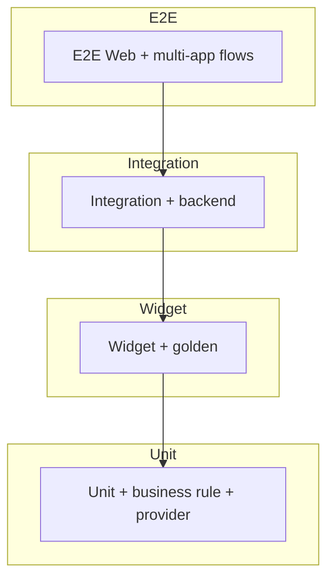
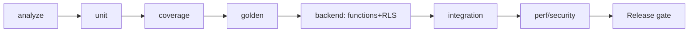

# PF-DOC-20 — Testing Strategy

| | |
|---|---|
| Document ID | PF-DOC-20 |
| Title | Testing Strategy |
| Version | 1.0 |
| Status | Approved (review PF-REV-01, 2026-08-06) |
| Date | 2026-08-06 |
| Author | QA Lead |
| References | PF-DOC-07 (FRs), PF-DOC-08 (NFRs), PF-DOC-11 (Flutter arch), PF-DOC-14 (API), PF-DOC-18 (business rules), PF-DOC-19 (security); successors PF-DOC-21 (CI/CD), PF-DOC-30 (DoD) |

---

## 1. Purpose

This document defines **how the PareFood Platform is tested**: the test pyramid, tooling,
test types per layer, coverage targets, environment strategy and quality gates. It turns
FR acceptance criteria (PF-DOC-07) and NFRs (PF-DOC-08) into executable quality.

## 2. Objectives

1. Define the test pyramid and per-layer tooling.
2. Define unit, widget, golden, integration and end-to-end test standards.
3. Define backend testing (Edge Functions, RLS policies, business rules).
4. Define performance, security and accessibility test programs.
5. Define coverage targets and quality gates.
6. Define test data and environment management.
7. Define the QA release sign-off process (feeds PF-DOC-30).

## 3. Requirements

### 3.1 Test Pyramid

| Layer | Share | Speed | Scope |
|---|---|---|---|
| Unit | 60% | ms | Domain logic, business rules, repositories (mocked) |
| Widget | 25% | s | Widget behaviour, states (Riverpod overrides) |
| Golden | (within widget) | s | Visual regression of `packages/design` |
| Integration (app) | 10% | min | Cross-feature flows with Supabase test project |
| E2E (web) | 5% | min | AP-PA via Playwright |
| Backend (function/RLS) | (parallel) | min | Edge Functions + RLS policy tests |

### 3.2 Unit Tests

| Area | Tool | Notes |
|---|---|---|
| Domain (`core`) | `test` + `mocktail` | Models, enums, value objects, exceptions |
| Data (`data`) | `mocktail` + `http_mock_adapter` | Repository ↔ source contracts |
| Business rules (BR) | Dart port tests + Deno function tests | Mirror PF-DOC-18 rules; dual coverage |
| Utils | `test` | Formatters (currency, ETA, time) |
| Providers | `test` + Riverpod overrides | Provider logic with fake repositories |

Convention: one test file per source file; table-driven tests for rules/edge cases.

### 3.3 Widget & Golden Tests

| Area | Tool | Notes |
|---|---|---|
| Feature widgets | `flutter_test` + `ProviderScope(overrides:)` | Assert states (loading/error/empty/data) |
| App shells | `flutter_test` | Tabs, guards, deep links via GoRouter |
| Design system | `golden_toolkit` | Every `Pf*` component; light + dark themes |
| Language | `golden_toolkit` + ARB | Smoke on id-ID strings |

Golden images stored in `packages/design/test/goldens/`; CI regenerates on deliberate
change (baseline review in PR).

### 3.4 Backend Tests

| Layer | Tool | Notes |
|---|---|---|
| Edge Functions | Deno test + Supabase local emulator | Business logic, idempotency, error codes |
| RLS policies | SQL policy tests (per role matrix, PF-DOC-19 §3.3) | Run as customer/business/driver/admin |
| Migrations | Supabase CLI `db test` / dry-run | Up + down; RLS present on every table |
| Webhooks | Signature verify tests | Valid/invalid signatures (SEC-007) |

### 3.5 Integration & E2E

| Area | Tool | Env |
|---|---|---|
| App integration (AP-PF/AP-PB/AP-PD) | `integration_test` | Staging Supabase with seeded data |
| Web admin E2E | Playwright (Dart web build) | Staging |
| Order lifecycle E2E | Scripted multi-app scenario | Place → accept → assign → deliver |
| Realtime ETA | Integration with clock control | Staging |

### 3.6 Performance & Load Tests

| Test | Tool | Target (PF-DOC-08) |
|---|---|---|
| Load (reads) | k6 against staging PostgREST | NFR-003/004/011 |
| Mutation load | k6 on Edge Functions | NFR-012 |
| App perf | Flutter DevTools / integration perf test | NFR-001..010 budgets |
| Realtime capacity | concurrent subscribe test | NFR-014 |

### 3.7 Security & Accessibility Tests

| Test | Tool | Gate |
|---|---|---|
| SAST (Dart) | `flutter analyze` strict + custom lints | CI |
| Secret scan | gitleaks | CI |
| Dependency scan | `osv-scanner` / SBOM | CI (PF-DOC-28) |
| RLS posture | policy tests (PF-DOC-19) | CI |
| Accessibility | `semantics` widget tests + axe for web | Pre-release |
| Contrast | token tests (PF-DOC-16) | CI |

### 3.8 Coverage Targets

| Scope | Target | Tool |
|---|---|---|
| `core` | ≥ 90% line | `lcov` + coverage gate |
| `data` | ≥ 80% line | coverage gate |
| `features/*` | ≥ 75% line (critical paths ≥ 90%) | coverage gate |
| `apps` | ≥ 60% line | coverage gate |
| Edge Functions | ≥ 85% branch (money functions 100% critical path) | Deno coverage |
| Global gate | NFR-037 | CI fails below |

### 3.9 Test Environments

| Env | Purpose | Data |
|---|---|---|
| Local (dev) | Fast dev loops; Supabase emulator | Seeded fixtures |
| Staging | Integration + E2E + release verification | Anonymised copy of prod shape |
| Prod | Smoke tests only | Real data, read-only asserts |

Secrets: staging uses fake PSP sandbox keys; never production keys (SEC-004).

### 3.10 Test Data Management

- Seeded factories per entity (restaurants, menu, orders in states).
- Time travel: E2E can control `now()` for timeouts (BR-ACCEPT).
- Anonymisation for staging copies (PII rules, PF-DOC-19 §3.4).
- Idempotent seeds; rerunnable.

### 3.11 QA Release Sign-off

Checklist before release (feeds PF-DOC-30):

- [ ] CI green (analyze, unit, widget, golden, backend, coverage)
- [ ] E2E smoke of 4 critical flows on staging (PF-DOC-15 §3.6)
- [ ] No open SEV-1/2 bugs (PF-DOC-19 §3.9)
- [ ] Perf budgets verified for changed journeys
- [ ] Security scans clean
- [ ] Accessibility spot-check for changed screens

## 4. Diagrams

### 4.1 Test Pyramid

### 4.2 CI Quality Gates (feeds PF-DOC-21)

## 5. Tables

### 5.1 Test Tooling Inventory

| Need | Tool |
|---|---|
| Flutter unit/widget | `flutter_test`, `mocktail` |
| Golden | `golden_toolkit` |
| HTTP mocking | `http_mock_adapter` |
| Edge Functions | Deno test + Supabase emulator |
| RLS tests | SQL policy tests |
| Web E2E | Playwright |
| Load | k6 |
| Coverage | lcov + codecov/lcov gates |
| Secret scan | gitleaks |
| Dependency | osv-scanner |
| Accessibility | axe-core (web), semantics tests (app) |

### 5.2 FR → Test Type Mapping

| FR group | Unit | Widget | Backend | E2E |
|---|---|---|---|---|
| AUTH/ONB | ✔ | ✔ | ✔ | ✔ |
| DISC/MENU | ✔ | ✔ | ✔ | |
| CART | ✔ | ✔ | ✔ | ✔ |
| ORDER | ✔ | ✔ | ✔ | ✔ |
| PAY/FIN | ✔ | | ✔ | ✔ |
| NOTIF | ✔ | ✔ | ✔ | |
| RATE | ✔ | ✔ | ✔ | |
| GEO | ✔ | ✔ | ✔ | |
| ADMIN/ANA/AUD | ✔ | ✔ | ✔ | ✔ |

## 6. Rules

- **TS-R01** Every FR (PF-DOC-07) has ≥ 1 test; acceptance criteria = test cases.
- **TS-R02** Business rules (PF-DOC-18) are tested in both Dart mirror and Deno source of
  truth; drift fails CI.
- **TS-R03** Coverage gates are mandatory (NFR-037); no exceptions without architect waiver.
- **TS-R04** No `print` debugging in tests; use assertions and logging.
- **TS-R05** Golden changes require visual review in PR.
- **TS-R06** Tests never depend on network or real PSP; mocks/emulators only.
- **TS-R07** Flaky tests are quarantined and fixed within the sprint (PF-DOC-25).

## 7. Checklist

- [ ] Test pyramid documented and tooling installed
- [ ] FR acceptance criteria mapped to tests
- [ ] Coverage gates configured in CI
- [ ] RLS policy tests cover role matrix
- [ ] E2E smoke suite for 4 critical flows
- [ ] QA sign-off checklist wired into release process

## 8. Risks

| Risk | Likelihood | Impact | Mitigation |
|---|---|---|---|
| Flaky E2E slows delivery | High | Medium | Quarantine rule (TS-R07) |
| Golden tests brittle (fonts/platform) | Medium | Medium | Standardised font loading in CI |
| Coverage games (testing getters) | Medium | Medium | Meaningful-coverage review |
| Backend/rule dual implementation drift | Medium | High | Shared rule fixtures (TS-R02) |
| E2E cost on 4 apps | Medium | Medium | Critical flows only at MVP |

## 9. Future Improvements

- Property-based testing (fast_check) for pricing formulas.
- Contract testing between functions and data layer (PF-DOC-29).
- Visual regression on real devices (device farm).
- Mutation testing for business rules.
