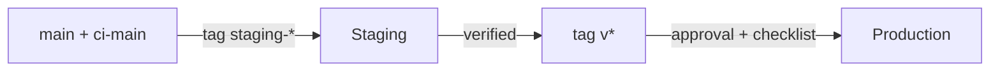
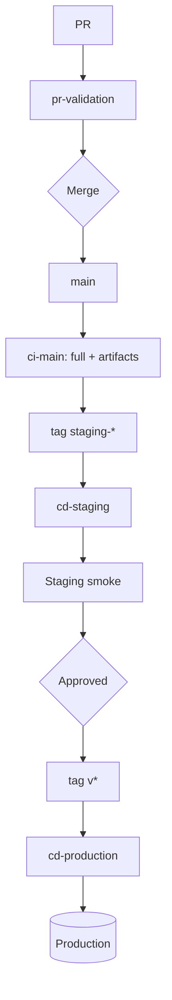
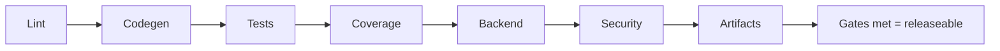

# PF-DOC-21 — CI/CD Strategy

| | |
|---|---|
| Document ID | PF-DOC-21 |
| Title | CI/CD Strategy |
| Version | 1.0 |
| Status | Approved (review PF-REV-01, 2026-08-06) |
| Date | 2026-08-06 |
| Author | DevOps Engineer |
| References | PF-DOC-09 (stack), PF-DOC-10 (monorepo), PF-DOC-20 (testing), PF-DOC-22 (deployment), PF-DOC-24 (git); successors PF-DOC-26 (release), PF-DOC-28 (maintenance) |

---

## 1. Purpose

This document defines the **continuous integration and delivery** pipeline for the
PareFood monorepo: workflows, stages, caching, quality gates, artifact building and
promotion. It operationalises the quality gates from PF-DOC-20 and prepares artifacts for
PF-DOC-22 deployment.

## 2. Objectives

1. Define the CI workflow (PR validation) and CD workflow (deployment).
2. Define affected-package detection for monorepo efficiency (PF-DOC-10 §4.2).
3. Define caching strategy (pub, FVM, build_runner, Supabase CLI).
4. Define the quality gate sequence and thresholds.
5. Define artifact production (AAB/IPA/Web) and versioning.
6. Define environment promotion (dev → staging → production) with approval gates.
7. Define tooling pinning and reproducibility (PF-DOC-09 TS-R01).

## 3. Requirements

### 3.1 Workflow Overview

| Workflow | Trigger | Target env | Gate |
|---|---|---|---|
| `pr-validation` | PR (every push) | — | analyze, test, coverage, golden, backend, security scans |
| `ci-main` | push to `main` | — | full validation + artifact build |
| `cd-staging` | tag `staging-*` or manual | Staging | approval (auto for tag) |
| `cd-production` | tag `v*` | Production | manual approval + release note |
| `nightly` | cron | — | full test suite + load smoke |

### 3.2 PR Validation Pipeline

Stages (sequential with caching):

1. **Setup**: checkout, install Flutter via FVM (pinned), activate Melos, `melos bootstrap`.
2. **Format/lint**: `melos run format` check; `melos run analyze` (strict, PF-DOC-23).
3. **Codegen diff**: `melos run codegen`; fail if working tree dirty (FL-R06).
4. **Unit/widget**: `melos run test` (affected packages + dependents).
5. **Coverage**: gate per PF-DOC-20 §3.8 (only affected packages merged coverage).
6. **Golden**: golden test runner; diff against baselines.
7. **Backend**: Supabase CLI db dry-run + lint; Edge Function tests; RLS policy tests.
8. **Security**: gitleaks secret scan; osv dependency scan; SAST.
9. **PR checks complete** → mergeable per PF-DOC-24.

### 3.3 Affected-Package Detection

- Use changed-files vs `main` to compute affected packages via `melos`/custom tool.
- Build & test: affected packages + all dependents (reverse dependency closure).
- Unaffected packages skip test/coverage but still run analyze (cheap).
- Full suite runs on `ci-main` and nightly (no skips).

### 3.4 Caching Strategy

| Cache | Key | Notes |
|---|---|---|
| FVM Flutter SDK | flutter-version hash | Shared cache across workflows |
| pub deps | pubspec.lock hash | `melos bootstrap` cache |
| build_runner | source hash | Incremental codegen |
| Gradle/Ruby/derived data | per platform | App build cache |
| Supabase CLI deps | CLI version | Deno deps cached |

### 3.5 Artifact Production (`ci-main` + CD)

| Artifact | Build | Output | Version |
|---|---|---|---|
| AP-PF Android | `flutter build apk/appbundle` | AAB + APK (debug) | semver `X.Y.Z+build` |
| AP-PB Android | AAB | AAB | semver |
| AP-PD Android | AAB | AAB | semver |
| AP-PF/iOS etc. | `flutter build ios --release` | IPA (on macOS runner) | semver |
| AP-PA Web | `flutter build web` | static bundle | semver |
| Edge Functions | `supabase functions deploy` (CD only) | deployed bundle | commit hash |
| Migrations | `supabase db push` (CD only) | applied SQL | sequential |

Artifacts stored with metadata (commit, PR link, changelog fragment) for traceability
(PF-DOC-26).

### 3.6 Environment Promotion

Promotion rules:
- Staging deploy is automatic on `staging-*` tag; runs E2E smoke (PF-DOC-20 §3.5) post-deploy.
- Production deploy requires: CI green on `v*`, staging smoke passed, release checklist
  (PF-DOC-26), and a named approver (two-person for finance-related changes).
- Rollback: production releases are immutable tags; rollback = redeploy previous tag with
  migration reversal runbook (PF-DOC-22/28).

### 3.7 Quality Gates (summary)

| Gate | Pass condition | Blocks |
|---|---|---|
| Format/analyze | 0 errors, 0 new warnings | Merge, deploy |
| Codegen diff | clean tree | Merge |
| Tests | all pass (affected + dependents) | Merge, deploy |
| Coverage | meets PF-DOC-20 §3.8 | Merge, deploy |
| Backend | functions tests + RLS tests + db dry-run | Merge, deploy |
| Security | gitleaks, osv, SAST clean | Merge, deploy |
| Build | artifacts build successfully | Deploy |
| Smoke (staging) | E2E critical flows pass | Production |

### 3.8 Tooling & Reproducibility

- Flutter/Dart pinned via FVM (TS-R01); CI uses same `.fvmrc` as dev.
- Melos pinned version; `melos bootstrap` from lockfile.
- GitHub Actions runner images pinned to digest where supported.
- Edge Function Deno deps pinned via `deno.lock`/imports.
- Supabase CLI version pinned in `config.toml` docs / workflow.

### 3.9 Notifications & Artefacts

| Event | Channel |
|---|---|
| PR fail | PR comment + GitHub status |
| Staging deploy success/fail | #ci channel |
| Production deploy | #deployments channel + release note |
| Nightly failures | #ci channel + QA triage |

## 4. Diagrams

### 4.1 CI/CD Pipeline

### 4.2 Quality Gate Sequence

## 5. Tables

### 5.1 Workflow Matrix

| Workflow | Runs on | Time target | Required secrets |
|---|---|---|---|
| pr-validation | ubuntu-latest + macos for ios | ≤ 15 min | none (mocked) |
| ci-main | ubuntu/macos | ≤ 25 min | none |
| cd-staging | ubuntu | ≤ 15 min | staging supabase + PSP sandbox |
| cd-production | ubuntu/macos | ≤ 20 min | prod supabase, PSP, signing keys |
| nightly | ubuntu | ≤ 45 min | staging secrets |

### 5.2 Environments Consumed (from PF-DOC-22)

| Env | CI/CD target | Deploy method | Auto/Manual |
|---|---|---|---|
| dev | — | Supabase CLI local | Manual |
| staging | cd-staging | `supabase db push` + functions deploy + web deploy | Auto on tag |
| production | cd-production | migrations + functions + store submission + web | Manual approval |

## 6. Rules

- **CI-R01** `main` must always be green; red `main` blocks all deploys.
- **CI-R02** Everything mergeable goes through `pr-validation`; direct pushes to `main`
  forbidden (PF-DOC-24).
- **CI-R03** Secrets never in workflow YAML; referenced from GitHub Secrets only.
- **CI-R04** Deploys to production require the release checklist (PF-DOC-26).
- **CI-R05** Nightly failures are triaged same-day by the owning team.
- **CI-R06** CI and local tooling use identical pins (FVM/Melos/Supabase CLI).
- **CI-R07** Financially-sensitive code paths require two approvals (PR + release approver).

## 7. Checklist

- [ ] Workflows created per §3.1
- [ ] Affected-package detection implemented
- [ ] Caching configured; build times within targets
- [ ] Quality gates enforced on PR and deploy
- [ ] Staging smoke automated post-deploy
- [ ] Tooling pins identical dev/CI (CI-R06)

## 8. Risks

| Risk | Likelihood | Impact | Mitigation |
|---|---|---|---|
| Long build times slow delivery | High | Medium | Caching + affected detection; monitor targets |
| Flaky e2e in CD blocks deploys | Medium | Medium | Quarantine + retry policy |
| Secret drift between envs | Medium | High | Secret manager + rotation (PF-DOC-19) |
| Migration ordering issues in CD | Medium | High | Db dry-run + sequential apply + rollback runbook |
| Runner cost grows | Medium | Low | Cache hit targets + cost review |

## 9. Future Improvements

- Remote build cache (Flutter/Cargo) shared runners (PF-DOC-29).
- Canary production deploys (PF-DOC-29).
- Machine-learning triage for test failures.
- Release trains automation integrated with PF-DOC-26.
