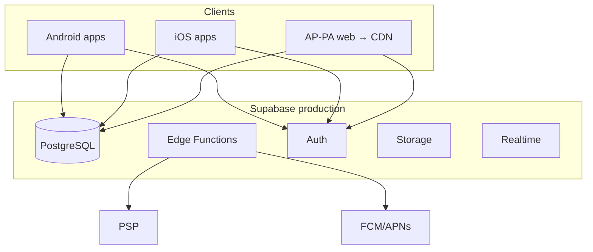
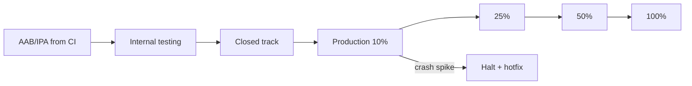

# PF-DOC-22 — Deployment Strategy

| | |
|---|---|
| Document ID | PF-DOC-22 |
| Title | Deployment Strategy |
| Version | 1.0 |
| Status | Approved (review PF-REV-01, 2026-08-06) |
| Date | 2026-08-06 |
| Author | DevOps Engineer |
| References | PF-DOC-12 (Supabase), PF-DOC-21 (CI/CD), PF-DOC-26 (release), PF-DOC-28 (maintenance); successors PF-DOC-27 (monitoring) |

---

## 1. Purpose

This document defines **how the PareFood Platform is deployed and rolled back** across
environments: Supabase provisioning, Edge Function deployment, Flutter app store
submission, web hosting (AP-PA), code signing, rollout and rollback runbooks.

## 2. Objectives

1. Define Supabase project provisioning and configuration per environment.
2. Define Edge Function and migration deployment procedure.
3. Define Flutter Web deployment (AP-PA) and hosting/CDN.
4. Define mobile app signing and store submission (Android/iOS).
5. Define environment configuration and secrets handling.
6. Define rollout, canary and rollback runbooks.
7. Define deployment health checks (feeds PF-DOC-27).

## 3. Requirements

### 3.1 Environment Provisioning

| Env | Supabase project | Region | Purpose |
|---|---|---|---|
| dev | `parefood-dev` | Singapore (nearest, low latency for ID) | local + shared dev |
| staging | `parefood-staging` | Singapore | verification |
| production | `parefood-prod` | Singapore (primary; DR later PF-DOC-29) | live |

- Projects created via Supabase dashboard/CLI; `config.toml` tracked in repo (non-secrets).
- Extensions enabled per PF-DOC-12 §3.8: `pg_cron`, `postgis`, `pgcrypto`, `pg_trgm`.
- Auth settings, rate limits, storage buckets provisioned by infrastructure-as-code
  (`infra/deploy/`) scripts.

### 3.2 Schema & Function Deployment

| Change | Procedure |
|---|---|
| Migrations | `supabase db push` in order; dry-run on staging first; zero-downtime review (PF-DOC-21) |
| Edge Functions | `supabase functions deploy <fn>` per environment; secrets injected via Supabase secrets |
| Rollback (DB) | Migrations are forward-only + additive; destructive changes require explicit reversal migration in same release |
| Rollback (functions) | Redeploy previous tag via `supabase functions deploy --ref <tag>` |

Zero-downtime rule: migrations are additive (new columns nullable, new tables), then
backfill, then switch code (expand-contract pattern).

### 3.3 Flutter Web Deployment (AP-PA)

| Step | Detail |
|---|---|
| Build | `flutter build web --release` (SPA, router mode `urlStrategy` per PF-DOC-17) |
| Hosting | Cloudflare Pages / Vercel/Netlify CDN edge |
| SPA fallback | Path routes rewrite to `index.html` (all `/...` → `/index.html`) so deep links and refresh work |
| CDN | Cache immutable assets (`build/` hashed filenames); index.html no-cache |
| Env config | Runtime config via injected `config.js` (supabase URL/anon key) — not compiled secrets |
| Headers | CSP, HSTS, X-Frame-Options (SEC-003) |
| Rollback | Redeploy previous release (CDN cache-bust) |

### 3.4 Mobile App Deployment

| Platform | Build | Signing | Store | Rollout |
|---|---|---|---|---|
| Android | AAB from CI (`ci-main`) | Play App Signing (upload key in CI secrets) | Google Play Console: internal → closed → production tracks | Staged rollout 10% → 25% → 50% → 100% |
| iOS | IPA from macOS runner | Apple Developer certs in CI Keychain | App Store Connect: TestFlight → App Review → release | Phased release (7-day) |

Code signing rules: signing keys stored in CI secrets/keychain only (SEC-004); never in
repo. Signing certificates audited quarterly (PF-DOC-28).

### 3.5 Environment Configuration

| Config | dev | staging | production |
|---|---|---|---|
| Supabase URL/anon | dev project | staging project | prod project |
| PSP keys | sandbox | sandbox | live (restricted) |
| Push (FCM/APNs) | dev creds | dev creds | prod creds |
| Sentry DSN | dev | staging | prod (rate-capped) |
| Feature flags | default on | prod-like | guarded |
| Log level | debug | info | info (PII-redacted) |

Config delivery: Flutter `--dart-define`/runtime config; Edge via Supabase secrets; never
committed.

### 3.6 Rollout Procedure (production)

1. Approval gate from `cd-production` (PF-DOC-21 §3.6) + release checklist (PF-DOC-26).
2. Deploy backend (migrations + functions) first — additive & backward-compatible.
3. Deploy AP-PA web (fast, reversible).
4. Submit mobile apps (staged rollout).
5. Post-deploy health checks (PF-DOC-27): error rate, order rate, ETA latency, crash-free.
6. Watch window 24 h before full 100% mobile rollout.

### 3.7 Rollback Runbook

| Trigger | Action | RTO |
|---|---|---|
| Backend regression | Redeploy previous function/migration tag (reverse migration) | ≤ 1 h |
| Web regression | Redeploy previous web release | ≤ 30 min |
| Mobile crash spike | Halt staged rollout; release hotfix (PF-DOC-26) or pull via Play/Apple | ≤ 4 h |
| Data corruption | Restore from PITR (NFR-019/020) with reconciliation | ≤ 4 h |

All rollbacks logged in deployment audit log (SEC-006).

### 3.8 Deployment Health Checks

| Check | After deploy | Alert |
|---|---|---|
| Migration applied | Db health + RLS tests | fail → block |
| Functions healthy | `functions` ping + smoke test | fail → alert |
| Web reachable | Uptime + TLS check | fail → alert |
| Mobile build integrity | Version banner check | mismatch → alert |
| Financial flows | Sandbox order + settle smoke on staging; read-only asserts on prod | fail → block full rollout |

## 4. Diagrams

### 4.1 Deployment Topology

### 4.2 Mobile Store Tracks

## 5. Tables

### 5.1 Deployment Targets

| Artifact | Host | URL/Store | Rollout speed |
|---|---|---|---|
| AP-PF/AP-PB/AP-PD | Google Play | Play Store | staged |
| AP-PF/AP-PB/AP-PD | App Store | App Store | phased |
| AP-PA web | Cloudflare Pages | `admin.parefood.id` | instant |
| Backend | Supabase | `*.supabase.co` | sequential |
| Static docs | GitHub Pages/repo | docs | instant |

### 5.2 Environment Matrix

| Env | Backend | Web | Mobile | Data |
|---|---|---|---|---|
| dev | dev project | local | debug builds | seed |
| staging | staging project | staging URL | internal track | anonymised |
| production | prod project | admin URL | prod tracks | live |

## 6. Rules

- **DEP-R01** Production deploys only from CI with approval gate; no direct CLI deploys.
- **DEP-R02** Backend changes are additive-first (expand/contract); destructive SQL requires
  explicit review + reversal migration.
- **DEP-R03** Signing keys live in CI secret storage; rotation ≤ 90 days.
- **DEP-R04** Every deploy is recorded in the deployment audit log.
- **DEP-R05** Mobile staged rollout is mandatory; 100% same-day only with release committee
  approval.
- **DEP-R06** Prod secrets are never in config files or builds; runtime injection only.

## 7. Checklist

- [ ] Supabase projects (dev/staging/prod) provisioned with extensions
- [ ] Migration + function deploy procedure tested in staging
- [ ] AP-PA web hosted with CSP/HSTS headers
- [ ] Signing and store credentials configured in CI
- [ ] Rollout + rollback runbooks written and rehearsed
- [ ] Post-deploy health checks wired to monitoring (PF-DOC-27)

## 8. Risks

| Risk | Likelihood | Impact | Mitigation |
|---|---|---|---|
| Migration fails mid-deploy | Medium | High | Dry-run, additive rule, reversal migration |
| Store review delays block launch | High | High | Submit early via TestFlight/Internal; buffer in PF-DOC-26 |
| Region latency (Indonesia) | Medium | Medium | Singapore region; CDN for web/images |
| Signing key loss | Low | High | Backup policy + Play App Signing |
| Canary config divergence | Medium | Medium | Config parity test staging→prod |

## 9. Future Improvements

- Multi-region + DR (PF-DOC-29).
- Infrastructure-as-Code for Supabase (Terraform provider).
- Feature-flag-driven progressive backend rollout.
- Blue-green for Edge Functions via versioned entry points.
