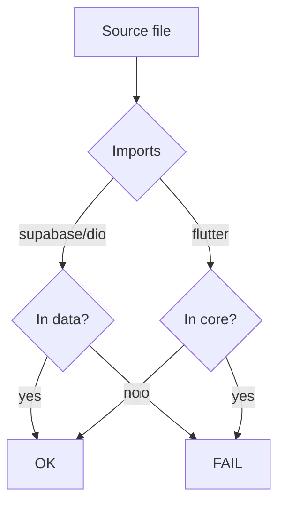

# PF-DOC-23 — Coding Standards

| | |
|---|---|
| Document ID | PF-DOC-23 |
| Title | Coding Standards |
| Version | 1.0 |
| Status | Approved (review PF-REV-01, 2026-08-06) |
| Date | 2026-08-06 |
| Author | Principal Architect |
| References | PF-DOC-09 (stack), PF-DOC-10 (monorepo), PF-DOC-11 (Flutter arch), PF-DOC-16 (design); successors PF-DOC-21 (CI), PF-DOC-24 (git), PF-DOC-30 (DoD) |

---

## 1. Purpose

This document defines **how code is written** in the PareFood monorepo: Dart style,
naming, lint rules, package conventions, codegen, comments, commit-level hygiene and
review standards. Consistency across the four apps is a release requirement (NFR-038).

## 2. Objectives

1. Define Dart/Flutter style rules and enforcement (`analysis_options.yaml`).
2. Define naming and file organisation conventions.
3. Define architecture-conformance lints (package boundaries, PF-DOC-10).
4. Define codegen and formatting workflow.
5. Define documentation-in-code standards (API docs, doc comments).
6. Define code review expectations and the reviewer checklist.
7. Define deprecation and compatibility rules.

## 3. Requirements

### 3.1 Formatting & Lint Baseline

- `dart format` is the only formatter (80-col default; project may keep default).
- `analysis_options.yaml` at repo root includes `flutter_lints` + `custom_lint` rules and
  strict options:
  - `strict-casts`, `strict-inference`, `strict-raw-types` ON.
  - `unnecessary_*`, `prefer_*`, `avoid_*` family enabled.
  - `always_declare_return_types`, `prefer_final_locals`.
- Zero analyzer errors and zero new warnings on PR (CI gate, NFR-038).

### 3.2 Naming Conventions

| Item | Rule | Example |
|---|---|---|
| Files | `snake_case.dart` | `order_detail_page.dart` |
| Classes/Enums | `UpperCamelCase` | `OrderStatus`, `PfButton` |
| Methods/functions | `lowerCamelCase` | `placeOrder()` |
| Constants | `lowerCamelCase` (Dart lint) | `deliveryBaseFee` |
| Provider variables | `lowerCamelCase` + `Provider` suffix | `orderProvider` |
| Packages | `snake_case` | `orders_feature` |
| DB fields in Dart | same as DB `snake_case` mapped to `camelCase` | `restaurantId` |
| Freezed unions | `UpperCamelCase` types; sealed variants | `CartState`, `CartLoading` |
| Test files | `_test.dart` suffix | `order_repository_test.dart` |
| Private members | `_` prefix | `_buildHeader()` |

### 3.3 File & Folder Structure

Per PF-DOC-10/11:

```
lib/
  data/      # repositories, sources, mappers
  domain/    # use cases, selectors
  application/ # providers, notifiers, state
  presentation/
    pages/
    widgets/
    controllers/
  <feature>.dart   # public barrel
```

Rules: one public class per file (except tiny value types); imports sorted by
`dart format`; relative imports preferred within a package; no `package:` import of
another app.

### 3.4 Architecture Conformance (enforced in CI)

| Rule | Detection | Doc |
|---|---|---|
| No `supabase_flutter`/`dio` imports outside `data` | import scan | PF-DOC-10 MO-R02 |
| No Flutter imports in `core` | import scan | PF-DOC-10 |
| No design-token literals in apps | token lint | PF-DOC-16 DS-R01 |
| No hard-coded user strings in widgets | ARB check | PF-DOC-16 DS-R05 |
| No business constants in apps | rule constants check | PF-DOC-18 BR-R03 |

### 3.5 Codegen Workflow

- Freezed models in `core`/state; `part` files generated and committed (FL-R06).
- Run via `melos run codegen`; CI fails if generated output differs (PF-DOC-21 §3.2).
- Manual edits to generated files are forbidden.

### 3.6 Documentation in Code

| Item | Requirement |
|---|---|
| Public API (models, providers, functions) | Doc comment with purpose + params/returns for non-obvious |
| Business-critical functions | Reference the BR/FR ID (e.g., `// Implements BR-PRICE-003`) |
| Edge Functions | Header doc: purpose, callers, auth, secrets used (SUP-R07) |
| Complex algorithms | Brief "why", not "what" |
| TODOs | Must reference an issue number; no naked TODO |

No comments restating code; no emojis in code comments.

### 3.7 Error & Logging Standards

- Exceptions from `core` (`PareException` hierarchy, PF-DOC-11 §3.5).
- Logging via a `Logger` util in `data`/apps; log levels: debug/info/warn/error.
- No `print` in production code (lint forbids).
- Logs never include PII or payment data (SEC, PF-DOC-19 §3.4).

### 3.8 State & Providers Conventions (Riverpod)

- Providers declared in `application/`; naming ends in `Provider`.
- State classes immutable + Freezed; no mutable public fields.
- Use `.family` for parameterised providers; `.autoDispose` for ephemeral.
- No provider accessed via global; always `ref`.
- Async providers return typed results; errors propagated as exceptions (not swallowed).

### 3.9 Database/SQL Standards

- Migrations in `backend/supabase/migrations/` named `<timestamp>_<name>.sql`.
- All migrations idempotent-safe for re-run during dev (not on prod).
- Money as `bigint`; `CHECK` constraints for status enums (PF-DOC-13 DB-R02/R03).
- Every migration adds RLS policies with tests (PF-DOC-19 SEC-002).

### 3.10 Code Review Expectations

| Item | Standard |
|---|---|
| PR size | ≤ 400 changed lines; larger split by feature |
| Self-review | Author runs format/analyze/tests before submit |
| Reviewer checklist | Security (privileged code), BR/FR trace, tests, UX states, i18n, no hard-coded tokens |
| Approvals | ≥ 1 reviewer + CODEOWNER for owned paths; 2 for money/privileged (CI-R07) |
| Merge | Squash-merge to `main` per PF-DOC-24 |

### 3.11 Deprecation & Compatibility

- Deprecated APIs marked `@Deprecated('removal date')`; removed after 2 releases.
- API clients must tolerate additive backend fields (PF-DOC-14 §3.7).
- Breaking Dart API changes announced in changelog + migration guide.

## 4. Diagrams

### 4.1 Code Quality Pipeline


### 4.2 Import Boundary Guard



## 5. Tables

### 5.1 Lint Severity Policy

| Class | Example | Severity |
|---|---|---|
| Errors | undefined, type errors | Blocking |
| Style | naming, unnecessary imports | Warning (blocking if new) |
| Hints | prefer_* | Warning (new) / info (existing) |

### 5.2 Naming Quick Reference

| Context | Case |
|---|---|
| Dart files | snake_case |
| Types/enums | UpperCamelCase |
| Functions/vars | lowerCamelCase |
| DB/SQL | snake_case |
| YAML/env keys | snake_case |
| Routes/paths | snake_case (PF-DOC-17) |

## 6. Rules

- **CS-R01** `dart format` + `flutter analyze` (0 errors, 0 new warnings) required on every
  merge.
- **CS-R02** Boundary lints (import scans) block merges.
- **CS-R03** Generated code is committed and CI-verified identical.
- **CS-R04** No hard-coded business values, colours, or user-facing strings.
- **CS-R05** No `print`, no naked `TODO`, no emoji in comments.
- **CS-R06** Public API requires doc comments; logic references BR/FR IDs.
- **CS-R07** Review standards (§3.10) are mandatory for every PR.

## 7. Checklist

- [ ] `analysis_options.yaml` strict config committed
- [ ] Boundary lints implemented and wired to CI
- [ ] Format + analyze + codegen checks pass locally
- [ ] Review checklist published and used
- [ ] Deprecation policy documented in repo contributing guide

## 8. Risks

| Risk | Likelihood | Impact | Mitigation |
|---|---|---|---|
| Lint fatigue / noise | Medium | Low | Tiered severity; only new violations block |
| Boundary rules bypassed | Medium | Medium | Automated scans + periodic audit |
| Review checklist drift | Medium | Low | Maintained in `docs/` + PR template |
| Generated code merge conflicts | Low | Low | Deterministic generation + CI diff |

## 9. Future Improvements

- Pre-commit hooks (lefthook) for format/lint/secret scan.
- Automated PR description from commit conventions (PF-DOC-24).
- Coding-standard compliance reports in CI.
