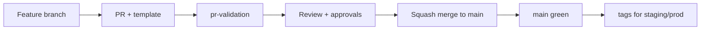

# PF-DOC-24 — Git Workflow

| | |
|---|---|
| Document ID | PF-DOC-24 |
| Title | Git Workflow |
| Version | 1.0 |
| Status | Approved (review PF-REV-01, 2026-08-06) |
| Date | 2026-08-06 |
| Author | DevOps Engineer |
| References | PF-DOC-10 (monorepo), PF-DOC-21 (CI/CD), PF-DOC-23 (coding); successors PF-DOC-25 (sprint), PF-DOC-26 (release) |

---

## 1. Purpose

This document defines **how the team collaborates in Git**: branching model, commit
conventions, pull request process, tagging, and release branches. It operationalises the
CI gates in PF-DOC-21 and the release process in PF-DOC-26.

## 2. Objectives

1. Define the branching model (trunk-based development with short-lived feature branches).
2. Define commit message conventions (Conventional Commits).
3. Define the pull request lifecycle and merge rules.
4. Define tagging and release branch strategy.
5. Define protection rules on `main` and release branches.
6. Define how hotfixes are handled.

## 3. Requirements

### 3.1 Branching Model — Trunk-Based with PRs

| Branch | Lifetime | Purpose |
|---|---|---|
| `main` | permanent | Always-releasable source of truth; protected |
| `feat/<pf-XXX>-<slug>` | short (≤ 3 days) | Feature work; merged via PR |
| `fix/<slug>` | short | Bug fixes |
| `chore/<slug>` | short | Tooling, docs, deps |
| `release/vX.Y.Z` | on demand | Release stabilisation (short-lived) |
| `hotfix/<slug>` | short | Emergency fix from `main` |

Rules:
- Direct pushes to `main` forbidden; all changes via PR (CI-R02).
- Feature branches fork from latest `main`; rebase before merge to avoid conflicts.
- Branches are deleted after merge.
- Long-running branches (> 3 days) require justification in PR description.

### 3.2 Commit Message Convention

Conventional Commits: `<type>(<scope>): <subject>` where:

| Type | Use | Example |
|---|---|---|
| `feat` | New FR/feature | `feat(cart): add quantity stepper (FR-CART-001)` |
| `fix` | Bug fix | `fix(orders): handle 409 conflict on accept` |
| `chore` | Tooling/deps | `chore(deps): update dio to 5.x` |
| `refactor` | No behaviour change | `refactor(data): extract mapper` |
| `docs` | Docs only | `docs: add PF-DOC-24` |
| `test` | Tests only | `test(rules): cover BR-CANCEL-002` |
| `ci` | Pipeline changes | `ci: cache flutter deps` |
| `perf` | Performance | `perf(search): index pg_trgm` |

Scope = package/app/area. Body explains **why**; references issue/FR/BR IDs. Breaking
changes marked `BREAKING CHANGE:` in footer (feeds PF-DOC-26 changelog).

### 3.3 Pull Request Lifecycle

1. Author creates branch + PR against `main` with template (description, FR/BR links, test
   summary, checklist from PF-DOC-23 §3.10).
2. CI `pr-validation` runs all gates (PF-DOC-21 §3.2).
3. Reviewer (CODEOWNER) reviews per PF-DOC-23 §3.10; security review for money/privileged.
4. Author addresses feedback; CI re-runs.
5. Merge = **squash-merge** to `main` (single clean commit). PR description becomes commit body.
6. Branch deleted; `main` green guaranteed.

PR size limit ≤ 400 changed lines (PF-DOC-23 §3.10); split otherwise.

### 3.4 Tagging & Releases

| Tag | Purpose | Created by | Gate |
|---|---|---|---|
| `staging-YYYYMMDD-N` | Deploy to staging | CI/ops | ci-main green |
| `vX.Y.Z` | Production release | Release manager | staging smoke + checklist (PF-DOC-26) |
| `hotfix-X.Y.Z` | Hotfix release | On-call + approver | full CI + expedited review |

Versioning: SemVer for products; monorepo uses a shared release version `vX.Y.Z` for the
platform release (PF-DOC-26). Changelog auto-generated from commits between tags.

### 3.5 `main` Protection Rules

| Rule | Setting |
|---|---|
| Require PR | Yes |
| Required checks | all `pr-validation` gates |
| Approvals | ≥ 1 (2 for money/privileged, CI-R07) |
| Dismiss stale reviews | Yes (rebase triggers re-review) |
| Linear history | Squash-merge enforces |
| Block force-push | Yes |
| CODEOWNERS review | Required for owned paths |

### 3.6 Hotfix Workflow

1. Branch `hotfix/<slug>` from `main` (or `release/vX.Y.Z` if a release is in flight).
2. Fix with normal PR to the release branch, then backport to `main`.
3. Tag `hotfix-X.Y.Z` per PF-DOC-26 hotfix process.
4. Post-mortem required for SEV-2+ (PF-DOC-28).

### 3.7 Contribution Conventions

- Issues use templates (bug/feature/tech-debt) with FR/BR references.
- Branches named per §3.1; commit per logical unit.
- Rebase with `main` before merging (fast-forward squash).
- No WIP on `main`; WIP allowed only on feature branches with draft PR.

### 3.8 Repository Hygiene

| Item | Rule |
|---|---|
| Large files | Git LFS for design assets > 10 MB (images later in Storage, not repo) |
| Secrets | Never committed; pre-commit hook + CI scan (SEC-004) |
| Lockfiles | `pubspec.lock` committed per package (Melos emits no lockfile; `melos.lock` does not exist) |
| `docs/` | Versioned with code; docs changes follow same PR flow |
| Generated files | Committed per FL-R06 |

## 4. Diagrams

### 4.1 Branch Flow

### 4.2 PR → CI → Merge Pipeline

## 5. Tables

### 5.1 Commit Types vs Actions

| Type | Bumps (semver) | Changelog section |
|---|---|---|
| feat | minor | Added |
| fix | patch | Fixed |
| perf | patch/minor | Changed |
| BREAKING CHANGE | major | Breaking |
| docs/test/chore/ci/refactor | none | Internal |

### 5.2 Branch Protection Summary

| Branch | Protection |
|---|---|
| main | PR required, checks, approvals, squash, no force-push |
| release/* | PR required, approvals, no force-push |
| staging-* tags | CI-gated deploy only |
| feat/fix/chore | ephemeral, no protection |

## 6. Rules

- **GW-R01** No direct commits to `main`; all changes via reviewed PRs.
- **GW-R02** Commit messages follow Conventional Commits with FR/BR references.
- **GW-R03** Squash-merge; linear history on `main`.
- **GW-R04** Tags only from CI-approved pipeline states (PF-DOC-21).
- **GW-R05** Hotfixes require a post-mortem if SEV-2+ (PF-DOC-28).
- **GW-R06** Secrets never enter the repository (pre-commit + CI scan).

## 7. Checklist

- [ ] Branch protection configured on `main`
- [ ] PR template + CODEOWNERS active
- [ ] Conventional Commits documented in CONTRIBUTING
- [ ] Pre-commit hooks (format, lint, secret scan) installed
- [ ] Tag/release process rehearsed (PF-DOC-26 dry-run)

## 8. Risks

| Risk | Likelihood | Impact | Mitigation |
|---|---|---|---|
| Merge conflicts in monorepo | Medium | Medium | Short-lived branches + daily rebase |
| Release-branch divergence | Medium | Medium | Release branches short-lived; backports tracked |
| PR review bottleneck | Medium | Medium | CODEOWNERS balance; small PRs |
| Squash loses granular history | Low | Low | Detailed PR body retained in commit |

## 9. Future Improvements

- Automated changelog + release notes generation (PF-DOC-26).
- Git submodule-free design asset management.
- Merge queue (GitHub) to serialise green merges.
