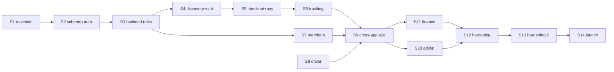
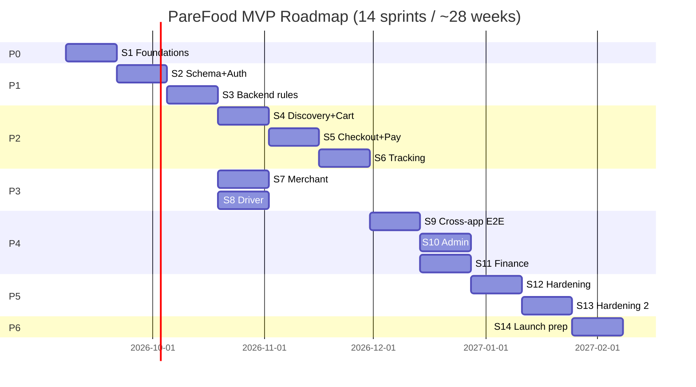

# PF-DOC-25 — Sprint Roadmap

| | |
|---|---|
| Document ID | PF-DOC-25 |
| Title | Sprint Roadmap |
| Version | 1.0 |
| Status | Approved (review PF-REV-01, 2026-08-06) |
| Date | 2026-08-06 |
| Author | Product Manager / Delivery Lead |
| References | PF-DOC-02 (products), PF-DOC-07 (FRs), PF-DOC-24 (git); successors PF-DOC-26 (release) |

---

## 1. Purpose

This document defines the **delivery plan**: phases, sprints, milestones and capacity
model that turn the FR catalogue (PF-DOC-07) into a ship sequence ending at the MVP
launch planned in PF-DOC-26.

## 2. Objectives

1. Define team composition and capacity assumptions.
2. Define the phase/milestone structure (Foundation → MVP → Launch).
3. Allocate FR groups (PF-DOC-07) to sprints with dependencies.
4. Define sprint ceremony cadence and velocity target.
5. Define how scope changes affect the plan (FR-R03).
6. Define launch readiness milestones consumed by PF-DOC-26.

## 3. Requirements

### 3.1 Team Model & Capacity

| Role | FTE | Allocation |
|---|---|---|
| Flutter engineers | 4 | 3.5 dev + 0.5 test |
| Backend (Edge/Supabase) | 1 | full |
| QA engineer | 1 | full |
| DevOps (part-time) | 0.5 | pipelines/deploy |
| Product owner | 1 | full |
| UI/UX designer | 0.5 | flows + design system |
| **Engineering capacity** | **≈ 26 story points/sprint** | 2-week sprints |

Velocity baseline: 26 SP/sprint; actual recalibrated after sprint 2 (PF-DOC-30 review).

### 3.2 Phase Structure

| Phase | Milestone | Duration | Exit criteria |
|---|---|---|---|
| P0 — Foundations | Monorepo + toolchain | 1 sprint | Melos bootstrap, CI gates, design tokens, ADR log |
| P1 — Backend core | Schema + RLS + auth + rules | 2 sprints | PF-DOC-13/14 backend testable on staging |
| P2 — Customer app | AP-PF MVP flows | 3 sprints | Flow 1–4 usable (PF-DOC-15 §3.6) |
| P3 — Merchant & driver | AP-PB + AP-PD | 3 sprints | Accept→ready; accept→delivered flows |
| P4 — Admin & finance | AP-PA + settlements | 2 sprints | Verification queue, finance ops |
| P5 — Hardening | Perf, security, e2e | 2 sprints | All PF-DOC-08/19/20 gates |
| P6 — Launch | Store submission + pilot | 1 sprint | Store approved; 50 merchants; launch (PF-DOC-26) |

Total ≈ **14 sprints / ~28 weeks** to MVP launch (assuming no slip; see risks).

### 3.3 Sprint Allocation of FR Groups

| Sprint | Focus | FR areas (PF-DOC-07) | Key deliverables |
|---|---|---|---|
| S1 | Monorepo & CI | (chore) | workspace, CI, tokens, ADR |
| S2 | Schema + Auth | AUTH, ONB | PF-DOC-13 tables, RLS, auth flows |
| S3 | Backend core rules | ORDER (state machine), PRICE | Edge Functions, BR tests |
| S4 | Discovery + cart | DISC, MENU, CART | AP-PF browse + cart |
| S5 | Checkout + payments | CART, PAY | checkout, PSP sandbox |
| S6 | Order tracking | ORDER, NOTIF, GEO | realtime tracking, notifications |
| S7 | Merchant app | ONB, MENU, ORDER, ANA | AP-PB full |
| S8 | Driver app | DRIV, FIN, GEO, NOTIF | AP-PD full |
| S9 | Cross-app E2E | ORDER (full) | multi-app integration |
| S10 | Admin app | ADMIN, ANA, AUD | AP-PA modules |
| S11 | Finance ops | FIN, PROMO | settlements, payouts, reconciliation |
| S12 | Hardening 1 | NFR | perf, security scans, pen test prep |
| S13 | Hardening 2 | NFR | E2E suite, a11y, load tests |
| S14 | Launch prep | (release) | store submission, ops runbooks, launch |

### 3.4 Dependency Ordering

Critical path: S1→S2→S3→S4→S5→S6→S9→S12→S13→S14. Merchant/driver/admin build in
parallel tracks from S3 onward (team split).

### 3.5 Sprint Ceremonies

| Ceremony | Cadence | Duration |
|---|---|---|
| Planning | Sprint start | 2 h |
| Backlog refinement | Mid-sprint | 1 h |
| Daily standup | Daily | 15 min |
| Review/demo | Sprint end | 1 h |
| Retrospective | Sprint end | 1 h |
| Release review | Each sprint | 30 min (PF-DOC-26 status) |

### 3.6 Definition of Sprint Done

A sprint is done when (feeds PF-DOC-30):

- All planned story points complete and merged to `main` (green CI).
- Each story meets feature DoD (PF-DOC-30).
- No open SEV-1/2 issues.
- Usability round completed for changed flows (PF-DOC-15 §3.9).
- Changelog fragments drafted for PF-DOC-26.

### 3.7 Scope Change Control

| Change | Process | Impact |
|---|---|---|
| New MUST FR | Product Committee approval; capacity trade-off | Sprints shift |
| Priority downgrade | PO decision | Free capacity |
| WON'T revival | PF-DOC-29 backlog review | Next release, not current |
| Technical spike | 1–2 SP cap; ADR output | Rarely |

### 3.8 Milestones (mapped to PF-DOC-26 releases)

| Milestone | Sprint | Release |
|---|---|---|
| M1 — Internal alpha | S8 | `v0.1.0-alpha` internal |
| M2 — Closed beta | S12 | `v0.9.0-beta` 50 merchants |
| M3 — MVP launch | S14 | `v1.0.0` public |

## 4. Diagrams

### 4.1 Roadmap Timeline

## 5. Tables

### 5.1 Capacity Model

| Sprint | SP planned | Teams | Risk buffer |
|---|---|---|---|
| S1–S3 | 26 | platform | 10% |
| S4–S9 | 26 | app teams parallel | 15% |
| S10–S13 | 26 | app + web | 15% |
| S14 | 20 | release | 25% |

### 5.2 FR Completion Targets by Milestone

| Milestone | FRs done (cumulative) | Apps shippable |
|---|---|---|
| S8 alpha | ~48 of 67 | AP-PF core, AP-PB, AP-PD |
| S12 beta | ~60 | all four (beta) |
| S14 launch | 61 (all MUST) | all four |

## 6. Rules

- **RD-R01** The critical path (S1→…→S14) is the release commitment; parallel work must not
  block it.
- **RD-R02** Velocity is recalibrated every 3 sprints; plan re-baselined with PO.
- **RD-R03** MUST FRs only land with full DoD (PF-DOC-30); partial features are not merged.
- **RD-R04** Scope changes follow §3.7; never mid-sprint without PO sign-off.
- **RD-R05** Milestones M1/M2/M3 are hard gates for PF-DOC-26 releases.
- **RD-R06** A sprint ending red (unfinished MUST) triggers immediate re-plan, not carry-over.

## 7. Checklist

- [ ] Team capacity model approved
- [ ] Phase/sprint allocation matches FR priorities (PF-DOC-07)
- [ ] Critical path identified and agreed
- [ ] Sprint ceremonies and DoD documented
- [ ] Milestones linked to PF-DOC-26 release gates

## 8. Risks

| Risk | Likelihood | Impact | Mitigation |
|---|---|---|---|
| Four-app scope too large for capacity | High | High | MUST-scope cap (PR-01); parallel tracks |
| Backend is critical-path bottleneck | Medium | High | Backend-first (S2–S3) + contract tests |
| Store review timing slips | Medium | Medium | Early submission (S13) per DEP |
| Team throughput variance | Medium | Medium | Velocity recalibration (RD-R02) |
| Scope creep from WON'T items | Medium | Medium | Change control (FR-R05) |

## 9. Future Improvements

- Quarterly roadmap reviews aligned with PF-DOC-29.
- Data-driven re-prioritisation using PF-DOC-03 KPIs.
- Automated release readiness dashboard (PF-DOC-27).
