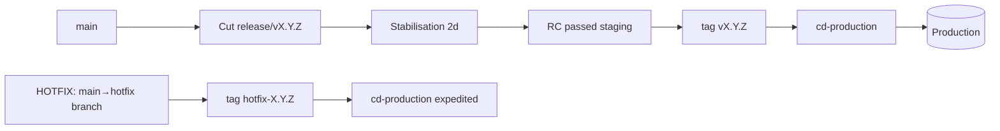
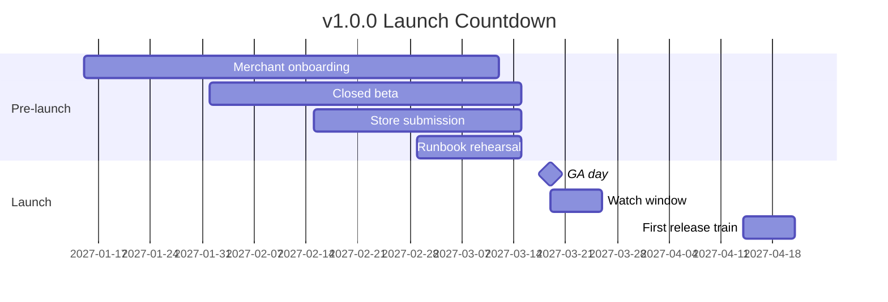

# PF-DOC-26 — Release Plan

| | |
|---|---|
| Document ID | PF-DOC-26 |
| Title | Release Plan |
| Version | 1.0 |
| Status | Approved (review PF-REV-01, 2026-08-06) |
| Date | 2026-08-06 |
| Author | Release Manager |
| References | PF-DOC-21 (CI/CD), PF-DOC-22 (deployment), PF-DOC-24 (git), PF-DOC-25 (roadmap), PF-DOC-30 (DoD); successors PF-DOC-27 (monitoring) |

---

## 1. Purpose

This document defines **how PareFood software is released**: versioning, cadence, release
trains, changelog, release gates, hotfix path and the MVP launch plan. It ties the sprint
deliverables (PF-DOC-25) to production deployment (PF-DOC-22) through CI/CD (PF-DOC-21).

## 2. Objectives

1. Define the versioning scheme for the four apps and the platform release.
2. Define release cadence and the release train model.
3. Define the release checklist and approval gates.
4. Define changelog and release notes generation.
5. Define the hotfix process and cadence exception.
6. Define the MVP launch plan and its phases.
7. Define post-release monitoring handover (feeds PF-DOC-27).

## 3. Requirements

### 3.1 Versioning

| Item | Scheme | Example |
|---|---|---|
| Platform release | `vX.Y.Z` (shared tag) | `v1.0.0` |
| Apps (bundle/build) | `X.Y.Z+build` | `1.0.0+15` |
| Backend functions | deploy ref = tag + commit | `v1.0.0-ab3f2c1` |
| Migrations | sequential timestamps | `20260807093000_orders_rls.sql` |

SemVer rules: `feat` → minor, `fix` → patch, `BREAKING CHANGE` → major (PF-DOC-24 §5.1).
Apps share the platform version at MVP; may diverge later (PF-DOC-29).

### 3.2 Release Cadence — Release Train

| Cadence | Model |
|---|---|
| Regular release | **Bi-weekly release train** on a fixed weekday (Wednesday) |
| Milestone releases | Alpha/beta/GA at PF-DOC-25 milestones |
| Hotfix | As needed (SEV-1/2) with expedited process |

Train mechanics:
- Cut `release/vX.Y.Z` from `main` 2 working days before release date.
- Stabilisation window: bug fixes only, no new features.
- Release candidate passes staging E2E → tagged `vX.Y.Z` → production gate.
- Missed train = next train (no late pushes into a closing train).

### 3.3 Release Checklist (per train)

- [ ] `main` green; all gates passed (PF-DOC-21 §3.7)
- [ ] Staging smoke of critical flows passed (PF-DOC-20 §3.5)
- [ ] Changelog drafted and approved
- [ ] FR traceability verified (all merged FRs in DoD state, PF-DOC-30)
- [ ] Finance-impacting changes double-approved (CI-R07)
- [ ] Rollback runbook verified (PF-DOC-22 §3.7)
- [ ] Post-release monitoring dashboard ready (PF-DOC-27)
- [ ] Release notes published (in-app + changelog.md)

### 3.4 Release Notes & Changelog

- `CHANGELOG.md` at repo root; auto-generated from Conventional Commits between tags
  (PF-DOC-24 §3.4).
- Sections: Added / Fixed / Changed / Security / Breaking.
- User-facing notes (Bahasa) prepared by product for store listing updates.
- Per-app store release notes generated from shared changelog filtered by scope.

### 3.5 Approval Gates

| Gate | Who | When |
|---|---|---|
| CI green | Automated | Before release tag |
| Staging smoke | QA | Release candidate |
| Financial approval | Finance lead | If PAY/FIN changes |
| Release sign-off | Release manager + PO | Before production deploy |
| Store submission | App team | After backend+web green |

### 3.6 Hotfix Process

1. Trigger: SEV-1/2 (PF-DOC-19 §3.9) or launch-blocking defect.
2. Branch `hotfix/<slug>` from current production tag; fix + normal review (expedited).
3. Tag `hotfix-X.Y.Z`; deploy via `cd-production` with release manager approval.
4. Backport to `main` within 24 h.
5. Post-mortem within 48 h (SEV-2+) per PF-DOC-28.

### 3.7 MVP Launch Plan (v1.0.0)

| Phase | Window | Activity |
|---|---|---|
| T-8w | S11+ | Merchant onboarding field team recruitment |
| T-6w | S12 | Closed beta (50 merchants, 40 drivers, 200 customers) — M2 |
| T-4w | S13 | Beta metrics review; fixes; store submission |
| T-2w | S14 | Launch runbook rehearsal; support staffing; promo plan |
| T-0 | Launch | Simultaneous: apps live in stores, web admin live, backend GA |
| T+1w | Post-launch | Watch window (PF-DOC-22 §3.6), daily ops review |
| T+4w | Stabilise | First release train under normal cadence |

Launch day targets: PF-DOC-03 §3.7 KPIs monitored via PF-DOC-27.

### 3.8 Post-Release Handover

| Item | To | On |
|---|---|---|
| Release metrics | Ops (PF-DOC-27) | Immediate |
| Incident runbooks | On-call (PF-DOC-28) | At deploy |
| Store ratings/feedback | Product | Daily T+1w |
| Feature adoption | Analytics | Weekly |
| Rollback decision authority | Release manager + on-call | Watch window |

## 4. Diagrams

### 4.1 Release Train

### 4.2 Launch Countdown

## 5. Tables

### 5.1 Release Types

| Type | Version | Cadence | Gate |
|---|---|---|---|
| Regular | vX.Y.Z | Bi-weekly | Full checklist |
| Alpha | v0.x.0-alpha | Milestone | Reduced (internal) |
| Beta | v0.x.0-beta | Milestone | Staging + core E2E |
| GA/MVP | v1.0.0 | Milestone | Full + launch plan |
| Hotfix | vX.Y.Z+1 (patch) | As needed | Expedited |

### 5.2 Release Roles & RACI

| Activity | PM | QA | Release mgr | DevOps | App team |
|---|---|---|---|---|---|
| Changelog | A | C | R | C | C |
| Staging smoke | C | R | A | C | C |
| Release sign-off | A | C | R | C | C |
| Production deploy | I | C | A | R | C |
| Store submission | C | I | A | C | R |
| Post-release monitor | C | C | A | R | C |

## 6. Rules

- **RL-R01** Releases ship only via the release train; exceptions require Release Committee.
- **RL-R02** A missed train ships on the next one — no late merging into a closing train.
- **RL-R03** Every release is tagged and immutable; rollback = previous tag (DEP-R01).
- **RL-R04** Hotfixes follow the expedited process and trigger post-mortem for SEV-2+.
- **RL-R05** Store listings and in-app copy for release are approved by product (Bahasa).
- **RL-R06** Release metrics feed the next planning cycle (PF-DOC-25).

## 7. Checklist

- [ ] Versioning scheme applied across apps/functions/migrations
- [ ] Release train calendar published
- [ ] Release checklist and RACI adopted
- [ ] Changelog automation working
- [ ] Hotfix runbook rehearsed
- [ ] Launch plan milestones mapped to PF-DOC-25

## 8. Risks

| Risk | Likelihood | Impact | Mitigation |
|---|---|---|---|
| Store review delays GA | High | High | Early submission + buffer (T-4w) |
| Train discipline breaks under pressure | Medium | Medium | Release Committee + RL-R01 |
| Hotfix introduces regression | Medium | High | Expedited but full CI + post-mortem |
| Changelog incomplete for compliance | Low | Medium | Auto-generate + finance review |
| Launch metrics miss targets | Medium | High | Beta validation (M2) before GA |

## 9. Future Improvements

- Release automation with app-store API submission.
- Canary/flagger-style staged rollout integrated into trains.
- Quarterly feature releases + monthly patch trains (PF-DOC-29).
- Automated rollback triggers on SLO breach (PF-DOC-27).
