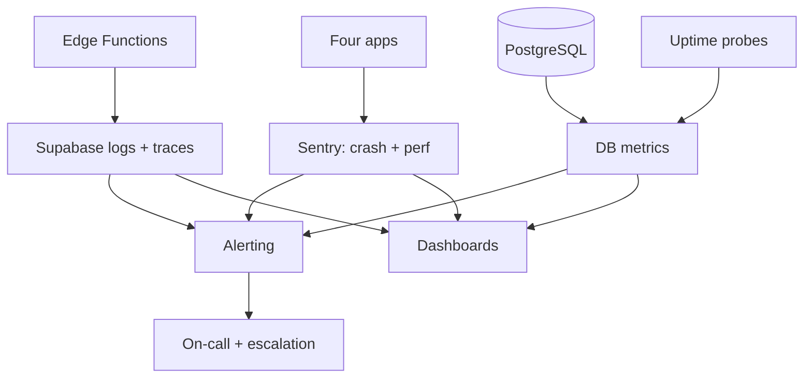
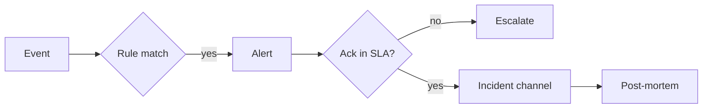

# PF-DOC-27 — Monitoring

| | |
|---|---|
| Document ID | PF-DOC-27 |
| Title | Monitoring |
| Version | 1.0 |
| Status | Approved (review PF-REV-01, 2026-08-06) |
| Date | 2026-08-06 |
| Author | DevOps Engineer / QA Lead |
| References | PF-DOC-08 (NFRs), PF-DOC-13 (DB), PF-DOC-14 (API), PF-DOC-19 (security), PF-DOC-22 (deployment), PF-DOC-26 (release); successors PF-DOC-28 (maintenance) |

---

## 1. Purpose

This document defines **how the PareFood Platform is observed**: logs, metrics, traces,
dashboards, SLOs, alerting and on-call escalation. It turns the SLO mapping of PF-DOC-08
§5.2 and the KPIs of PF-DOC-03 §3.7 into live operational signals.

## 2. Objectives

1. Define the observability pillars (logs, metrics, traces, events).
2. Define the metric catalogue mapped to SLOs and KPIs.
3. Define dashboards per audience (ops, engineering, finance, product).
4. Define alerting rules, thresholds and escalation.
5. Define log collection, redaction and retention.
6. Define the on-call model and incident workflows (feeds PF-DOC-28).
7. Define SLO evaluation and error budget process.

## 3. Requirements

### 3.1 Observability Stack

| Pillar | Tool | Scope |
|---|---|---|
| Logs | Supabase logs + Sentry (client) + structured logging to cloud logs | Backend, Edge Functions, apps |
| Metrics | Supabase metrics + custom counters (Sentry/metrics endpoint) | Orders, payments, latency |
| Traces | Supabase function traces + Sentry performance | Edge Functions, app perf |
| Uptime | External uptime probes | Backend URL, web admin |
| Crash | Sentry | All four apps |
| Analytics (product) | Postgres aggregates + reporting (PF-DOC-13) | KPIs, finance |

### 3.2 Metric Catalogue (SLO-linked)

| Metric | Source | SLO target | Doc |
|---|---|---|---|
| Backend availability | uptime probe | 99.9% | NFR-016 |
| Crash-free sessions | Sentry | ≥ 99.5% | NFR-017 |
| Order placement success | function metric | ≥ 99.5% | NFR-021 |
| Median delivery time | orders timestamps | < 35 min | PF-DOC-03 |
| Notification latency | function timing | p95 < 5 s | NFR-006 |
| Realtime update latency | client-side timing | < 2 s | NFR-007 |
| API p95 read latency | Supabase logs | ≤ 2 s (list) | NFR-003 |
| Migration/functions health | deploy checks | all green | PF-DOC-22 |
| Finance integrity | reconcile result | 100% accuracy | PF-DOC-18 |

### 3.3 KPI Dashboards

| Dashboard | Audience | Key tiles |
|---|---|---|
| Ops live | On-call | orders/min, active orders by state, error rate, ETA latency, driver online |
| Engineering | Eng teams | crash-free, p95 latencies, function errors, queue sizes |
| Finance | Finance | GMV, commission, payouts, settlements, reconciliation status |
| Product | PM | WAU, repeat rate, orders/day, AOV, cancellation rate |
| Security | Security | auth failures, refund velocity, admin actions, RLS policy changes |

Dashboards live in the monitoring tooling config (`infra/monitor/`) and are versioned.

### 3.4 Alerting Rules & Escalation

| Alert | Severity | Threshold | Escalate to |
|---|---|---|---|
| Backend down | SEV-1 | probe fail 2 min | On-call + release mgr |
| Crash-free < 99.5% (7d) | SEV-2 | trend | On-call eng |
| Order error rate > 1% (15 min) | SEV-2 | p95 > 2% | On-call |
| Delivery p75 > 40 min (2 h) | SEV-3 | ops review | Ops |
| Finance reconcile mismatch | SEV-1 | any | Finance + on-call |
| Auth brute force | SEV-2 | threshold | Security on-call |
| Refund velocity flag | SEV-3 | BR-FRAUD-003 | Ops review |
| RLS migration merged w/o policy test | SEV-2 | CI gap | Security |
| Error budget burnt (month) | SEV-3 | > 100% | Release mgr |

Severity levels per PF-DOC-19 §3.9 (SEV-1/2/3).

### 3.5 Logging & Redaction

| Rule | Detail |
|---|---|
| Structure | JSON logs with `request_id`, `function`, `latency_ms`, `level` |
| Redaction | PII/payment fields redacted at source; `credit_card`, `token`, `phone` masked |
| Retention | App/function logs 90 days; finance/audit logs 7 years (NFR-042) |
| Sampling | Debug logs sampled; errors never sampled |
| Correlation | `X-Request-Id` passed from apps through functions (PF-DOC-14) |

### 3.6 On-Call Model

| Aspect | Design |
|---|---|
| Coverage | 24/7 on-call from launch; business-hours at beta |
| Rotation | Weekly; 1 primary + 1 secondary |
| Tools | Alerting + runbook links (PF-DOC-28 §runbooks) |
| Response | SEV-1 < 15 min acknowledgement; SEV-2 < 30 min |
| Handover | Daily ops standup summary |

### 3.7 SLO & Error Budget

- SLOs defined in PF-DOC-08 §5.2; measured over 30-day windows.
- Error budget = 100% − SLO. Budget exhaustion (month) triggers release freeze per §3.4.
- SLO review monthly; target changes require architect approval (NFR-R04).

### 3.8 Release Monitoring Handover

On every release (PF-DOC-26 §3.8):
- Deploy checks run (PF-DOC-22 §3.8).
- Watch window with live dashboards.
- Rollback decision authority per PF-DOC-22 §3.7.

## 4. Diagrams

### 4.1 Observability Flow

### 4.2 Alert Pipeline

## 5. Tables

### 5.1 Dashboard & Owner Matrix

| Dashboard | Owner | Refresh |
|---|---|---|
| Ops live | Ops | realtime |
| Engineering | Eng | 1 min |
| Finance | Finance | daily + on-demand |
| Product | PM | daily |
| Security | Security | realtime |

### 5.2 SLO Register

| SLO | 30-day target | Window | Error budget |
|---|---|---|---|
| Availability | 99.9% | month | 43 min downtime |
| Crash-free | 99.5% | month | 0.5% sessions |
| Order success | 99.5% | month | 0.5% attempts |
| Notif latency p95 | 5 s | week | — |
| Delivery median | 35 min | week | — |

## 6. Rules

- **MON-R01** No feature/function ships without at least one metric or log event.
- **MON-R02** Alerts must be actionable; noisy alerts are tuned or deleted.
- **MON-R03** Logs never contain PII or payment data (redaction, PF-DOC-19).
- **MON-R04** SLO breaches require a post-mortem and documented remediation.
- **MON-R05** Dashboard definitions are code (`infra/monitor/`) and reviewed in PRs.
- **MON-R06** On-call acknowledges within SLA or escalation fires.

## 7. Checklist

- [ ] Log/metrics/tracing wired for all apps + functions
- [ ] Dashboards created per audience
- [ ] Alert rules configured with thresholds
- [ ] Redaction verified in staging logs
- [ ] On-call rotation established before launch
- [ ] SLO register + error budget active

## 8. Risks

| Risk | Likelihood | Impact | Mitigation |
|---|---|---|---|
| Alert fatigue | High | Medium | Threshold tuning + noise review |
| Metric gaps on new features | Medium | Medium | MON-R01 gate in review |
| Log storage cost grows | Medium | Medium | Retention + sampling policy |
| Dashboard drift from reality | Medium | Medium | Versioned dashboard code |
| On-call burnout | Medium | Medium | Rotation, secondary, load review |

## 9. Future Improvements

- Distributed tracing across app→function→DB (OpenTelemetry).
- AI-assisted anomaly detection on order/delivery metrics.
- Business-metric dashboards in AP-PA (finance/product self-service).
- Capacity forecasting from trend metrics (PF-DOC-29).
