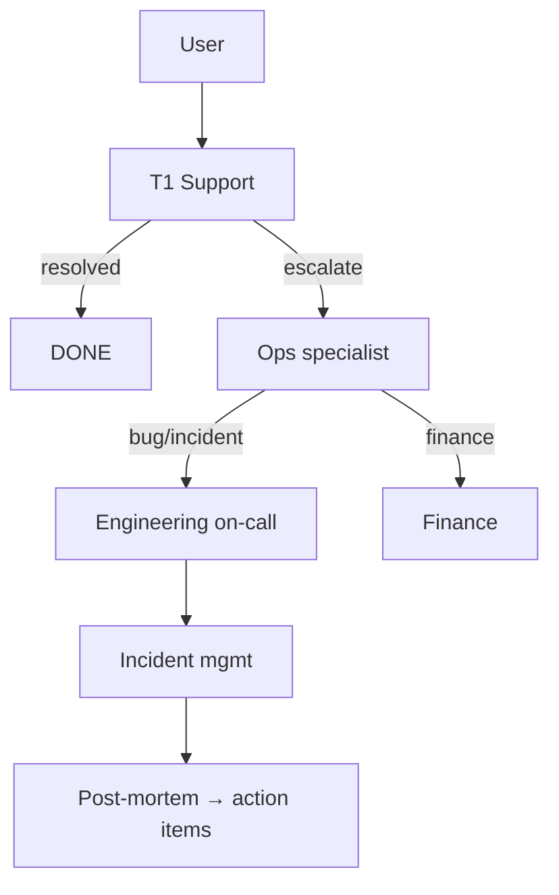
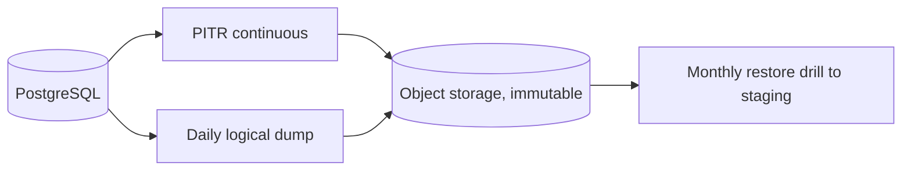

# PF-DOC-28 — Maintenance

| | |
|---|---|
| Document ID | PF-DOC-28 |
| Title | Maintenance |
| Version | 1.0 |
| Status | Approved (review PF-REV-01, 2026-08-06) |
| Date | 2026-08-06 |
| Author | DevOps Engineer / QA Lead |
| References | PF-DOC-08 (NFRs), PF-DOC-19 (security), PF-DOC-22 (deployment), PF-DOC-27 (monitoring); successors PF-DOC-29 (future), PF-DOC-30 (DoD) |

---

## 1. Purpose

This document defines **how the platform is operated and maintained post-launch**:
support model, incident response, backups/restores, dependency and patch management,
data retention, performance tuning, and lifecycle reviews. It keeps NFR-016..021 and
NFR-039..044 satisfied over time.

## 2. Objectives

1. Define the support model (tiers, SLA, channels) for users and merchants.
2. Define the incident management process (severity, response, post-mortem).
3. Define backup, restore and disaster recovery operations.
4. Define dependency and security-patch management cadence.
5. Define database maintenance (indexing, growth, vacuum/statistics).
6. Define data retention and legal archival/deletion operations.
7. Define periodic engineering and product reviews.

## 3. Requirements

### 3.1 Support Model

| Tier | Owner | Scope | SLA |
|---|---|---|---|
| T1 | Support staff | FAQs, account issues, order escalations | First response < 1 h (business hours) |
| T2 | Ops specialists | Verification, disputes, force-cancel | < 4 h |
| T3 | Engineering on-call | Bugs, incidents (PF-DOC-27 §3.6) | SEV per severity |
| Finance | Finance team | Settlements, payouts, reconciliation | < 24 h |

Channels: in-app support (AP-PF), merchant WhatsApp group (AP-PB), driver hotline (AP-PD),
internal ticketing for AP-PA. Escalation path documented in runbooks.

### 3.2 Incident Management

| Severity | Definition | Response | Post-incident |
|---|---|---|---|
| SEV-1 | Platform down / data breach / payment issue | < 15 min ack, containment first | Post-mortem ≤ 48 h |
| SEV-2 | Major feature down (ordering) | < 30 min ack | Post-mortem ≤ 48 h |
| SEV-3 | Minor degradation | < 4 h | Weekly review |

Process: detect (PF-DOC-27) → contain → remediate → verify → post-mortem (5 whys,
action items with owners + due dates) → follow-up in next sprint (PF-DOC-25).

### 3.3 Backups & Recovery

| Item | Setting | NFR |
|---|---|---|
| Continuous backup | Supabase PITR enabled | NFR-019 |
| Nightly dumps | Full logical dump to object storage | RPO ≤ 15 min |
| Retention | PITR 7 days; dumps 30 days; finance records 7 years | NFR-042 |
| Restore test | Monthly restore drill (staging) | NFR-020 |
| RTO | ≤ 4 h restore | NFR-020 |
| Immutability | Backups write-once (object lock) | SEC |

### 3.4 Dependency & Patch Management

| Cadence | Activity |
|---|---|
| Continuous | Dependabot/osv alerts triaged daily (CI scans, PF-DOC-21) |
| Monthly | `dart pub outdated` review; Flutter/Dart minor upgrades |
| Quarterly | Flutter stable upgrade + deprecation cleanup |
| On release | Patch releases bundled into next train (PF-DOC-26) |
| Critical security | Expedited hotfix (PF-DOC-26 §3.6) |

Upgrade policy: one minor step at a time; full test suite + E2E before merge; Flutter
upgrades planned as dedicated spikes (PF-DOC-25).

### 3.5 Database Maintenance

| Activity | Frequency | Detail |
|---|---|---|
| Index review | Quarterly | Drop unused, add missing (per query stats, PF-DOC-13 §5.2) |
| Growth monitoring | Weekly | Table sizes, bloat alerts |
| Vacuum/analyze | Automatic | Supabase-managed + periodic manual for hot tables |
| Partitioning plan | When tables > 100M rows | PF-DOC-29 trigger |
| Query review | Monthly | Slow-query report from logs |
| Data quality | Weekly | Orphaned rows, invalid coordinates checks |

### 3.6 Data Retention & Legal Operations

| Data class | Retention | Action |
|---|---|---|
| Financial records | 7 years | Archive + export to immutable storage |
| Order/ops data | ≤ 24 months | Archive; then purge unless legal |
| PII (profiles) | active + 30 days post-deletion | Legal deletion flow (PF-DOC-19 §3.4) |
| Documents (KTP/NIB/SIM) | active + 7 years (compliance) | Restricted access |
| Logs | 90 days | Delete after window |
| Backups | per §3.3 | Object-lock |

Legal deletion: dedicated function purges PII and related rows with audit log; executed
on request within SLA (NFR-041).

### 3.7 Performance Reviews

| Review | Cadence | Output |
|---|---|---|
| Capacity vs demand | Monthly | Scaling recommendations (NFR-011..015) |
| App perf regression | Per release | Budget check (PF-DOC-08) |
| Cost review | Monthly | Cloud spend vs PF-DOC-03 model |
| SLO review | Monthly | Error budget status (PF-DOC-27 §3.7) |

### 3.8 Engineering & Product Reviews

| Review | Cadence | Owners |
|---|---|---|
| Architecture review | Quarterly | Architect + teams |
| Security audit | Pre-launch + annual | External vendor |
| Dependency review | Monthly | DevOps |
| Codebase health | Per sprint | Teams (PF-DOC-25) |
| Persona refresh | Annual | Product (PF-DOC-06) |
| Business rules audit | Quarterly | Finance (PF-DOC-18) |

### 3.9 Runbook Inventory (stored in `docs/runbooks/`)

| Runbook | Linked to |
|---|---|
| SEV-1 response | PF-DOC-27 §3.4 |
| Restore from backup | §3.3 |
| Rollback release | PF-DOC-22 §3.7 |
| Migrate/expand schema | PF-DOC-22 §3.2 |
| Rotate secrets | PF-DOC-19 §3.5 |
| Onboard new city | PF-DOC-29 |
| Legal data deletion | §3.6 |

## 4. Diagrams

### 4.1 Support Escalation

### 4.2 Backup & Restore

## 5. Tables

### 5.1 Maintenance Cadence Summary

| Activity | Daily | Weekly | Monthly | Quarterly | Annual |
|---|---|---|---|---|---|
| Alert triage | ✔ | | | | |
| Support SLA review | | ✔ | | | |
| Growth/db health | | ✔ | | | |
| Dep updates | ✔ | | ✔ | ✔ (Flutter) | |
| Index/query review | | | ✔ | ✔ | |
| Restore drill | | | ✔ | | |
| Capacity/cost review | | | ✔ | | |
| Security audit | | | | | ✔ |
| Persona refresh | | | | | ✔ |
| Business rules audit | | | ✔ | | |

### 5.2 Support SLA Table

| Channel | First response | Resolution target |
|---|---|---|
| In-app (AP-PF) | 1 h (business) | 24 h |
| Merchant WhatsApp | 30 min (business) | 8 h |
| Driver hotline | 30 min | 8 h |
| Finance desk | 2 h (business) | 24 h |
| Emergency (SEV) | per §3.2 | per severity |

## 6. Rules

- **MT-R01** All production changes follow the release train or hotfix path (PF-DOC-26).
- **MT-R02** Post-mortems are blameless; action items tracked to completion.
- **MT-R03** Backups are tested monthly; untested backups count as no backup.
- **MT-R04** Dependency upgrades never skip test + E2E gates (PF-DOC-21).
- **MT-R05** PII deletion is executed by the legal-deletion function only (audited).
- **MT-R06** Runbooks are reviewed annually and after every SEV-1/2 incident.

## 7. Checklist

- [ ] Support tiers + SLAs staffed before launch
- [ ] Incident process documented and rehearsed
- [ ] Backups + restore drill running
- [ ] Dependency cadence active (alerts on)
- [ ] Retention/archival jobs scheduled
- [ ] Runbook inventory complete and linked

## 8. Risks

| Risk | Likelihood | Impact | Mitigation |
|---|---|---|---|
| Support load exceeds capacity at launch | High | Medium | Tiered model + staffing at GA |
| Restore time exceeds RTO | Medium | High | Monthly drill + tune |
| Dependency drift / CVE exposure | Medium | High | Continuous alerts + monthly updates |
| Growth outpaces DB tuning | Medium | Medium | Weekly monitoring + partitioning trigger |
| Key-person dependency | Medium | Medium | Cross-training + runbooks |

## 9. Future Improvements

- Self-service support portal and merchant help centre.
- Automated runbook execution (Chaos/stack storm drills).
- Predictive capacity from load forecasting (PF-DOC-29).
- Multi-region DR with active replication (PF-DOC-29).
