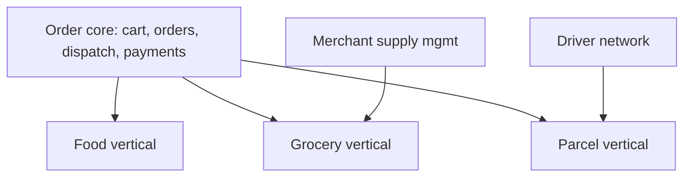

# PF-DOC-29 — Future Expansion

| | |
|---|---|
| Document ID | PF-DOC-29 |
| Title | Future Expansion |
| Version | 1.0 |
| Status | Approved (review PF-REV-01, 2026-08-06) |
| Date | 2026-08-06 |
| Author | Principal Architect / Product Manager |
| References | PF-DOC-01 (vision), PF-DOC-02 (products), PF-DOC-03 (business), PF-DOC-09 (stack); successors PF-DOC-25 (roadmap), PF-DOC-30 (DoD) |

---

## 1. Purpose

This document is the **strategic backlog beyond the MVP**. It records the "WON'T" items
from PF-DOC-02 and the improvement ideas noted throughout the suite, prioritised for the
12–36 month horizon (PF-DOC-01 §3.5). Items here are candidates; nothing here ships
without a business case and the normal process (PF-DOC-07 change control).

## 2. Objectives

1. Catalogue growth candidates across products, platform and operations.
2. Prioritise with a value/effort model tied to PF-DOC-03 KPIs.
3. Define the expansion trigger criteria for each candidate.
4. Keep "WON'T" items of the MVP visible and revivable only via this doc.
5. Define architectural readiness work so future expansion is cheap.

## 3. Requirements

### 3.1 Expansion Catalogue

#### Product growth (customer, AP-PF)

| # | Candidate | Value driver | Trigger |
|---|---|---|---|
| E1 | Scheduled/pre-order delivery | Convenience, off-peak fill | Repeat rate > 35% |
| E2 | Group ordering & order splitting | Viral growth, AOV | WAU > 5k |
| E3 | ParePro subscription | Revenue stability (PF-DOC-03) | Repeat rate mature |
| E4 | In-app chat with driver/merchant | Service quality | Post-launch feedback |
| E5 | PareHygiene (hygiene score) | Trust differentiation (PF-DOC-04) | Post-launch trust KPI |
| E6 | Loyalty & gamification | Repeat rate | Post-launch |
| E7 | Dark-mode/premium themes | Brand (PF-DOC-16) | Post-launch |

#### Merchant growth (AP-PB)

| # | Candidate | Value driver | Trigger |
|---|---|---|---|
| E8 | Multi-branch management | Merchant retention | ≥ 200 merchants |
| E9 | Menu sync with POS/WhatsApp | Ops efficiency | Merchant demand |
| E10 | Dynamic pricing/promo self-service | Merchant spend | ≥ 300 merchants |
| E11 | Demand forecasting for kitchen | Merchant value | Analytics mature |

#### Driver growth (AP-PD)

| # | Candidate | Value driver | Trigger |
|---|---|---|---|
| E12 | Multi-order batching | Delivery density | ≥ 500 drivers |
| E13 | Parcel (non-food) delivery | Revenue diversification | Logistics ops ready |
| E14 | Shift scheduling & earnings insurance | Driver retention | Driver churn signal |
| E15 | SOS + safety features | Safety (PF-DOC-04) | Post-launch |

#### Platform & ops

| # | Candidate | Value driver | Trigger |
|---|---|---|---|
| E16 | Support ticketing system (AP-PA) | Support SLA (PF-DOC-28) | Support volume |
| E17 | Refund automation engine | Ops cost | Refund volume |
| E18 | Advertising/ranked discovery | Revenue (PF-DOC-03) | GMV maturity |
| E19 | Data warehouse + ML insights | Decision quality | Data volume |
| E20 | Public partner API (POS integration) | Ecosystem | Merchant scale |

### 3.2 Expansion to New Cities & Verticals

| Expansion | Detail | Readiness |
|---|---|---|
| New cities | Config-driven (pricing, radius, hours, payment mix per city, PF-DOC-05 TU-05) | Onboarding runbook (PF-DOC-28) |
| Grocery (PareMart) | Same order/fulfilment core | Product extension |
| PareMart/packages | Same driver network | Logistics |
| Institutional (B2B lunch) | Corporate accounts | Post-E1 |

Architecture rule: any vertical reuses the same backend/DB (VR-04, PF-DOC-01) and adds
its own tables + features.

### 3.3 Technical Readiness Investments

| Investment | Why | When |
|---|---|---|
| Partitioning hot tables | Orders > 100M rows | Pre-scale (PF-DOC-13) |
| Read replica / warehouse | Analytics load isolation | Analytics maturity |
| Multi-region + DR | Latency & availability | City expansion |
| Remote build cache | CI speed | Team growth |
| Feature flags platform | Progressive rollout | Post-launch |
| Canary/blue-green backend | Safer deploys | Post-launch |
| OpenTelemetry tracing | Deep debugging | Post-launch |
| Wasm/Flutter web perf | AP-PA scale | Web growth |

### 3.4 Prioritisation Model

Score = value (0–10) × alignment (0–1) / effort (story points equivalent). Ranked
annually at roadmap review (PF-DOC-25). Criteria:

| Factor | Weight | Source |
|---|---|---|
| Revenue/unit-economics impact | 30% | PF-DOC-03 |
| Retention/quality impact | 25% | PF-DOC-03 KPIs |
| Strategic alignment | 20% | PF-DOC-01 |
| Competitive defensibility | 15% | PF-DOC-04 |
| Feasibility/risk | 10% | Architecture |

### 3.5 Candidate Process (revival rule)

WON'T → E-candidate flow:
1. Request logged with business case (KPI linkage).
2. Scored in quarterly roadmap review (PF-DOC-25).
3. If approved → new FRs (PF-DOC-07) with priorities → sprint planning.
4. If rejected → stays in this catalogue with rejection note.

## 4. Diagrams

### 4.1 Expansion Horizon Map

```mermaid
graph LR
    subgraph Horizon 1 (6–12m)
        E1[Scheduled orders]
        E2[Group ordering]
        E5[PareHygiene]
    end
    subgraph Horizon 2 (12–24m)
        E8[Multi-branch]
        E13[Parcel delivery]
        E16[Support system]
        CITIES[5 cities]
    end
    subgraph Horizon 3 (24–36m)
        E19[Data warehouse + ML]
        E20[Partner API]
        MART[Grocery vertical]
        DR[Multi-region DR]
    end
    H1[H1] --> H2[H2] --> H3[H3]
```

### 4.2 Vertical Reuse Model



## 5. Tables

### 5.1 Horizon Ranking (initial)

| Horizon | Candidates | Priority |
|---|---|---|
| H1 | E1, E2, E5, E14 | High |
| H2 | E8, E9, E12, E13, E16, E17, cities | Medium-High |
| H3 | E3, E6, E10, E11, E18, E19, E20, grocery, DR | Medium |

### 5.2 Readiness Checklist per Candidate

| Item | Required before build |
|---|---|
| Business case with KPI | yes |
| FR draft + trace | yes (PF-DOC-07) |
| NFR/impact assessment | yes (PF-DOC-08) |
| Business rules update | if money/ops (PF-DOC-18) |
| Security review | if new data/privileges (PF-DOC-19) |
| Test plan addition | yes (PF-DOC-20) |
| Roadmap slot | yes (PF-DOC-25) |

## 6. Rules

- **EX-R01** Nothing in this catalogue ships without the candidate process (§3.5).
- **EX-R02** New verticals must reuse the single backend/database (VR-04).
- **EX-R03** Multi-city expansion requires config-driven pricing and city onboarding runbook
  (TU-05).
- **EX-R04** WON'T items (PF-DOC-02) are revivable only through this catalogue.
- **EX-R05** Technical readiness investments are planned one horizon ahead of need.

## 7. Checklist

- [ ] Catalogue complete and scored
- [ ] WON'T items from PF-DOC-02 transferred here
- [ ] Horizon map agreed with stakeholders
- [ ] Candidate process documented and adopted
- [ ] Architecture readiness backlog created (technical items)

## 8. Risks

| Risk | Likelihood | Impact | Mitigation |
|---|---|---|---|
| Scope creep from catalogue | High | Medium | Candidate process gate (EX-R01) |
| Vertical expansion complexity | Medium | High | Core reuse + clear table boundaries |
| ML/analytics premature investment | Medium | Medium | Trigger-gated (data maturity) |
| City expansion ops burden | Medium | Medium | Config-driven ops + runbook |
| Multi-region cost surprises | Low | Medium | Cost model review pre-decision |

## 9. Future Improvements

- Annual strategy refresh aligned to PF-DOC-03 KPIs.
- Public product vision board for community input.
- Machine-learning roadmap (ETA prediction, fraud, recommendations).
- Global expansion feasibility framework.
