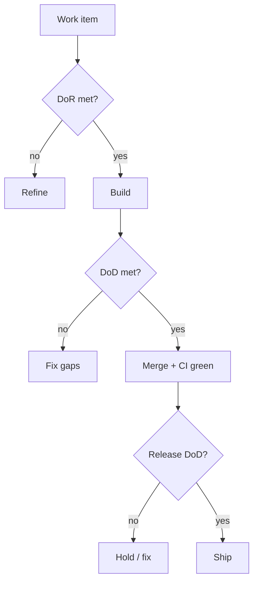
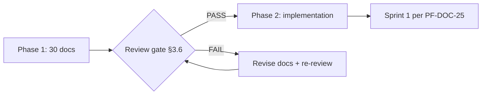

# PF-DOC-30 — Definition of Done

| | |
|---|---|
| Document ID | PF-DOC-30 |
| Title | Definition of Done |
| Version | 1.0 |
| Status | Approved (review PF-REV-01, 2026-08-06) |
| Date | 2026-08-06 |
| Author | Principal Architect / QA Lead |
| References | All PF-DOC-01..29 (this is the master gate document) |

---

## 1. Purpose

This document is the **master acceptance gate** for the PareFood Platform. It defines
Definition of Ready (DoR), Definition of Done (DoD) for work units (story, feature, bug,
release, hotfix), and the **Phase 1 review gate** for this documentation suite. Approval
here unlocks Phase 2 (implementation).

## 2. Objectives

1. Define Definition of Ready for work items.
2. Define Definition of Done per work-unit type.
3. Define the documentation review gate (Phase 1 acceptance).
4. Define release and hotfix quality gates.
5. Define the no-go conditions that block acceptance.
6. Provide the single checklist referenced by all teams.

## 3. Requirements

### 3.1 Definition of Ready (DoR)

A work item is **ready** to start when:

- [ ] Linked to ≥ 1 FR (PF-DOC-07) with priority (MoSCoW)
- [ ] Acceptance criteria written and testable
- [ ] Persona/segment referenced (PF-DOC-06)
- [ ] Business rules/DB/API impacts identified (PF-DOC-13/14/18)
- [ ] Design references resolved (PF-DOC-15/16)
- [ ] Sized (story points) and capacity available (PF-DOC-25)
- [ ] No unresolved dependency blocks

### 3.2 Definition of Done — Story/Feature

- [ ] FR acceptance criteria met and tests added (TS-R01)
- [ ] Code follows PF-DOC-23 (format, analyze 0/0, boundary lints)
- [ ] Unit + widget tests pass; coverage gate met (PF-DOC-20 §3.8)
- [ ] Golden tests updated/reviewed (TS-R05)
- [ ] Backend: functions + RLS tests updated if applicable
- [ ] i18n (id-ID) strings complete (DS-R05)
- [ ] All four UI states handled (FL-R07) + accessibility checked (NFR-029)
- [ ] Business rules mirrored correctly (BR tests, PF-DOC-18)
- [ ] Security checklist passed for money/privileged code (SEC-R01)
- [ ] Changelog fragment drafted (PF-DOC-26)
- [ ] UX usability round done for changed flow (PF-DOC-15 §3.9)
- [ ] Docs updated if contracts/schema changed (PF-DOC-13/14)

### 3.3 Definition of Done — Bug

- [ ] Root cause identified and fixed
- [ ] Regression test added
- [ ] Verified in affected apps/environments
- [ ] Severity logged; SEV-1/2 has post-mortem link (PF-DOC-28)
- [ ] No open related regressions

### 3.4 Definition of Done — Release (vX.Y.Z)

- [ ] All release checklist items from PF-DOC-26 §3.3
- [ ] `main` green; staging smoke passed (PF-DOC-21)
- [ ] SLO metrics reviewed; no budget breach blocking (PF-DOC-27)
- [ ] Rollback runbook verified (PF-DOC-22)
- [ ] Store listings + release notes approved (Bahasa)
- [ ] Finance sign-off if PAY/FIN changes (CI-R07)
- [ ] Post-release monitoring watch window scheduled

### 3.5 Definition of Done — Hotfix

- [ ] Expedited review completed (PF-DOC-26 §3.6)
- [ ] Full CI on the fix branch
- [ ] Backport to `main` ≤ 24 h
- [ ] Post-mortem scheduled if SEV-2+ (PF-DOC-28)

### 3.6 Phase 1 Review Gate (this documentation suite)

The documentation phase is accepted when **all** of the following hold:

- [ ] All 30 documents exist and are complete (no placeholders)
- [ ] Every document contains: Purpose, Objectives, Requirements, Diagrams, Tables, Rules,
      Checklist, Risks, Future Improvements
- [ ] Every document references its predecessors (chain intact)
- [ ] Cross-document consistency verified:
  - [ ] App codes (AP-PF/AP-PB/AP-PD/AP-PA) consistent (README)
  - [ ] FR IDs referenced in PF-DOC-13/14/18 match PF-DOC-07
  - [ ] BR IDs referenced in PF-DOC-14/20 match PF-DOC-18
  - [ ] NFR/SLO IDs in PF-DOC-27 match PF-DOC-08
  - [ ] Table names in PF-DOC-14/18 match PF-DOC-13
  - [ ] MoSCoW priorities in PF-DOC-07 match PF-DOC-02
- [ ] Financial figures (PF-DOC-03) consistent with PF-DOC-18 defaults
- [ ] Roadmap (PF-DOC-25) covers all MUST FRs (61/61)
- [ ] Risk registers reviewed; top risks have owners
- [ ] Phase 2 architecture review performed (docs/review/); all High/Medium findings closed
- [ ] Stakeholder sign-off recorded for strategy set (01–06)
- [ ] Architect sign-off for architecture set (09–17)
- [ ] Finance sign-off for PF-DOC-03/18
- [ ] Security sign-off for PF-DOC-19

**Gate result:** PASS → Phase 2 (implementation) may begin per PF-DOC-25.
FAIL → items listed and re-reviewed.

### 3.7 Master DoD — Sprint

- [ ] All planned work units meet their DoD (PF-DOC-25 §3.6)
- [ ] `main` green; no open SEV-1/2
- [ ] Velocity recalibrated; roadmap updated
- [ ] Retrospective actions tracked

### 3.8 No-Go Conditions (block acceptance)

| Condition | Blocks |
|---|---|
| Any MUST FR without acceptance-criteria tests | Story/release |
| Coverage below gate on critical paths | Merge/release |
| RLS missing on any table | Backend/release |
| SEC-001/002/004 controls not active | Release |
| SLO breach without approved remediation plan | Release |
| Unexplained money discrepancy | Finance/release |
| Cross-document inconsistency (PF-DOC-30 §3.6) | Phase 2 start |

## 4. Diagrams

### 4.1 DoD Gate Flow

### 4.2 Phase 1 → Phase 2 Transition

## 5. Tables

### 5.1 DoD Matrix

| Work unit | Tests | CI green | Docs | Approvals | Sign-offs |
|---|---|---|---|---|---|
| Story/feature | yes | yes | updated | reviewer | — |
| Bug | regression | yes | as needed | reviewer | — |
| Release | E2E+perf | yes | changelog | release mgr | finance/security as needed |
| Hotfix | full | yes | changelog | release mgr | post-mortem |
| Phase 1 docs | — | — | this suite | all owners | §3.6 |

### 5.2 Document Review Owners (Phase 1)

| Document set | Approver |
|---|---|
| 01–06 strategy | Stakeholders / PO |
| 07–08 requirements | PO + QA |
| 09–14 architecture | Principal Architect |
| 15–17 experience | UX Architect |
| 18 business rules | Finance + PO |
| 19 security | Security Architect |
| 20–22 quality/delivery | QA + DevOps |
| 23–26 engineering/delivery | Eng lead + Release mgr |
| 27–28 operations | Ops lead |
| 29 growth | PO |
| 30 DoD | All (master gate) |

## 6. Rules

- **DOD-R01** DoD is non-negotiable and applies to every work unit of every app.
- **DOD-R02** No partial credit: a unit is done only when every DoD item is met.
- **DOD-R03** DoD evolution requires a change proposal reviewed by QA + architect.
- **DOD-R04** The Phase 1 gate (§3.6) must PASS before any source code is written.
- **DOD-R05** No-Go conditions (§3.8) block releases regardless of schedule pressure.
- **DOD-R06** Evidence is recorded (CI reports, PR links, test results) for every gate.

## 7. Checklist

- [ ] DoR/DoD adopted by all teams
- [ ] No-Go conditions published
- [ ] Phase 1 review gate executed and PASSED
- [ ] Sign-offs recorded (§5.2)
- [ ] Phase 2 start condition communicated (PF-DOC-25 Sprint 1)
- [ ] This suite versioned as v1.0; change control established

## 8. Risks

| Risk | Likelihood | Impact | Mitigation |
|---|---|---|---|
| DoD treated as paperwork | Medium | Medium | Automated gates where possible (CI) |
| Gate pressure to skip items | Medium | High | No-Go conditions (DOD-R05) |
| Cross-doc drift after changes | Medium | Medium | Traceability checks in CI (PF-DOC-07 future) |
| Stakeholder sign-off delays | Medium | Medium | Pre-approval sessions per set |

## 9. Future Improvements

- Automated cross-document consistency checker (FR/BR/NFR/table registry).
- DoD compliance dashboards per sprint (PF-DOC-27).
- Continuous Phase 2 documentation updates with the same gate discipline.
